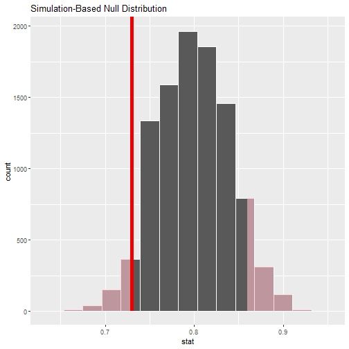

```r
# Load libraries
library(tidyverse)
library(magrittr)
library(moderndive)
library(infer)
library(janitor)
library(patchwork)
```

### B.2 One mean
#### B.2.1 Problem statement
The National Survey of Family Growth conducted by the Centers for Disease Control gathers information on family life, marriage and divorce, pregnancy, infertility, use of contraception, and men’s and women’s health. One of the variables collected on this survey is the age at first marriage. 5,534 randomly sampled US women between 2006 and 2010 completed the survey. The women sampled here had been married at least once. Do we have evidence that the mean age of first marriage for all US women from 2006 to 2010 is greater than 23 years? (Tweaked a bit from Diez, Barr, and Çetinkaya-Rundel 2014 [Chapter 4])

#### B.2.2 Competing hypotheses

In words

    Null hypothesis: The mean age of first marriage for all US women from 2006 to 2010 is equal to 23 years.
    Alternative hypothesis: The mean age of first marriage for all US women from 2006 to 2010 is greater than 23     years.

In symbols (with annotations)

    H0:μ = μ0, where μ is the mean age of first marriage for all US women from 2006 to 2010 and μ0 is 23.
    HA:μ > 23

Set α

It’s important to set the significance level before starting the testing using the data. Let’s set the significance level at 5 % here.

#### B.2.3 Exploring the sample data


```r
age_at_marriage <- read_csv("https://moderndive.com/data/ageAtMar.csv")
```

```
## Rows: 5534 Columns: 1
## -- Column specification ----------------------------------------------------------------------------------------
## Delimiter: ","
## dbl (1): age
## 
## i Use `spec()` to retrieve the full column specification for this data.
## i Specify the column types or set `show_col_types = FALSE` to quiet this message.
```


```r
# Check summary
age_at_marriage %>% 
  summary()
```

```
##       age       
##  Min.   :10.00  
##  1st Qu.:20.00  
##  Median :23.00  
##  Mean   :23.44  
##  3rd Qu.:26.00  
##  Max.   :43.00
```

```r
# Histogram
  age_at_marriage %>% 
  ggplot(aes(age)) +
  geom_histogram(binwidth = 1, color = "white")
```


```r
# The observed statistic of interest here is the sample mean:
age_mean_obs <-
  age_at_marriage %>% 
  observe(response = age, stat = "mean") 
age_mean_obs
```

```
## Response: age (numeric)
## # A tibble: 1 x 1
##    stat
##   <dbl>
## 1  23.4
```

Guess about statistical significance

We are looking to see if the observed sample mean of 23.44 is statistically greater than μ0=23. 
They seem to be quite close, but we have a large sample size here. Let’s guess that the large sample 
size will lead us to reject this practically small difference.

#### B.2.4 Non-traditional methods

Bootstrapping for hypothesis test

We can use the idea of bootstrapping to simulate the population from which the sample came and then generate samples from that simulated population to account for sampling variability. Recall how bootstrapping would apply in this context:

    Sample with replacement from our original sample of 5534 women and repeat this process 10,000 times,
    calculate the mean for each of the 10,000 bootstrap samples created in Step 1.,
    combine all of these bootstrap statistics calculated in Step 2 into a boot_distn object, and
    shift the center of this distribution over to the null value of 23. (This is needed since it will be centered at 23.44 via the process of bootstrapping.)


```r
# Create bootstrap distribution
set.seed(2018)
null_distn_one_mean <-
  age_at_marriage %>% 
  specify(response = age) %>% 
  hypothesise(null = "point", mu = 23) %>% 
  generate(reps = 10000, type = "bootstrap") %>% 
  calculate(stat = "mean") 
null_distn_one_mean
```

```
## Response: age (numeric)
## Null Hypothesis: point
## # A tibble: 10,000 x 2
##    replicate  stat
##        <int> <dbl>
##  1         1  22.9
##  2         2  23.1
##  3         3  23.1
##  4         4  22.9
##  5         5  23.1
##  6         6  23.0
##  7         7  23.0
##  8         8  23.0
##  9         9  23.0
## 10        10  23.0
## # ... with 9,990 more rows
```


```r
# Visualize bootstrap distribution
null_distn_one_mean %>% 
  visualize()
```


```r
# Visualize p-value
null_distn_one_mean %>% 
  visualize() + 
  shade_p_value(obs_stat = age_mean_obs, direction = "greater")
```


```r
# Calculat p-value
null_distn_one_mean %>% 
  get_p_value(obs_stat = age_mean_obs, direction = "greater")
```

```
## Warning: Please be cautious in reporting a p-value of 0. This result is an approximation based on the number of
## `reps` chosen in the `generate()` step. See `?get_p_value()` for more information.
```

```
## # A tibble: 1 x 1
##   p_value
##     <dbl>
## 1       0
```

Bootstrapping for confidence interval

We can also create a confidence interval for the unknown population parameter μ using our sample data using bootstrapping. Note that we don’t need to shift this distribution since we want the center of our confidence interval to be our point estimate x_hat = 23.44.


```r
# 95% Confidence interval using standard error 
bootstrap_distn_one_mean <-
  age_at_marriage %>% 
  specify(response = age) %>% 
  generate(reps = 10000, type = "bootstrap") %>% 
  calculate(stat = "mean") 

ci <-
  bootstrap_distn_one_mean %>% 
  get_ci(level = 0.95, type = "percentile")
```


```r
# Visualize confidence interval
bootstrap_distn_one_mean %>% 
  visualise() +
  shade_confidence_interval(endpoints = ci)
```


We see that 23 is not contained in this confidence interval as a plausible value of μ 
(the unknown population mean) and the entire interval is larger than 23. 
This matches with our hypothesis test results of rejecting the null hypothesis 
in favor of the alternative (μ > 23).

Interpretation: We are 95% confident the true mean age of first marriage for all 
US women from 2006 to 2010 is between 23.3 and 23.6.

### B.2.5 Traditional methods

Check conditions

Remember that in order to use the shortcut (formula-based, theoretical) approach, we need to check that some conditions are met.

    Independent observations: The observations are collected independently.

    The cases are selected independently through random sampling so this condition is met.

    Approximately normal: The distribution of the response variable should be normal or the sample size should be at least 30.

    The histogram for the sample above does show some skew. The Q-Q plot below also shows some skew.


```r
# qq-plot
age_at_marriage %>% 
  ggplot(aes(sample = age)) +
  stat_qq() +
  stat_qq_line()
```


Observed test statistic

While one could compute the observed test statistic by “hand”, the focus here is on the set-up of the problem and in understanding which formula for the test statistic applies. We can use the t_test() function to perform this analysis for us.


```r
# t-test

t_test_results <-
  age_at_marriage %>% 
  t_test( age ~ NULL, alternative = "greater", mu = 23)
t_test_results
```

```
## # A tibble: 1 x 7
##   statistic  t_df  p_value alternative estimate lower_ci upper_ci
##       <dbl> <dbl>    <dbl> <chr>          <dbl>    <dbl>    <dbl>
## 1      6.94  5533 2.25e-12 greater         23.4     23.3      Inf
```

Compute p-value

The p-value—the probability of observing an t-obs value of 6.936 or more in our 
null distribution of a t with 5533 degrees of freedom—is essentially 0.

State conclusion

We, therefore, have sufficient evidence to reject the null hypothesis. Our initial 
guess that our observed sample mean was statistically greater than the hypothesized 
mean has supporting evidence here. Based on this sample, we have evidence that the 
mean age of first marriage for all US women from 2006 to 2010 is greater than 23 years.


Confidence interval


```r
# Confidence interval
t.test( x = age_at_marriage$age, alternative = "two.sided", mu = 23)$conf
```

```
## [1] 23.31577 23.56461
## attr(,"conf.level")
## [1] 0.95
```

#### B.2.6 Comparing results

Observing the bootstrap distribution that were created, it makes quite a bit of 
sense that the results are so similar for traditional and non-traditional methods 
in terms of the p-value and the confidence interval since these distributions look
very similar to normal distributions. The conditions also being met (the large sample
size was the driver here) leads us to better guess that using any of the methods 
whether they are traditional (formula-based) or non-traditional (computational-based)
will lead to similar results.


### B.3 One proportion
#### B.3.1 Problem statement

The CEO of a large electric utility claims that 80 percent of his 1,000,000 customers
are satisfied with the service they receive. To test this claim, the local newspaper 
surveyed 100 customers, using simple random sampling. 73 were satisfied and the 
remaining were unsatisfied. Based on these findings from the sample, can we reject 
the CEO’s hypothesis that 80% of the customers are satisfied? [Tweaked a bit from http://stattrek.com/hypothesis-test/proportion.aspx?Tutorial=AP]


#### B.3.2 Competing hypotheses


In words

    Null hypothesis: The proportion of all customers of the large electric utility satisfied with service they receive is equal 0.80.
    Alternative hypothesis: The proportion of all customers of the large electric utility satisfied with service they receive is different from 0.80.

In symbols (with annotations)

    H0:π = p0, where π represents the proportion of all customers of the large electric utility satisfied with service they receive and p0
is 0.8.
HA:π ≠ 0.8

Set α

It’s important to set the significance level before starting the testing using the data. Let’s set the significance level at 5% here.

#### B.3.3 Exploring the sample data


```r
# Create data.frame
(elec <-
  c(rep("satisfied", 73), rep("unsatisfied", 27)) %>% 
  enframe() %>% 
  rename(satisfy = value)) 
```

```
## # A tibble: 100 x 2
##     name satisfy  
##    <int> <chr>    
##  1     1 satisfied
##  2     2 satisfied
##  3     3 satisfied
##  4     4 satisfied
##  5     5 satisfied
##  6     6 satisfied
##  7     7 satisfied
##  8     8 satisfied
##  9     9 satisfied
## 10    10 satisfied
## # ... with 90 more rows
```


```r
# Plot distribution
elec %>% 
  ggplot(aes(satisfy, fill = satisfy)) +
  geom_bar()
```


```r
# Compute observed statistic
(p_hat <-
  elec %>% 
  observe(response = satisfy, stat = "prop", success = "satisfied"))
```

```
## Response: satisfy (factor)
## # A tibble: 1 x 1
##    stat
##   <dbl>
## 1  0.73
```

Guess about statistical significance

We are looking to see if the sample proportion of 0.73 is statistically different from p0=0.8
based on this sample. They seem to be quite close, and our sample size is not huge here (n=100). Let’s guess that we do not have evidence to reject the null hypothesis.

### B.3.4 Non-traditional methods

Simulation for hypothesis test

In order to look to see if 0.73 is statistically different from 0.8, we need to account for the sample size. We also need to determine a process that replicates how the original sample of size 100 was selected. We can use the idea of an unfair coin to simulate this process. We will simulate flipping an unfair coin (with probability of success 0.8 matching the null hypothesis) 100 times. Then we will keep track of how many heads come up in those 100 flips. Our simulated statistic matches with how we calculated the original statistic p_hat: the number of heads (satisfied) out of our total sample of 100. We then repeat this process many times (say 10,000) to create the null distribution looking at the simulated proportions of successes


```r
set.seed(2018)
null_distn_one_prop <-
  elec %>% 
  specify(response = satisfy, success = "satisfied") %>% 
  hypothesize(null = "point", p = 0.8) %>% 
  generate(reps = 10000, type = "draw") %>% 
  calculate(stat = "prop")
```


```r
# Plot

null_distn_one_prop %>% 
  visualize() +
  shade_p_value(obs_stat = p_hat, direction = "both")
```




```r
# Compute p-value
(p_value <-
  null_distn_one_prop %>% 
  get_p_value(obs_stat = p_hat, direction = "both"))
```

```
## # A tibble: 1 x 1
##   p_value
##     <dbl>
## 1   0.114
```

So our p-value is 0.114 and we fail to reject the null hypothesis at the 5% level.


Bootstrapping for confidence interval

We can also create a confidence interval for the unknown population parameter π

using our sample data. To do so, we use bootstrapping, which involves

    sampling with replacement from our original sample of 100 survey respondents and repeating this process 10,000 times,
    calculating the proportion of successes for each of the 10,000 bootstrap samples created in Step 1.,
    combining all of these bootstrap statistics calculated in Step 2 into a boot_distn object,
    identifying the 2.5th and 97.5th percentiles of this distribution (corresponding to the 5% significance level chosen) to find a 95% confidence interval for π, and interpret this confidence interval in the context of the problem.


```r
# Bootstrap distribution
(boot_distn_one_prop <- 
  elec %>%
  specify(response = satisfy, success = "satisfied") %>% 
  generate(reps = 10000, type = "bootstrap") %>% 
  calculate(stat = "prop"))
```

```
## Response: satisfy (factor)
## # A tibble: 10,000 x 2
##    replicate  stat
##        <int> <dbl>
##  1         1  0.73
##  2         2  0.68
##  3         3  0.73
##  4         4  0.78
##  5         5  0.69
##  6         6  0.72
##  7         7  0.68
##  8         8  0.78
##  9         9  0.78
## 10        10  0.66
## # ... with 9,990 more rows
```

Calculate p-value


```r
# Compute pvalue
(ci <- 
  boot_distn_one_prop %>%
  get_ci(type = "percentile", level = 0.95))
```

```
## # A tibble: 1 x 2
##   lower_ci upper_ci
##      <dbl>    <dbl>
## 1     0.64     0.81
```


```r
# Plot bootstrap distribution
boot_distn_one_prop %>% 
visualize() +
  shade_ci(endpoints = ci)
```


We see that 0.80 is contained in this confidence interval as a plausible value of π

(the unknown population proportion). This matches with our hypothesis test results of failing to reject the null hypothesis.

Interpretation: We are 95% confident the true proportion of customers who are satisfied with the service they receive is between 0.64 and 0.81

### B.3.5 Traditional methods

§Check conditions

Remember that in order to use the shortcut (formula-based, theoretical) approach, we need to check that some conditions are met.

    Independent observations: The observations are collected independently.

    The cases are selected independently through random sampling so this condition is met.

    Approximately normal: The number of expected successes and expected failures is at least 10.

    This condition is met since 73 and 27 are both greater than 10.


Observed test statistic

While one could compute the observed test statistic by “hand” by plugging the observed values into the formula, the focus here is on the set-up of the problem and in understanding which formula for the test statistic applies. The calculation has been done in R below for completeness though:


```r
p_hat <- 0.73
p0 <- 0.8
n <- 100
(z_obs <- (p_hat - p0) / sqrt((p0 * (1 - p0)) / n))
```

```
## [1] -1.75
```

Visualize and compute p-value


```r
elec %>%
  specify(response = satisfy, success = "satisfied") %>%
  hypothesize(null = "point", p = 0.8) %>%
  calculate(stat = "z") %>%
  visualize(method = "theoretical", obs_stat = z_obs, direction = "both")
```

```
## Rather than setting `method = "theoretical"` with a simulation-based null distribution, the preferred method for visualizing theory-based distributions with infer is now to pass the output of `assume()` as the first argument to `visualize()`.
```

```
## Warning: The arguments `c("obs_stat", "direction")` are deprecated in `visualize()` and will be ignored. They
## should now be passed to one of `shade_p_value()` or `shade_confidence_interval()`.
```

```
## Warning: Check to make sure the conditions have been met for the theoretical method. {infer} currently does not
## check these for you.
```


```r
2 * pnorm(z_obs)
```

```
## [1] 0.08011831
```

The p-value — the probability of observing an zobs

value of -1.75 or more extreme (in both directions) in our null distribution — is around 8%.

Note that we could also do this test directly using the prop.test function.


```r
prop.test(
  x = table(elec$satisfy),
  n = length(elec$satisfy),
  alternative = "two.sided",
  p = 0.8,
  correct = FALSE
)
```

```
## 
## 	1-sample proportions test without continuity correction
## 
## data:  table(elec$satisfy), null probability 0.8
## X-squared = 3.0625, df = 1, p-value = 0.08012
## alternative hypothesis: true p is not equal to 0.8
## 95 percent confidence interval:
##  0.6356788 0.8073042
## sample estimates:
##    p 
## 0.73
```

Note that the 95 percent confidence interval given above matches well with the one calculated using bootstrapping.


State conclusion

We, therefore, do not have sufficient evidence to reject the null hypothesis. Our initial guess that our observed sample proportion was not statistically different from the hypothesized proportion has not been invalidated. Based on this sample, we have do not evidence that the proportion of all customers of the large electric utility satisfied with service they receive is different from 0.80, at the 5% level.


#### B.3.6 Comparing results

Observing the bootstrap distribution and the null distribution that were created, it makes quite a bit of sense that the results are so similar for traditional and non-traditional methods in terms of the p-value and the confidence interval since these distributions look very similar to normal distributions. The conditions also being met leads us to better guess that using any of the methods whether they are traditional (formula-based) or non-traditional (computational-based) will lead to similar results.

### B.4 Two proportions
#### B.4.1 Problem statement

A 2010 survey asked 827 randomly sampled registered voters in California “Do you support? Or do you oppose? Drilling for oil and natural gas off the Coast of California? Or do you not know enough to say?” Conduct a hypothesis test to determine if the data provide strong evidence that the proportion of college graduates who do not have an opinion on this issue is different than that of non-college graduates. (Tweaked a bit from Diez, Barr, and Çetinkaya-Rundel 2014 [Chapter 6])

#### B.4.2 Competing hypotheses


In words

    Null hypothesis: There is no association between having an opinion on drilling and having a college degree for all registered California voters in 2010.

    Alternative hypothesis: There is an association between having an opinion on drilling and having a college degree for all registered California voters in 2010.


Another way in words

    Null hypothesis: The probability that a Californian voter in 2010 having no opinion on drilling and is a college graduate is the same as that of a non-college graduate.

    Alternative hypothesis: These parameter probabilities are different

Set α

It’s important to set the significance level before starting the testing using the data. Let’s set the significance level at 5% here.

#### B.4.3 Exploring the sample data


```r
offshore <- read_csv("https://moderndive.com/data/offshore.csv")
```

```
## Rows: 827 Columns: 2
## -- Column specification ----------------------------------------------------------------------------------------
## Delimiter: ","
## chr (2): college_grad, response
## 
## i Use `spec()` to retrieve the full column specification for this data.
## i Specify the column types or set `show_col_types = FALSE` to quiet this message.
```

```r
(counts <- offshore %>% tabyl(college_grad, response))
```

```
##  college_grad no opinion opinion
##            no        131     258
##           yes        104     334
```


```r
# Reverse levels
offshore <-
  offshore %>% 
  mutate(response = fct_rev(response))
```


```r
# Plot
offshore %>% 
  ggplot(aes(college_grad, fill = response)) +
  geom_bar() +
  coord_flip()
```


Guess about statistical significance

We are looking to see if a difference exists in the size of the bars corresponding to no opinion for the plot. Based solely on the plot, we have little reason to believe that a difference exists since the bars seem to be about the same size, BUT… it’s important to use statistics to see if that difference is actually statistically significant!


#### B.4.4 Non-traditional methods

Collecting summary info


```r
# Observed statistic
d_hat <-
  offshore %>% 
  observe(
    formula = response ~ college_grad, 
    success = "no opinion", 
    stat = "diff in props", 
    order = c("yes", "no")
  )
```

Randomization for hypothesis test

In order to ascertain if the observed sample proportion with no opinion for college graduates of 0.237 is statistically different than the observed sample proportion with no opinion for non-college graduates of 0.337, we need to account for the sample sizes. Note that this is the same as ascertaining if the observed difference in sample proportions -0.099 is statistically different than 0. We also need to determine a process that replicates how the original group sizes of 389 and 438 were selected.

We can use the idea of randomization testing (also known as permutation testing) to simulate the population from which the sample came (with two groups of different sizes) and then generate samples using shuffling from that simulated population to account for sampling variability.


```r
set.seed(2018)
(null_distn_two_props  <-
  offshore %>% 
  specify(response ~ college_grad, success = "no opinion") %>% 
  hypothesise(null = "independence") %>% 
  generate(reps = 10000, type = "permute") %>% 
  calculate(stat = "diff in props", order = c("yes", "no")))
```

```
## Response: response (factor)
## Explanatory: college_grad (factor)
## Null Hypothesis: independence
## # A tibble: 10,000 x 2
##    replicate     stat
##        <int>    <dbl>
##  1         1 -0.0265 
##  2         2  0.0172 
##  3         3  0.0220 
##  4         4 -0.00710
##  5         5 -0.0459 
##  6         6  0.0172 
##  7         7 -0.00710
##  8         8 -0.0168 
##  9         9  0.0220 
## 10        10  0.0560 
## # ... with 9,990 more rows
```


```r
# Plot 0-distribution

null_distn_two_props %>% 
  visualise() +
  shade_p_value(obs_stat = d_hat, direction = "both")
```


```r
# Compute p-value
(pvalue <-
  null_distn_two_props %>% 
  get_p_value(obs_stat = d_hat, direction = "both"))
```

```
## # A tibble: 1 x 1
##   p_value
##     <dbl>
## 1  0.0024
```

So our p-value is 0.002 and we reject the null hypothesis at the 5% level.
You can also see this from the histogram above that we are far into the tails of the null distribution.

Bootstrapping for confidence interval

We can also create a confidence interval for the unknown population parameter 
using our sample data with bootstrapping.


```r
(boot_distn_two_props <- 
  offshore %>%
  specify(response ~ college_grad, success = "no opinion") %>% 
  generate(reps = 10000, type = "bootstrap") %>% 
  calculate(stat = "diff in props", order = c("yes", "no")))
```

```
## Response: response (factor)
## Explanatory: college_grad (factor)
## # A tibble: 10,000 x 2
##    replicate    stat
##        <int>   <dbl>
##  1         1 -0.0955
##  2         2 -0.0468
##  3         3 -0.119 
##  4         4 -0.108 
##  5         5 -0.112 
##  6         6 -0.112 
##  7         7 -0.0992
##  8         8 -0.0864
##  9         9 -0.156 
## 10        10 -0.0634
## # ... with 9,990 more rows
```


```r
# Get CI
(ci <-
  boot_distn_two_props %>% 
  get_ci(level = 0.95, type = "percentile"))
```

```
## # A tibble: 1 x 2
##   lower_ci upper_ci
##      <dbl>    <dbl>
## 1   -0.160  -0.0379
```


```r
# Visualize CI
boot_distn_two_props %>% 
  visualize() +
  shade_ci(endpoints = ci)
```


We see that 0 is not contained in this confidence interval as a plausible value. This matches with our hypothesis test results of rejecting the null hypothesis. Since zero is not a plausible value of the population parameter, we have evidence that the proportion of college graduates in California with no opinion on drilling is different than that of non-college graduates.

Interpretation: 
We are 95% confident the true proportion of non-college graduates with no opinion on offshore drilling in California is between 0.16 dollars smaller to 0.04 dollars smaller than for college graduates.

#### B.4.5 Traditional methods

Remember that in order to use the short-cut (formula-based, theoretical) approach, we need to check that some conditions are met.

    Independent observations: Each case that was selected must be independent of all the other cases selected.

    Sample size: The number of pooled successes and pooled failures must be at least 10 for each group.
    
    Independent selection of samples: The cases are not paired in any meaningful way.


We have no reason to suspect that a college graduate selected would have any relationship to a non-college graduate selected.

#### B.4.6 Test statistic


```r
# Calculate observed statistic
(z_hat <- offshore %>%
  observe(response ~ college_grad, 
          success = "no opinion", 
          stat = "z", 
          order = c("yes", "no")))
```

```
## Response: response (factor)
## Explanatory: college_grad (factor)
## # A tibble: 1 x 1
##    stat
##   <dbl>
## 1 -3.16
```


```r
# p-value 
2 * pnorm(-3.16, lower.tail = TRUE)
```

```
## [1] 0.001577691
```

#### B.4.7 State conclusion
We, therefore, have sufficient evidence to reject the null hypothesis. Our initial guess that a statistically significant difference did not exist in the proportions of no opinion on offshore drilling between college educated and non-college educated Californians was not validated. We do have evidence to suggest that there is a dependency between college graduation and position on offshore drilling for Californians.

#### B.4.8 Comparing results
Observing the bootstrap distribution and the null distribution that were created, it makes quite a bit of sense that the results are so similar for traditional and non-traditional methods in terms of the p
-value and the confidence interval since these distributions look very similar to normal distributions. The conditions were not met since the number of pairs was small, but the sample data was not highly skewed. Using any of the methods whether they are traditional (formula-based) or non-traditional (computational-based) lead to similar results.

### B.5 Two means (independent samples)


#### B.5.1 Problem statement
Average income varies from one region of the country to another, and it often reflects both lifestyles and regional living expenses. Suppose a new graduate is considering a job in two locations, Cleveland, OH and Sacramento, CA, and he wants to see whether the average income in one of these cities is higher than the other. He would like to conduct a hypothesis test based on two randomly selected samples from the 2000 Census. (Tweaked a bit from Diez, Barr, and Çetinkaya-Rundel 2014 [Chapter 5])

#### B.5.2 Competing hypotheses
In words

    Null hypothesis: There is no association between income and location (Cleveland, OH and Sacramento, CA).
    Alternative hypothesis: There is an association between income and location (Cleveland, OH and Sacramento, CA).

Another way in words

    Null hypothesis: The mean income is the same for both cities.
    Alternative hypothesis: The mean income is different for the two cities.

Set α

It’s important to set the significance level before starting the testing using the data. Let’s set the significance level at 5% here.

#### B.5.3 Exploring the sample data


```r
cle_sac <- read.delim("https://moderndive.com/data/cleSac.txt") %>%
  rename(
    metro_area = Metropolitan_area_Detailed,
    income = Total_personal_income
  ) %>%
  na.omit()
```


```r
(inc_summ <- cle_sac %>%
  group_by(metro_area) %>%
  summarize(
    sample_size = n(),
    mean = mean(income),
    sd = sd(income),
    minimum = min(income),
    lower_quartile = quantile(income, 0.25),
    median = median(income),
    upper_quartile = quantile(income, 0.75),
    max = max(income)
  ))
```

```
## # A tibble: 2 x 9
##   metro_area     sample_size   mean     sd minimum lower_quartile median upper_quartile    max
##   <chr>                <int>  <dbl>  <dbl>   <int>          <dbl>  <dbl>          <dbl>  <int>
## 1 Cleveland_ OH          212 27467. 27681.       0           8475  21000          35275 152400
## 2 Sacramento_ CA         175 32428. 35774.       0           8050  20000          49350 206900
```


```r
# The boxplot below also shows the mean for each group highlighted by the red dots.
cle_sac %>% 
  ggplot(aes(metro_area, income)) +
  geom_boxplot() +
  stat_summary(fun.y = "mean", geom = "point", color = "red")
```

```
## Warning: `fun.y` is deprecated. Use `fun` instead.
```


**Guess about statistical significance**

We are looking to see if a difference exists in the mean income of the two levels of the explanatory variable. Based solely on the boxplot, we have reason to believe that no difference exists. The distributions of income seem similar and the means fall in roughly the same place.

#### B.5.4 Non-traditional methods

**Collecting summary info**

We now compute the observed statistic


```r
(d_hat <- 
   cle_sac %>%
   observe(
     income ~ metro_area, 
     stat = "diff in means", 
     order = c("Sacramento_ CA", "Cleveland_ OH")
   ))
```

```
## Response: income (numeric)
## Explanatory: metro_area (factor)
## # A tibble: 1 x 1
##    stat
##   <dbl>
## 1 4960.
```

**Randomization for hypothesis test**


```r
# Create null distribution
set.seed(2018)
(null_distn_two_means <- 
  cle_sac %>%
  specify(income ~ metro_area) %>% 
  hypothesise(null = "independence") %>% 
  generate(reps = 10000, type = "permute") %>% 
  calculate(stat = "diff in means", order = c("Sacramento_ CA", "Cleveland_ OH")))
```

```
## Response: income (numeric)
## Explanatory: metro_area (factor)
## Null Hypothesis: independence
## # A tibble: 10,000 x 2
##    replicate    stat
##        <int>   <dbl>
##  1         1  3350. 
##  2         2   119. 
##  3         3  1907. 
##  4         4    89.7
##  5         5  1163. 
##  6         6 -1577. 
##  7         7  1809. 
##  8         8  2606. 
##  9         9  4748. 
## 10        10 -3629. 
## # ... with 9,990 more rows
```


```r
# Visualize
null_distn_two_means %>% 
  visualize() +
  shade_p_value(obs_stat = d_hat, direction = "both")
```


```r
# Calculate p-value
null_distn_two_means %>% 
  get_p_value(obs_stat = d_hat, direction = "both")
```

```
## # A tibble: 1 x 1
##   p_value
##     <dbl>
## 1   0.126
```

So our p-value is 0.126 and we fail to reject the null hypothesis at the 5% level. You can also see this from the histogram above that we are not very far into the tail of the null distribution.

**Bootstrapping for confidence interval**

We can also create a confidence interval for the unknown population parameter using our sample 
data with bootstrapping. Here we will bootstrap each of the samples with replacement instead of shuffling. This is done by setting the type argument in the generate function to “bootstrap”.


```r
(boot_distn_two_means <- 
  cle_sac %>%
  specify(income ~ metro_area) %>% 
  generate(reps = 10000, type = "bootstrap") %>% 
  calculate(stat = "diff in means", order = c("Sacramento_ CA", "Cleveland_ OH")))
```

```
## Response: income (numeric)
## Explanatory: metro_area (factor)
## # A tibble: 10,000 x 2
##    replicate  stat
##        <int> <dbl>
##  1         1 9245.
##  2         2 9453.
##  3         3 2889.
##  4         4 1593.
##  5         5  441.
##  6         6 7800.
##  7         7 6516.
##  8         8 5067.
##  9         9 3495.
## 10        10 8655.
## # ... with 9,990 more rows
```


```r
(ci <-
  boot_distn_two_means %>% 
  get_ci(level = 0.95, type = "percentile"))
```

```
## # A tibble: 1 x 2
##   lower_ci upper_ci
##      <dbl>    <dbl>
## 1   -1359.   11500.
```


```r
boot_distn_two_means %>% 
  visualize() +
  shade_ci(endpoints = ci)
```


We see that 0 is contained in this confidence interval as a plausible value.  This matches with our hypothesis test results of failing to reject the null hypothesis. Since zero is a plausible value of the population parameter, we do not have evidence that Sacramento incomes are different than Cleveland incomes.

Interpretation: We are 95% confident the true mean yearly income for those living in Sacramento is between 1359.5 dollars smaller to 11499.69 dollars higher than for Cleveland.

#### B.5.5 Traditional methods

Check conditions

Remember that in order to use the short-cut (formula-based, theoretical) approach, we need to check that some conditions are met.

    Independent observations: The observations are independent in both groups.

    This metro_area variable is met since the cases are randomly selected from each city.

    Approximately normal: The distribution of the response for each group should be normal or the sample sizes should be at least 30.


```r
cle_sac %>% 
ggplot(aes(income)) +
  geom_histogram(color = "white", binwidth = 20000) +
  facet_wrap(~metro_area)
```


We have some reason to doubt the normality assumption here since both the histograms show deviation from a normal model fitting the data well for each group. The sample sizes for each group are greater than 100 though so the assumptions should still apply.

    Independent samples: The samples should be collected without any natural pairing.

    There is no mention of there being a relationship between those selected in Cleveland and in Sacramento.


#### B.5.6 Test statistic

The test statistic is a random variable based on the sample data. Here, we are interested in seeing if our observed difference in sample means.


Observed test statistic

Note that we could also do (ALMOST) this test directly using the t.test function. The x and y arguments are expected to both be numeric vectors here so we’ll need to appropriately filter our datasets.


```r
cle_sac %>%
  observe(income ~ metro_area, stat = "t", order = c("Cleveland_ OH", "Sacramento_ CA"))
```

```
## Response: income (numeric)
## Explanatory: metro_area (factor)
## # A tibble: 1 x 1
##    stat
##   <dbl>
## 1 -1.50
```

#### B.5.7 Compute p-value

```r
# This can also be calculated in R directly
2 * pt(-1.501, df = min(212 - 1, 175 - 1), lower.tail = TRUE)
```

```
## [1] 0.135168
```


```r
# We can also approximate by using the standard normal curve:
2 * pnorm(-1.501)
```

```
## [1] 0.1333556
```


#### B.5.8 State conclusion
We, therefore, do not have sufficient evidence to reject the null hypothesis. Our initial guess that a statistically significant difference not existing in the means was backed by this statistical analysis. We do not have evidence to suggest that the true mean income differs between Cleveland, OH and Sacramento, CA based on this data.

#### B.5.9 Comparing results
Observing the bootstrap distribution and the null distribution that were created, it makes quite a bit of sense that the results are so similar for traditional and non-traditional methods in terms of the p
-value and the confidence interval since these distributions look very similar to normal distributions. The conditions also being met leads us to better guess that using any of the methods whether they are traditional (formula-based) or non-traditional (computational-based) will lead to similar 


### B.6 Two means (paired samples)

**Problem statement**

Trace metals in drinking water affect the flavor and an unusually high concentration can pose a health hazard. Ten pairs of data were taken measuring zinc concentration in bottom water and surface water at 10 randomly selected locations on a stretch of river. Do the data suggest that the true average concentration in the surface water is smaller than that of bottom water? (Note that units are not given.) [Tweaked a bit from https://onlinecourses.science.psu.edu/stat500/node/51]

#### B.6.1 Competing hypotheses

In words

    Null hypothesis: The mean concentration in the bottom water is the same as that of the surface water at different paired locations.
    Alternative hypothesis: The mean concentration in the surface water is smaller than that of the bottom water at different paired locations.

Set α

It’s important to set the significance level before starting the testing using the data. Let’s set the significance level at 5% here.

#### B.6.2 Exploring the sample data


```r
(zinc_tidy <- read_csv("https://moderndive.com/data/zinc_tidy.csv"))
```

```
## Rows: 20 Columns: 3
## -- Column specification ----------------------------------------------------------------------------------------
## Delimiter: ","
## chr (1): location
## dbl (2): loc_id, concentration
## 
## i Use `spec()` to retrieve the full column specification for this data.
## i Specify the column types or set `show_col_types = FALSE` to quiet this message.
```

```
## # A tibble: 20 x 3
##    loc_id location concentration
##     <dbl> <chr>            <dbl>
##  1      1 bottom           0.43 
##  2      1 surface          0.415
##  3      2 bottom           0.266
##  4      2 surface          0.238
##  5      3 bottom           0.567
##  6      3 surface          0.39 
##  7      4 bottom           0.531
##  8      4 surface          0.41 
##  9      5 bottom           0.707
## 10      5 surface          0.605
## 11      6 bottom           0.716
## 12      6 surface          0.609
## 13      7 bottom           0.651
## 14      7 surface          0.632
## 15      8 bottom           0.589
## 16      8 surface          0.523
## 17      9 bottom           0.469
## 18      9 surface          0.411
## 19     10 bottom           0.723
## 20     10 surface          0.612
```

We want to look at the differences in surface - bottom for each location:

```r
(zinc_diff <- zinc_tidy %>%
  group_by(loc_id) %>%
  summarize(pair_diff = diff(concentration)) %>%
  ungroup())
```

```
## # A tibble: 10 x 2
##    loc_id pair_diff
##     <dbl>     <dbl>
##  1      1   -0.0150
##  2      2   -0.0280
##  3      3   -0.177 
##  4      4   -0.121 
##  5      5   -0.102 
##  6      6   -0.107 
##  7      7   -0.0190
##  8      8   -0.0660
##  9      9   -0.058 
## 10     10   -0.111
```

Next we calculate the mean difference as our observed statistic

```r
(d_hat <- zinc_diff %>%
  observe(response = pair_diff, stat = "mean"))
```

```
## Response: pair_diff (numeric)
## # A tibble: 1 x 1
##      stat
##     <dbl>
## 1 -0.0804
```

The histogram below also shows the distribution of pair_diff

```r
zinc_diff %>% 
  ggplot(aes(pair_diff)) +
  geom_histogram(color = "white", binwidth = 0.04)
```


Guess about statistical significance

We are looking to see if the sample paired mean difference of -0.08 is statistically less than 0. They seem to be quite close, but we have a small number of pairs here. Let’s guess that we will fail to reject the null hypothesis.

#### B.6.3 Non-traditional methods

Bootstrapping for hypothesis test

```r
set.seed(2018)
(null_distn_paired_means <- zinc_diff %>%
  specify(response = pair_diff) %>% 
  hypothesize(null = "point", mu = 0) %>% 
  generate(reps = 10000, type = "bootstrap") %>% 
  calculate(stat = "mean"))
```

```
## Response: pair_diff (numeric)
## Null Hypothesis: point
## # A tibble: 10,000 x 2
##    replicate     stat
##        <int>    <dbl>
##  1         1 -0.0107 
##  2         2 -0.00940
##  3         3  0.0171 
##  4         4  0.0251 
##  5         5  0.0055 
##  6         6  0.00130
##  7         7  0.0158 
##  8         8  0.0114 
##  9         9 -0.0142 
## 10        10  0.0079 
## # ... with 9,990 more rows
```


```r
null_distn_paired_means %>% 
  visualize() +
  shade_p_value(obs_stat = d_hat, direction = "less")
```


```r
# Compute p-value
null_distn_paired_means %>% 
  get_p_value(obs_stat = d_hat, direction = "less")
```

```
## Warning: Please be cautious in reporting a p-value of 0. This result is an approximation based on the number of
## `reps` chosen in the `generate()` step. See `?get_p_value()` for more information.
```

```
## # A tibble: 1 x 1
##   p_value
##     <dbl>
## 1       0
```

Bootstrapping for confidence interval


```r
(boot_distn_paired_means  <- zinc_diff %>%
  specify(response = pair_diff) %>% 
  generate(reps = 10000, type = "bootstrap") %>% 
  calculate(stat = "mean"))
```

```
## Response: pair_diff (numeric)
## # A tibble: 10,000 x 2
##    replicate    stat
##        <int>   <dbl>
##  1         1 -0.0757
##  2         2 -0.085 
##  3         3 -0.0676
##  4         4 -0.0841
##  5         5 -0.0966
##  6         6 -0.0738
##  7         7 -0.075 
##  8         8 -0.0849
##  9         9 -0.0954
## 10        10 -0.0713
## # ... with 9,990 more rows
```


```r
(ci <-
  boot_distn_paired_means %>% 
  get_ci(level = 0.95, type = "percentile"))
```

```
## # A tibble: 1 x 2
##   lower_ci upper_ci
##      <dbl>    <dbl>
## 1   -0.112  -0.0502
```


```r
boot_distn_paired_means %>% 
  visualize() +
  shade_ci(endpoints = ci)
```


We see that 0 is not contained in this confidence interval as a plausible value.

This matches with our hypothesis test results of rejecting the null hypothesis. Since zero is not a plausible value of the population parameter and since the entire confidence interval falls below zero, we have evidence that surface zinc concentration levels are lower, on average, than bottom level zinc concentrations.

Interpretation: We are 95% confident the true mean zinc concentration on the surface is between 0.11 units smaller to 0.05 units smaller than on the bottom.

#### B.6.4 Traditional methods

Check conditions

Remember that in order to use the shortcut (formula-based, theoretical) approach, we need to check that some conditions are met.

    Independent observations: The observations among pairs are independent.

    The locations are selected independently through random sampling so this condition is met.

    Approximately normal: The distribution of population of differences is normal or the number of pairs is at least 30.

    The histogram above does show some skew so we have reason to doubt the population being normal based on this sample. We also only have 10 pairs which is fewer than the 30 needed. A theory-based test may not be valid here.

Test statistic

The test statistic is a random variable based on the sample data. Here, we want to look at a way to estimate the population mean difference.


```r
(t_test_results <- zinc_diff %>%
  t_test(
    formula = pair_diff ~ NULL,
    alternative = "less",
    mu = 0
  ))
```

```
## # A tibble: 1 x 7
##   statistic  t_df  p_value alternative estimate lower_ci upper_ci
##       <dbl> <dbl>    <dbl> <chr>          <dbl>    <dbl>    <dbl>
## 1     -4.86     9 0.000446 less         -0.0804     -Inf  -0.0501
```

Compute p-value


```r
pt(-4.8638, df = nrow(zinc_diff) - 1, lower.tail = TRUE)
```

```
## [1] 0.0004455656
```


State conclusion

We, therefore, have sufficient evidence to reject the null hypothesis. Our initial guess that our observed sample mean difference was not statistically less than the hypothesized mean of 0 has been invalidated here. Based on this sample, we have evidence that the mean concentration in the bottom water is greater than that of the surface water at different paired locations.

#### B.6.5 Comparing results

Observing the bootstrap distribution and the null distribution that were created, it makes quite a bit of sense that the results are so similar for traditional and non-traditional methods in terms of the p-value and the confidence interval since these distributions look very similar to normal distributions. The conditions were not met since the number of pairs was small, but the sample data was not highly skewed. Using any of the methods whether they are traditional (formula-based) or non-traditional (computational-based) lead to similar results here.
