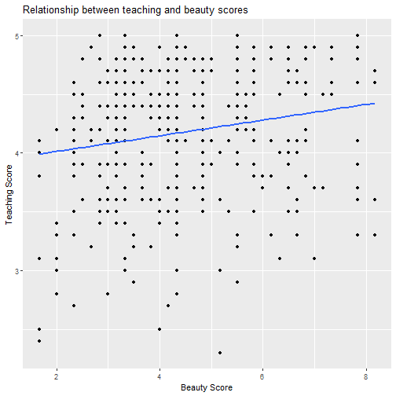
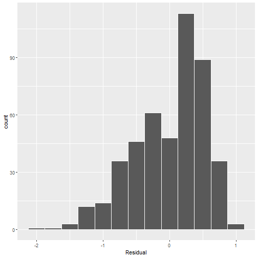
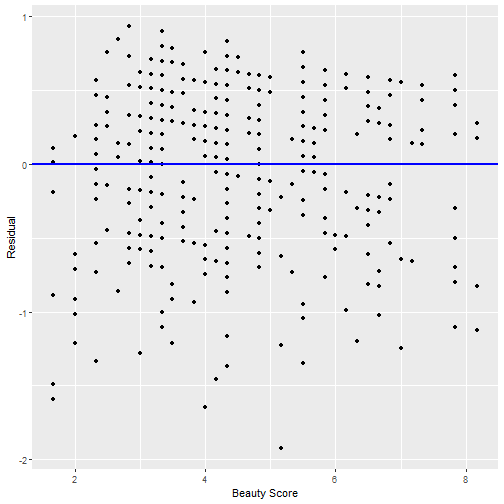
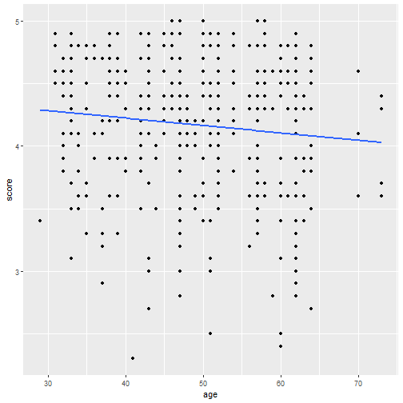
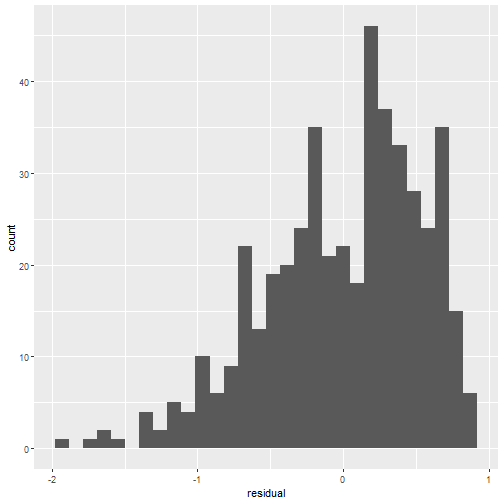
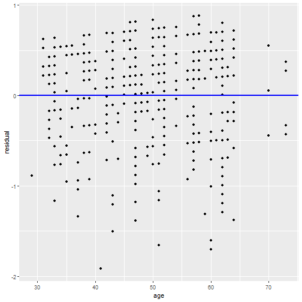
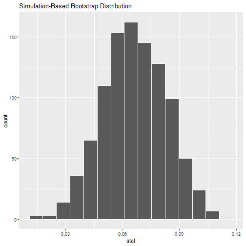
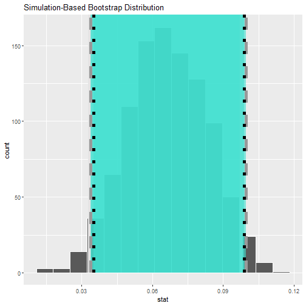
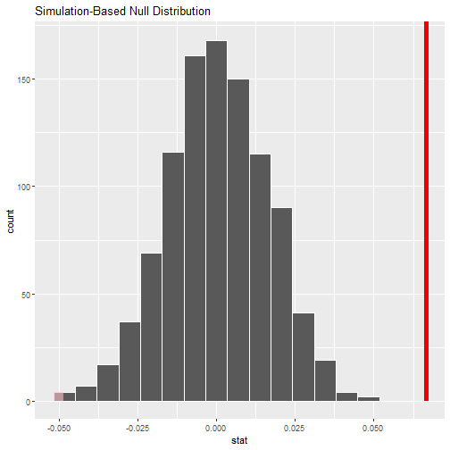
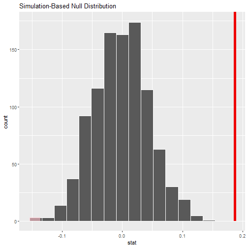

```r
# Load packages
library(tidyverse)
library(moderndive)
library(infer)
```

### 10.1 Regression refresher
#### 10.1.1 Teaching evaluations analysis


```r
evals_ch5 <- evals %>%
  select(ID, score, bty_avg, age)

evals_ch5 %>% 
glimpse()
```

```
## Rows: 463
## Columns: 4
## $ ID      <int> 1, 2, 3, 4, 5, 6, 7, 8, 9, 10, 11, 12, 13, 14, 15, 16, 17, 18, 19, 20, 21, 22, 23, 24, 25, 26,~
## $ score   <dbl> 4.7, 4.1, 3.9, 4.8, 4.6, 4.3, 2.8, 4.1, 3.4, 4.5, 3.8, 4.5, 4.6, 3.9, 3.9, 4.3, 4.5, 4.8, 4.6,~
## $ bty_avg <dbl> 5.000, 5.000, 5.000, 5.000, 3.000, 3.000, 3.000, 3.333, 3.333, 3.167, 3.167, 3.167, 3.167, 3.1~
## $ age     <int> 36, 36, 36, 36, 59, 59, 59, 51, 51, 40, 40, 40, 40, 40, 40, 40, 40, 31, 31, 31, 31, 31, 31, 62~
```

```r
ggplot(evals_ch5, 
       aes(x = bty_avg, y = score)) +
  geom_point() +
  labs(x = "Beauty Score", 
       y = "Teaching Score",
       title = "Relationship between teaching and beauty scores") +  
  geom_smooth(method = "lm", se = FALSE)
```

```
## `geom_smooth()` using formula 'y ~ x'
```



```r
# Fit regression model:
score_model <- lm(score ~ bty_avg, data = evals_ch5)
# Get regression table:
get_regression_table(score_model)
```

```
## # A tibble: 2 x 7
##   term      estimate std_error statistic p_value lower_ci upper_ci
##   <chr>        <dbl>     <dbl>     <dbl>   <dbl>    <dbl>    <dbl>
## 1 intercept    3.88      0.076     51.0        0    3.73     4.03 
## 2 bty_avg      0.067     0.016      4.09       0    0.035    0.099
```

#### 10.1.2 Sampling scenario

Let’s view the instructors for these 463 courses as a representative sample from 
a greater study population. In our case, let’s assume that the study population 
is all instructors at UT Austin and that the sample of instructors who taught these 
463 courses is a representative sample. Unfortunately, we can only assume these 
two facts without more knowledge of the sampling methodology used by the researchers.

We can view our fitted slope b1 = 0.067 as a point estimate of the population slope β1. 
In other words, β1 quantifies the relationship between teaching score and “beauty” 
average bty_avg for all instructors at UT Austin. Similarly, we can view our fitted 
intercept b0 = 3.88 as a point estimate of the population intercept β0 for all 
instructors at UT Austin.

### 10.2 Interpreting regression tables

Given the lack of practical interpretation for the fitted intercept b0, in this 
section we’ll focus only on the second row of the table corresponding to the fitted 
slope b1. We’ll first interpret the std_error, statistic, p_value, lower_ci and 
upper_ci columns.

#### 10.2.1 Standard error

The standard error is the standard deviation of any point estimate computed from a sample.

#### 10.2.2 Test statistic

Here, our null hypothesis H0 assumes that the population slope β1 is 0. If the population
slope β1 is truly 0, then this is saying that there is no true relationship between teaching
and “beauty” scores for all the instructors in our population.

#### 10.2.3 p-value

A p-value is the probability of obtaining a test statistic just as extreme or more
extreme than the observed test statistic assuming the null hypothesis H0 is true.

Recall that you can intuitively think of the p-value as quantifying how “extreme” 
the observed fitted slope of b1 = 0.067 is in a  “hypothesized universe” where there 
is no relationship between teaching and “beauty” scores.

#### 10.2.4 Confidence interval

The statistically precise interpretation of this confidence interval is: “if we 
repeated this sampling procedure a large number of times, we expect about 95% of the 
resulting confidence intervals to capture the value of the population slope β1.” 
However, we’ll summarize this using our shorthand interpretation that 
“we’re 95% ‘confident’ that the true population slope β1 lies between 0.035 and 0.099.”

Since β1 = 0 is not in our plausible range of values for β1, we are inclined to 
believe that there, in fact, is a relationship between teaching and “beauty” scores 
and a positive one at that.

#### 10.2.5 How does R compute the table?

Much like the theory-based method for constructing confidence intervals you saw in 
Subsection 8.7.2 and the theory-based hypothesis test you saw in Subsection 9.6.1, 
there exist mathematical formulas that allow you to construct confidence intervals 
and conduct hypothesis tests for inference for regression.

### 10.3 Conditions for inference for regression
#### 10.3.1 Residuals refresher


```r
# Fit regression model:
score_model <- lm(score ~ bty_avg, data = evals_ch5)
# Get regression points:
regression_points <- get_regression_points(score_model)
regression_points
```

```
## # A tibble: 463 x 5
##       ID score bty_avg score_hat residual
##    <int> <dbl>   <dbl>     <dbl>    <dbl>
##  1     1   4.7    5         4.21    0.486
##  2     2   4.1    5         4.21   -0.114
##  3     3   3.9    5         4.21   -0.314
##  4     4   4.8    5         4.21    0.586
##  5     5   4.6    3         4.08    0.52 
##  6     6   4.3    3         4.08    0.22 
##  7     7   2.8    3         4.08   -1.28 
##  8     8   4.1    3.33      4.10   -0.002
##  9     9   3.4    3.33      4.10   -0.702
## 10    10   4.5    3.17      4.09    0.409
## # ... with 453 more rows
```
#### 10.3.2 Linearity of relationship

Would you say that the relationship between x and y is linear? It’s hard to say 
because of the scatter of the points about the line. In the authors’ opinions, we 
feel this relationship is “linear enough.”

#### 10.3.3 Independence of residuals


```r
evals %>% 
  select(ID, prof_ID, score, bty_avg)
```

```
## # A tibble: 463 x 4
##       ID prof_ID score bty_avg
##    <int>   <int> <dbl>   <dbl>
##  1     1       1   4.7    5   
##  2     2       1   4.1    5   
##  3     3       1   3.9    5   
##  4     4       1   4.8    5   
##  5     5       2   4.6    3   
##  6     6       2   4.3    3   
##  7     7       2   2.8    3   
##  8     8       3   4.1    3.33
##  9     9       3   3.4    3.33
## 10    10       4   4.5    3.17
## # ... with 453 more rows
```

In this case, we say there exists dependence between observations. The first four 
courses taught by professor 1 are dependent, the next 3 courses taught by professor 2 
are related, and so on. Any proper analysis of this data needs to take into account 
that we have repeated measures for the same profs.

So in this case, the independence condition is not met. What does this mean for 
our analysis?

#### 10.3.4 Normality of residuals

```r
ggplot(regression_points, aes(x = residual)) +
  geom_histogram(binwidth = 0.25, color = "white") +
  labs(x = "Residual")
```



This histogram shows that we have more positive residuals than negative.

Our regression model’s fitted teaching scores ˆy tend to underestimate the true 
teaching scores y. Furthermore, this histogram has a slight left-skew in that there 
is a tail on the left. This is another way to say the residuals exhibit a negative skew.

Is this a problem? Again, there is a certain amount of subjectivity in the response. 
In the authors’ opinion, while there is a slight skew to the residuals, we feel it 
isn’t drastic. On the other hand, others might disagree with our assessment.

#### 10.3.5 Equality of variance


```r
#  Plot of residuals over beauty score. 
ggplot(regression_points, aes(x = bty_avg, y = residual)) +
  geom_point() +
  labs(x = "Beauty Score", y = "Residual") +
  geom_hline(yintercept = 0, col = "blue", size = 1)
```



You can think of this figure as a modified version of the plot with the regression 
line in Figure 10.1, but with the regression line flattened out to y=0. Looking at 
this plot, would you say that the spread of the residuals around the line at y=0 is 
constant across all values of the explanatory variable x of “beauty” score? 

However, it can be argued that there isn’t a drastic non-constancy.

#### 10.3.6 What’s the conclusion?


```r
# (LC10.1) Continuing with our regression using age as the explanatory variable and teaching score as the outcome variable. 

# Use the get_regression_points() function to get the observed values, fitted values, and residuals for all 463 instructors. Perform a residual analysis and look for any systematic patterns in the residuals. Ideally, there should be little to no pattern but comment on what you find here.

score_model2 <-
  evals_ch5 %>% 
  lm(score ~ age, data = .)

regression_points2 <-
  score_model2 %>% 
  get_regression_points()
```


```r
# L
evals_ch5 %>% 
  ggplot(aes(age, score)) +
  geom_point() +
  geom_smooth(method = "lm", se = FALSE)
```

```
## `geom_smooth()` using formula 'y ~ x'
```



```r
# A: Yes
```


```r
# N  
regression_points2 %>% 
  ggplot(aes(residual)) +
  geom_histogram()
```

```
## `stat_bin()` using `bins = 30`. Pick better value with `binwidth`.
```



```r
# A: somewhat normal (with left skew)
```

```r
# E
regression_points2 %>% 
  ggplot(aes(age, residual)) +
  geom_point() +
  geom_hline(yintercept = 0, size = 1, color = "blue")
```



```r
# A: Acceptable; negative skew visible
```

### 10.4 Simulation-based inference for regression
#### 10.4.1 Confidence interval for slope


```r
# Let’s first construct the bootstrap distribution for the fitted slope b1:
bootstrap_distn_slope <-
  evals %>% 
  specify(score ~ bty_avg) %>% 
  generate(reps = 1000, type = "bootstrap") %>% 
  calculate(stat = "slope")
bootstrap_distn_slope
```

```
## Response: score (numeric)
## Explanatory: bty_avg (numeric)
## # A tibble: 1,000 x 2
##    replicate   stat
##        <int>  <dbl>
##  1         1 0.0537
##  2         2 0.0679
##  3         3 0.0499
##  4         4 0.0667
##  5         5 0.0543
##  6         6 0.0806
##  7         7 0.0474
##  8         8 0.0564
##  9         9 0.0768
## 10        10 0.0472
## # ... with 990 more rows
```


```r
# Let's visualize
bootstrap_distn_slope %>% visualize()
```



Percentile-method

```r
percentile_ci <-
  bootstrap_distn_slope %>% 
  get_ci(level = 0.95, type = "percentile")
percentile_ci
```

```
## # A tibble: 1 x 2
##   lower_ci upper_ci
##      <dbl>    <dbl>
## 1   0.0333   0.0976
```

Standard error method

```r
obs_slope <-
  evals %>% 
  specify(score ~ bty_avg) %>% 
  calculate(stat = "slope")
obs_slope
```

```
## Response: score (numeric)
## Explanatory: bty_avg (numeric)
## # A tibble: 1 x 1
##     stat
##    <dbl>
## 1 0.0666
```


```r
se_ci <-
  bootstrap_distn_slope %>% 
  get_ci(level = 0.95, type = "se", point_estimate = obs_slope)
se_ci
```

```
## # A tibble: 1 x 2
##   lower_ci upper_ci
##      <dbl>    <dbl>
## 1   0.0337   0.0996
```

Comparing all three

```r
bootstrap_distn_slope %>% 
visualize() + 
  shade_confidence_interval(endpoints = percentile_ci, fill = NULL, 
                            linetype = "solid", color = "grey90") + 
  shade_confidence_interval(endpoints = se_ci, fill = NULL, 
                            linetype = "dashed", color = "grey60") +
  shade_confidence_interval(endpoints = c(0.035, 0.099), fill = NULL, 
                            linetype = "dotted", color = "black")
```



#### 10.4.2 Hypothesis test for slope


```r
null_distn_slope <- 
  evals %>% 
  specify(score ~ bty_avg) %>%
  hypothesize(null = "independence") %>% 
  generate(reps = 1000, type = "permute") %>% 
  calculate(stat = "slope")
null_distn_slope
```

```
## Response: score (numeric)
## Explanatory: bty_avg (numeric)
## Null Hypothesis: independence
## # A tibble: 1,000 x 2
##    replicate     stat
##        <int>    <dbl>
##  1         1  0.00423
##  2         2 -0.0421 
##  3         3  0.00678
##  4         4  0.00371
##  5         5  0.0311 
##  6         6 -0.00446
##  7         7 -0.0111 
##  8         8  0.0170 
##  9         9  0.00489
## 10        10  0.0193 
## # ... with 990 more rows
```


```r
# Visualize null distribution and p-value
null_distn_slope %>% 
  visualize() + 
  shade_p_value(direction = "both", obs_stat = obs_slope)
```




```r
# Get p-value
null_distn_slope %>% 
  get_p_value(obs_stat = obs_slope, direction = "both")
```

```
## Warning: Please be cautious in reporting a p-value of 0. This result is an approximation based on the number of
## `reps` chosen in the `generate()` step. See `?get_p_value()` for more information.
```

```
## # A tibble: 1 x 1
##   p_value
##     <dbl>
## 1       0
```


```r
# (LC10.2) Repeat the inference but this time for the correlation coefficient instead of the slope. Note the implementation of stat = "correlation" in the calculate() function of the infer package.

null_distn_cc <- 
  evals %>% 
  specify(score ~ bty_avg) %>%
  hypothesize(null = "independence") %>% 
  generate(reps = 1000, type = "permute") %>% 
  calculate(stat = "correlation")

obs_cc <- 
  evals %>% 
  observe(score ~ bty_avg, stat = "correlation")

null_distn_cc %>% 
  visualize() + 
  shade_p_value(direction = "both", obs_stat = obs_cc)
```



```r
null_distn_cc %>% 
get_p_value(obs_stat = obs_cc, direction = "both")
```

```
## Warning: Please be cautious in reporting a p-value of 0. This result is an approximation based on the number of
## `reps` chosen in the `generate()` step. See `?get_p_value()` for more information.
```

```
## # A tibble: 1 x 1
##   p_value
##     <dbl>
## 1       0
```
