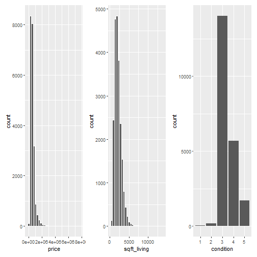

```r
# Load libraries
library(tidyverse)
library(moderndive)
library(skimr)
library(fivethirtyeight)
library(patchwork)
```

### 11.1 Review

### 11.2 Case study: Seattle house prices
#### 11.2.1 Exploratory data analysis: Part I


```r
# Look at raw data
glimpse(house_prices)
```

```
## Rows: 21,613
## Columns: 21
## $ id            <chr> "7129300520", "6414100192", "5631500400", "2487200875", "1954400510", "7237550310", "132~
## $ date          <date> 2014-10-13, 2014-12-09, 2015-02-25, 2014-12-09, 2015-02-18, 2014-05-12, 2014-06-27, 201~
## $ price         <dbl> 221900, 538000, 180000, 604000, 510000, 1225000, 257500, 291850, 229500, 323000, 662500,~
## $ bedrooms      <int> 3, 3, 2, 4, 3, 4, 3, 3, 3, 3, 3, 2, 3, 3, 5, 4, 3, 4, 2, 3, 4, 3, 5, 2, 3, 3, 3, 3, 3, 4~
## $ bathrooms     <dbl> 1.00, 2.25, 1.00, 3.00, 2.00, 4.50, 2.25, 1.50, 1.00, 2.50, 2.50, 1.00, 1.00, 1.75, 2.00~
## $ sqft_living   <int> 1180, 2570, 770, 1960, 1680, 5420, 1715, 1060, 1780, 1890, 3560, 1160, 1430, 1370, 1810,~
## $ sqft_lot      <int> 5650, 7242, 10000, 5000, 8080, 101930, 6819, 9711, 7470, 6560, 9796, 6000, 19901, 9680, ~
## $ floors        <dbl> 1.0, 2.0, 1.0, 1.0, 1.0, 1.0, 2.0, 1.0, 1.0, 2.0, 1.0, 1.0, 1.5, 1.0, 1.5, 2.0, 2.0, 1.5~
## $ waterfront    <lgl> FALSE, FALSE, FALSE, FALSE, FALSE, FALSE, FALSE, FALSE, FALSE, FALSE, FALSE, FALSE, FALS~
## $ view          <int> 0, 0, 0, 0, 0, 0, 0, 0, 0, 0, 0, 0, 0, 0, 0, 3, 0, 0, 0, 0, 0, 4, 0, 0, 0, 0, 0, 0, 0, 0~
## $ condition     <fct> 3, 3, 3, 5, 3, 3, 3, 3, 3, 3, 3, 4, 4, 4, 3, 3, 3, 4, 4, 4, 4, 3, 3, 3, 4, 5, 3, 5, 3, 3~
## $ grade         <fct> 7, 7, 6, 7, 8, 11, 7, 7, 7, 7, 8, 7, 7, 7, 7, 9, 7, 7, 7, 7, 7, 9, 8, 7, 8, 6, 8, 8, 7, ~
## $ sqft_above    <int> 1180, 2170, 770, 1050, 1680, 3890, 1715, 1060, 1050, 1890, 1860, 860, 1430, 1370, 1810, ~
## $ sqft_basement <int> 0, 400, 0, 910, 0, 1530, 0, 0, 730, 0, 1700, 300, 0, 0, 0, 970, 0, 0, 0, 0, 760, 720, 0,~
## $ yr_built      <int> 1955, 1951, 1933, 1965, 1987, 2001, 1995, 1963, 1960, 2003, 1965, 1942, 1927, 1977, 1900~
## $ yr_renovated  <int> 0, 1991, 0, 0, 0, 0, 0, 0, 0, 0, 0, 0, 0, 0, 0, 0, 0, 0, 0, 0, 0, 0, 0, 0, 0, 0, 0, 0, 0~
## $ zipcode       <fct> 98178, 98125, 98028, 98136, 98074, 98053, 98003, 98198, 98146, 98038, 98007, 98115, 9802~
## $ lat           <dbl> 47.5112, 47.7210, 47.7379, 47.5208, 47.6168, 47.6561, 47.3097, 47.4095, 47.5123, 47.3684~
## $ long          <dbl> -122.257, -122.319, -122.233, -122.393, -122.045, -122.005, -122.327, -122.315, -122.337~
## $ sqft_living15 <int> 1340, 1690, 2720, 1360, 1800, 4760, 2238, 1650, 1780, 2390, 2210, 1330, 1780, 1370, 1360~
## $ sqft_lot15    <int> 5650, 7639, 8062, 5000, 7503, 101930, 6819, 9711, 8113, 7570, 8925, 6000, 12697, 10208, ~
```


```r
# Skim interesting variables
house_prices %>% 
  select(price, sqft_living, condition) %>% 
  skim()
```


Table: Data summary

|                         |           |
|:------------------------|:----------|
|Name                     |Piped data |
|Number of rows           |21613      |
|Number of columns        |3          |
|_______________________  |           |
|Column type frequency:   |           |
|factor                   |1          |
|numeric                  |2          |
|________________________ |           |
|Group variables          |None       |


**Variable type: factor**

|skim_variable | n_missing| complete_rate|ordered | n_unique|top_counts                         |
|:-------------|---------:|-------------:|:-------|--------:|:----------------------------------|
|condition     |         0|             1|FALSE   |        5|3: 14031, 4: 5679, 5: 1701, 2: 172 |


**Variable type: numeric**

|skim_variable | n_missing| complete_rate|     mean|        sd|    p0|    p25|    p50|    p75|    p100|hist                                     |
|:-------------|---------:|-------------:|--------:|---------:|-----:|------:|------:|------:|-------:|:----------------------------------------|
|price         |         0|             1| 540088.1| 367127.20| 75000| 321950| 450000| 645000| 7700000|▇▁▁▁▁ |
|sqft_living   |         0|             1|   2079.9|    918.44|   290|   1427|   1910|   2550|   13540|▇▂▁▁▁ |


```r
# Exploratory vizualisations
(house_prices %>% 
   ggplot(aes(price)) +
   geom_histogram(color = "white")) +
  (house_prices %>% 
     ggplot(aes(sqft_living)) +
     geom_histogram(color = "white")) +
  (house_prices %>% 
     ggplot(aes(condition)) +
     geom_bar())
```

```
## `stat_bin()` using `bins = 30`. Pick better value with `binwidth`.
## `stat_bin()` using `bins = 30`. Pick better value with `binwidth`.
```



```r
# Log10 transform the numeric variables because of long right tail
house_prices <-
  house_prices %>% 
  mutate(log10_price = log10(price),
         log10_size = log10(sqft_living))
house_prices
```

```
## # A tibble: 21,613 x 23
##    id         date         price bedrooms bathrooms sqft_living sqft_lot floors waterfront  view condition grade
##    <chr>      <date>       <dbl>    <int>     <dbl>       <int>    <int>  <dbl> <lgl>      <int> <fct>     <fct>
##  1 7129300520 2014-10-13  221900        3      1           1180     5650      1 FALSE          0 3         7    
##  2 6414100192 2014-12-09  538000        3      2.25        2570     7242      2 FALSE          0 3         7    
##  3 5631500400 2015-02-25  180000        2      1            770    10000      1 FALSE          0 3         6    
##  4 2487200875 2014-12-09  604000        4      3           1960     5000      1 FALSE          0 5         7    
##  5 1954400510 2015-02-18  510000        3      2           1680     8080      1 FALSE          0 3         8    
##  6 7237550310 2014-05-12 1225000        4      4.5         5420   101930      1 FALSE          0 3         11   
##  7 1321400060 2014-06-27  257500        3      2.25        1715     6819      2 FALSE          0 3         7    
##  8 2008000270 2015-01-15  291850        3      1.5         1060     9711      1 FALSE          0 3         7    
##  9 2414600126 2015-04-15  229500        3      1           1780     7470      1 FALSE          0 3         7    
## 10 3793500160 2015-03-12  323000        3      2.5         1890     6560      2 FALSE          0 3         7    
## # ... with 21,603 more rows, and 11 more variables: sqft_above <int>, sqft_basement <int>, yr_built <int>,
## #   yr_renovated <int>, zipcode <fct>, lat <dbl>, long <dbl>, sqft_living15 <int>, sqft_lot15 <int>,
## #   log10_price <dbl>, log10_size <dbl>
```


```r
# Before and after visualization
((house_prices %>% 
   ggplot(aes(price)) +
   geom_histogram(color = "white")) +
  (house_prices %>% 
   ggplot(aes(log10_price)) +
   geom_histogram(color = "white"))) /
  ((house_prices %>% 
   ggplot(aes(sqft_living)) +
   geom_histogram(color = "white")) +
  (house_prices %>% 
   ggplot(aes(log10_size)) +
   geom_histogram(color = "white")))
```

```
## `stat_bin()` using `bins = 30`. Pick better value with `binwidth`.
## `stat_bin()` using `bins = 30`. Pick better value with `binwidth`.
## `stat_bin()` using `bins = 30`. Pick better value with `binwidth`.
## `stat_bin()` using `bins = 30`. Pick better value with `binwidth`.
```


#### 11.2.2 Exploratory data analysis: Part II


```r
(# Plot interaction model
house_prices %>% 
  ggplot(aes(log10_size, log10_price, color = condition)) +
  geom_point(alpha = 0.05) +
  geom_smooth(method = "lm", se = FALSE) +
  theme(legend.position = "none")) +
  
(# Plot parallel slopes model
house_prices %>% 
  ggplot(aes(log10_size, log10_price, color = condition)) +
  geom_point(alpha = 0.05) +
  geom_parallel_slopes(se = FALSE))
```

```
## `geom_smooth()` using formula 'y ~ x'
```


```r
# Show faceted version of interaction model
house_prices %>% 
  ggplot(aes(log10_size, log10_price, color = condition)) +
  geom_point(alpha = 0.25) +
  geom_smooth(method = "lm", se = FALSE) +
  facet_wrap(~ condition)
```

```
## `geom_smooth()` using formula 'y ~ x'
```


#### 11.2.3 Regression modeling


```r
# Fit model with interaction
price_interaction <-
  house_prices %>% 
  lm(log10_price ~ log10_size * condition, data = .)

get_regression_table(price_interaction)
```

```
## # A tibble: 10 x 7
##    term                  estimate std_error statistic p_value lower_ci upper_ci
##    <chr>                    <dbl>     <dbl>     <dbl>   <dbl>    <dbl>    <dbl>
##  1 intercept                3.33      0.451     7.38    0        2.45     4.22 
##  2 log10_size               0.69      0.148     4.65    0        0.399    0.98 
##  3 condition: 2             0.047     0.498     0.094   0.925   -0.93     1.02 
##  4 condition: 3            -0.367     0.452    -0.812   0.417   -1.25     0.519
##  5 condition: 4            -0.398     0.453    -0.879   0.38    -1.29     0.49 
##  6 condition: 5            -0.883     0.457    -1.93    0.053   -1.78     0.013
##  7 log10_size:condition2   -0.024     0.163    -0.148   0.882   -0.344    0.295
##  8 log10_size:condition3    0.133     0.148     0.893   0.372   -0.158    0.424
##  9 log10_size:condition4    0.146     0.149     0.979   0.328   -0.146    0.437
## 10 log10_size:condition5    0.31      0.15      2.07    0.039    0.016    0.604
```

#### 11.2.4 Making predictions

Say you’re a realtor and someone calls you asking you how much their home will sell for. They tell you that it’s in condition = 5 and is sized 1900 square feet. What do you tell them? Let’s use the interaction model we fit to make predictions!


```r
# Use predict to get the predicted log10 price
predicted_log10_price_interaction <-
  price_interaction %>% 
  predict(newdata = tibble(condition = factor(5), log10_size = log10(1900))) %>% 
  unname()
predicted_log10_price_interaction
```

```
## [1] 5.724213
```


```r
# unlog the get the real price
10^predicted_log10_price_interaction
```

```
## [1] 529923.9
```


```r
# (LC11.1) Repeat the regression modeling in Subsection 11.2.3 and the prediction making you just did on the house of condition 5 and size 1900 square feet in Subsection 11.2.4, but using the parallel slopes model you visualized in Figure 11.6. Show that it’s $524,807!

# Fit model with interaction
price_parallel_slopes <-
  house_prices %>% 
  lm(log10_price ~ log10_size + condition, data = .)

get_regression_table(price_parallel_slopes)
```

```
## # A tibble: 6 x 7
##   term         estimate std_error statistic p_value lower_ci upper_ci
##   <chr>           <dbl>     <dbl>     <dbl>   <dbl>    <dbl>    <dbl>
## 1 intercept       2.88      0.036     80.0    0        2.81     2.95 
## 2 log10_size      0.837     0.006    134.     0        0.825    0.85 
## 3 condition: 2   -0.039     0.033     -1.16   0.246   -0.104    0.027
## 4 condition: 3    0.032     0.031      1.04   0.3     -0.028    0.092
## 5 condition: 4    0.044     0.031      1.42   0.155   -0.017    0.104
## 6 condition: 5    0.096     0.031      3.09   0.002    0.035    0.156
```

```r
predicted_log10_price_parallel_slopes <-
  price_parallel_slopes %>% 
  predict(newdata = tibble(condition = factor(5), log10_size = log10(1900))) %>% 
  unname()
predicted_log10_price_parallel_slopes
```

```
## [1] 5.722644
```

```r
10^predicted_log10_price_parallel_slopes
```

```
## [1] 528012.5
```

### 11.3 Case study: Effective data storytelling

#### 11.3.2 US Births in 1999


```r
glimpse(US_births_1994_2003)
```

```
## Rows: 3,652
## Columns: 6
## $ year          <int> 1994, 1994, 1994, 1994, 1994, 1994, 1994, 1994, 1994, 1994, 1994, 1994, 1994, 1994, 1994~
## $ month         <int> 1, 1, 1, 1, 1, 1, 1, 1, 1, 1, 1, 1, 1, 1, 1, 1, 1, 1, 1, 1, 1, 1, 1, 1, 1, 1, 1, 1, 1, 1~
## $ date_of_month <int> 1, 2, 3, 4, 5, 6, 7, 8, 9, 10, 11, 12, 13, 14, 15, 16, 17, 18, 19, 20, 21, 22, 23, 24, 2~
## $ date          <date> 1994-01-01, 1994-01-02, 1994-01-03, 1994-01-04, 1994-01-05, 1994-01-06, 1994-01-07, 199~
## $ day_of_week   <ord> Sat, Sun, Mon, Tues, Wed, Thurs, Fri, Sat, Sun, Mon, Tues, Wed, Thurs, Fri, Sat, Sun, Mo~
## $ births        <int> 8096, 7772, 10142, 11248, 11053, 11406, 11251, 8653, 7910, 10498, 11706, 11567, 11212, 1~
```


```r
US_Biths_1999 <-
  US_births_1994_2003 %>% 
  filter(year == 1999)
```


```r
US_Biths_1999 %>% 
  ggplot(aes(date, births)) +
  geom_line() +
  labs(x = "Date", 
       y = "Number of births", 
       title = "US Births in 1999")
```


```r
US_Biths_1999 %>% 
  arrange(desc(births))
```

```
## # A tibble: 365 x 6
##     year month date_of_month date       day_of_week births
##    <int> <int>         <int> <date>     <ord>        <int>
##  1  1999     9             9 1999-09-09 Thurs        14540
##  2  1999    12            21 1999-12-21 Tues         13508
##  3  1999     9             8 1999-09-08 Wed          13437
##  4  1999     9            21 1999-09-21 Tues         13384
##  5  1999     9            28 1999-09-28 Tues         13358
##  6  1999     7             7 1999-07-07 Wed          13343
##  7  1999     7             8 1999-07-08 Thurs        13245
##  8  1999     8            17 1999-08-17 Tues         13201
##  9  1999     9            10 1999-09-10 Fri          13181
## 10  1999    12            28 1999-12-28 Tues         13158
## # ... with 355 more rows
```


```r
# (LC11.2) What date between 1994 and 2003 has the fewest number of births in the US? What story could you tell about why this is the case?

US_births_1994_2003 %>% 
  arrange(births)
```

```
## # A tibble: 3,652 x 6
##     year month date_of_month date       day_of_week births
##    <int> <int>         <int> <date>     <ord>        <int>
##  1  2001    12            25 2001-12-25 Tues          6443
##  2  2000    12            25 2000-12-25 Mon           6566
##  3  2003    12            25 2003-12-25 Thurs         6628
##  4  2002    12            25 2002-12-25 Wed           6629
##  5  1999    12            25 1999-12-25 Sat           6674
##  6  2000    12            24 2000-12-24 Sun           6801
##  7  1995    12            24 1995-12-24 Sun           6999
##  8  2002     4             7 2002-04-07 Sun           7008
##  9  2002     3            31 2002-03-31 Sun           7019
## 10  1998    12            25 1998-12-25 Fri           7020
## # ... with 3,642 more rows
```

```r
# A: Chirstmas day seems to be the day when the least number of births occur.
```


