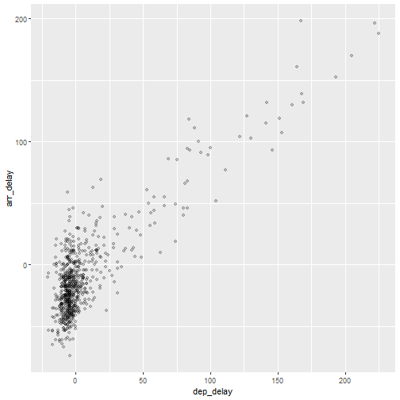
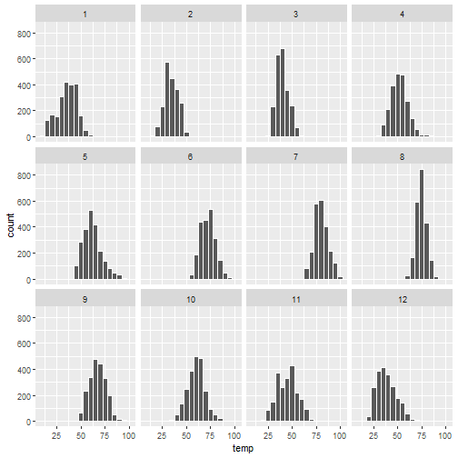
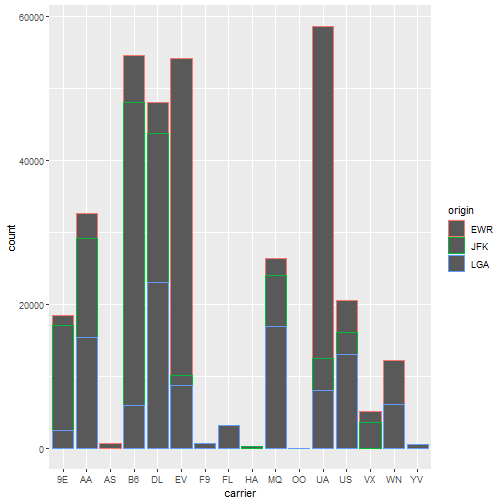

```r
# Load libraries
library(tidyverse)
```

```
## -- Attaching packages ------------------------------------------------------------------------ tidyverse 1.3.1 --
```

```
## v ggplot2 3.3.5     v purrr   0.3.4
## v tibble  3.1.6     v dplyr   1.0.8
## v tidyr   1.2.0     v stringr 1.4.0
## v readr   2.1.2     v forcats 0.5.1
```

```
## -- Conflicts --------------------------------------------------------------------------- tidyverse_conflicts() --
## x dplyr::filter() masks stats::filter()
## x dplyr::lag()    masks stats::lag()
```

```r
library(nycflights13)
```

```
## Warning: package 'nycflights13' was built under R version 4.1.3
```

```r
# Load function to clear libraries
source(here::here("clear_libraries.R"))
```


```r
# (LC2.1) Take a look at both the flights and alaska_flights data frames by 
# running View(flights) and View(alaska_flights). 
# In what respect do these data frames differ? 
# For example, think about the number of rows in each dataset.

# A: (see outputs below)
# The alaska_flights df has only 714 rows compared to >336k in the full df
```


```r
glimpse(flights)
```

```
## Rows: 336,776
## Columns: 19
## $ year           <int> 2013, 2013, 2013, 2013, 2013, 2013, 2013, 2013, 2013, 2013, 2013, 2013, 2013, 2013, 2013~
## $ month          <int> 1, 1, 1, 1, 1, 1, 1, 1, 1, 1, 1, 1, 1, 1, 1, 1, 1, 1, 1, 1, 1, 1, 1, 1, 1, 1, 1, 1, 1, 1~
## $ day            <int> 1, 1, 1, 1, 1, 1, 1, 1, 1, 1, 1, 1, 1, 1, 1, 1, 1, 1, 1, 1, 1, 1, 1, 1, 1, 1, 1, 1, 1, 1~
## $ dep_time       <int> 517, 533, 542, 544, 554, 554, 555, 557, 557, 558, 558, 558, 558, 558, 559, 559, 559, 600~
## $ sched_dep_time <int> 515, 529, 540, 545, 600, 558, 600, 600, 600, 600, 600, 600, 600, 600, 600, 559, 600, 600~
## $ dep_delay      <dbl> 2, 4, 2, -1, -6, -4, -5, -3, -3, -2, -2, -2, -2, -2, -1, 0, -1, 0, 0, 1, -8, -3, -4, -4,~
## $ arr_time       <int> 830, 850, 923, 1004, 812, 740, 913, 709, 838, 753, 849, 853, 924, 923, 941, 702, 854, 85~
## $ sched_arr_time <int> 819, 830, 850, 1022, 837, 728, 854, 723, 846, 745, 851, 856, 917, 937, 910, 706, 902, 85~
## $ arr_delay      <dbl> 11, 20, 33, -18, -25, 12, 19, -14, -8, 8, -2, -3, 7, -14, 31, -4, -8, -7, 12, -6, -8, 16~
## $ carrier        <chr> "UA", "UA", "AA", "B6", "DL", "UA", "B6", "EV", "B6", "AA", "B6", "B6", "UA", "UA", "AA"~
## $ flight         <int> 1545, 1714, 1141, 725, 461, 1696, 507, 5708, 79, 301, 49, 71, 194, 1124, 707, 1806, 1187~
## $ tailnum        <chr> "N14228", "N24211", "N619AA", "N804JB", "N668DN", "N39463", "N516JB", "N829AS", "N593JB"~
## $ origin         <chr> "EWR", "LGA", "JFK", "JFK", "LGA", "EWR", "EWR", "LGA", "JFK", "LGA", "JFK", "JFK", "JFK~
## $ dest           <chr> "IAH", "IAH", "MIA", "BQN", "ATL", "ORD", "FLL", "IAD", "MCO", "ORD", "PBI", "TPA", "LAX~
## $ air_time       <dbl> 227, 227, 160, 183, 116, 150, 158, 53, 140, 138, 149, 158, 345, 361, 257, 44, 337, 152, ~
## $ distance       <dbl> 1400, 1416, 1089, 1576, 762, 719, 1065, 229, 944, 733, 1028, 1005, 2475, 2565, 1389, 187~
## $ hour           <dbl> 5, 5, 5, 5, 6, 5, 6, 6, 6, 6, 6, 6, 6, 6, 6, 5, 6, 6, 6, 6, 6, 6, 6, 6, 6, 6, 6, 6, 6, 6~
## $ minute         <dbl> 15, 29, 40, 45, 0, 58, 0, 0, 0, 0, 0, 0, 0, 0, 0, 59, 0, 0, 0, 0, 10, 5, 10, 10, 7, 0, 0~
## $ time_hour      <dttm> 2013-01-01 05:00:00, 2013-01-01 05:00:00, 2013-01-01 05:00:00, 2013-01-01 05:00:00, 201~
```


```r
alaska_flights <-
  flights %>% 
  filter(carrier == "AS") 

glimpse(alaska_flights)
```

```
## Rows: 714
## Columns: 19
## $ year           <int> 2013, 2013, 2013, 2013, 2013, 2013, 2013, 2013, 2013, 2013, 2013, 2013, 2013, 2013, 2013~
## $ month          <int> 1, 1, 1, 1, 1, 1, 1, 1, 1, 1, 1, 1, 1, 1, 1, 1, 1, 1, 1, 1, 1, 1, 1, 1, 1, 1, 1, 1, 1, 1~
## $ day            <int> 1, 1, 2, 2, 3, 3, 4, 4, 5, 5, 6, 6, 7, 7, 8, 8, 9, 9, 10, 10, 11, 11, 12, 12, 13, 13, 14~
## $ dep_time       <int> 724, 1808, 722, 1818, 724, 1817, 725, 1808, 725, 1803, 722, 1817, 727, 1826, 719, 1844, ~
## $ sched_dep_time <int> 725, 1815, 725, 1815, 725, 1815, 725, 1815, 725, 1815, 725, 1815, 725, 1815, 725, 1815, ~
## $ dep_delay      <dbl> -1, -7, -3, 3, -1, 2, 0, -7, 0, -12, -3, 2, 2, 11, -6, 29, 15, 10, -6, -4, -6, 5, 24, -1~
## $ arr_time       <int> 1020, 2111, 949, 2131, 1012, 2121, 1031, 2101, 1011, 2118, 1024, 2146, 1100, 2138, 1037,~
## $ sched_arr_time <int> 1030, 2130, 1030, 2130, 1030, 2130, 1030, 2130, 1030, 2130, 1030, 2130, 1030, 2130, 1030~
## $ arr_delay      <dbl> -10, -19, -41, 1, -18, -9, 1, -29, -19, -12, -6, 16, 30, 8, 7, 29, 32, 40, -19, -19, -52~
## $ carrier        <chr> "AS", "AS", "AS", "AS", "AS", "AS", "AS", "AS", "AS", "AS", "AS", "AS", "AS", "AS", "AS"~
## $ flight         <int> 11, 7, 11, 7, 11, 7, 11, 7, 11, 7, 11, 7, 11, 7, 11, 7, 11, 7, 11, 7, 11, 7, 11, 7, 11, ~
## $ tailnum        <chr> "N594AS", "N553AS", "N592AS", "N552AS", "N533AS", "N552AS", "N579AS", "N553AS", "N546AS"~
## $ origin         <chr> "EWR", "EWR", "EWR", "EWR", "EWR", "EWR", "EWR", "EWR", "EWR", "EWR", "EWR", "EWR", "EWR~
## $ dest           <chr> "SEA", "SEA", "SEA", "SEA", "SEA", "SEA", "SEA", "SEA", "SEA", "SEA", "SEA", "SEA", "SEA~
## $ air_time       <dbl> 338, 336, 314, 332, 325, 327, 345, 338, 330, 343, 341, 350, 364, 336, 347, 346, 358, 359~
## $ distance       <dbl> 2402, 2402, 2402, 2402, 2402, 2402, 2402, 2402, 2402, 2402, 2402, 2402, 2402, 2402, 2402~
## $ hour           <dbl> 7, 18, 7, 18, 7, 18, 7, 18, 7, 18, 7, 18, 7, 18, 7, 18, 7, 18, 7, 18, 7, 18, 7, 18, 7, 1~
## $ minute         <dbl> 25, 15, 25, 15, 25, 15, 25, 15, 25, 15, 25, 15, 25, 15, 25, 15, 25, 15, 25, 15, 25, 15, ~
## $ time_hour      <dttm> 2013-01-01 07:00:00, 2013-01-01 18:00:00, 2013-01-02 07:00:00, 2013-01-02 18:00:00, 201~
```
#### 5NG#1: Scatterplots

```r
alaska_flights %>% 
  ggplot(aes(dep_delay, arr_delay)) +
  geom_point() 
```

```
## Warning: Removed 5 rows containing missing values (geom_point).
```


```r
# (LC2.2) What are some practical reasons why dep_delay and arr_delay have 
# a positive relationship?

# A: Any flight that leaves late is more likely to arrive late
```


```r
# (LC2.3) What variables in the weather data frame would you expect to have a 
# negative correlation (i.e., a negative relationship) with dep_delay? Why? 
# Remember that we are focusing on numerical variables here. 
# Hint: Explore the weather dataset by using the View() function.

# A: visib (lower visibility, higher delay)

glimpse(weather)
```

```
## Rows: 26,115
## Columns: 15
## $ origin     <chr> "EWR", "EWR", "EWR", "EWR", "EWR", "EWR", "EWR", "EWR", "EWR", "EWR", "EWR", "EWR", "EWR", "~
## $ year       <int> 2013, 2013, 2013, 2013, 2013, 2013, 2013, 2013, 2013, 2013, 2013, 2013, 2013, 2013, 2013, 20~
## $ month      <int> 1, 1, 1, 1, 1, 1, 1, 1, 1, 1, 1, 1, 1, 1, 1, 1, 1, 1, 1, 1, 1, 1, 1, 1, 1, 1, 1, 1, 1, 1, 1,~
## $ day        <int> 1, 1, 1, 1, 1, 1, 1, 1, 1, 1, 1, 1, 1, 1, 1, 1, 1, 1, 1, 1, 1, 1, 2, 2, 2, 2, 2, 2, 2, 2, 2,~
## $ hour       <int> 1, 2, 3, 4, 5, 6, 7, 8, 9, 10, 11, 13, 14, 15, 16, 17, 18, 19, 20, 21, 22, 23, 0, 1, 2, 3, 4~
## $ temp       <dbl> 39.02, 39.02, 39.02, 39.92, 39.02, 37.94, 39.02, 39.92, 39.92, 41.00, 41.00, 39.20, 39.02, 3~
## $ dewp       <dbl> 26.06, 26.96, 28.04, 28.04, 28.04, 28.04, 28.04, 28.04, 28.04, 28.04, 26.96, 28.40, 24.08, 2~
## $ humid      <dbl> 59.37, 61.63, 64.43, 62.21, 64.43, 67.21, 64.43, 62.21, 62.21, 59.65, 57.06, 69.67, 54.68, 5~
## $ wind_dir   <dbl> 270, 250, 240, 250, 260, 240, 240, 250, 260, 260, 260, 330, 280, 290, 300, 330, 310, 320, 31~
## $ wind_speed <dbl> 10.35702, 8.05546, 11.50780, 12.65858, 12.65858, 11.50780, 14.96014, 10.35702, 14.96014, 13.~
## $ wind_gust  <dbl> NA, NA, NA, NA, NA, NA, NA, NA, NA, NA, NA, NA, NA, NA, 20.71404, NA, 25.31716, NA, NA, 26.4~
## $ precip     <dbl> 0, 0, 0, 0, 0, 0, 0, 0, 0, 0, 0, 0, 0, 0, 0, 0, 0, 0, 0, 0, 0, 0, 0, 0, 0, 0, 0, 0, 0, 0, 0,~
## $ pressure   <dbl> 1012.0, 1012.3, 1012.5, 1012.2, 1011.9, 1012.4, 1012.2, 1012.2, 1012.7, 1012.4, 1011.4, NA, ~
## $ visib      <dbl> 10, 10, 10, 10, 10, 10, 10, 10, 10, 10, 10, 10, 10, 10, 10, 10, 10, 10, 10, 10, 10, 10, 10, ~
## $ time_hour  <dttm> 2013-01-01 01:00:00, 2013-01-01 02:00:00, 2013-01-01 03:00:00, 2013-01-01 04:00:00, 2013-01~
```


```r
# (LC2.4) Why do you believe there is a cluster of points near (0, 0)?
# What does (0, 0) correspond to in terms of the Alaska Air flights?

# A: Many flights depart and arrive on time. (0, 0) is zero delay
```


```r
# (LC2.5) What are some other features of the plot that stand out to you?

# A: the linear correlation is high (~0.84)
cor(alaska_flights$dep_delay, alaska_flights$arr_delay, use = "complete.obs")
```

```
## [1] 0.8373792
```
#### Scatterplots

```r
# (LC2.6) Create a new scatterplot using different variables in the 
# alaska_flights data frame by modifying the example given.

alaska_flights %>% 
  ggplot(aes(arr_delay, air_time)) +
  geom_point()
```

```
## Warning: Removed 5 rows containing missing values (geom_point).
```


```r
alaska_flights %>% 
  ggplot(aes(dep_delay, arr_delay)) +
  geom_point(alpha = 0.2) 
```

```
## Warning: Removed 5 rows containing missing values (geom_point).
```




```r
alaska_flights %>% 
  ggplot(aes(dep_delay, arr_delay)) +
  geom_jitter(width = 30, height = 30) 
```

```
## Warning: Removed 5 rows containing missing values (geom_point).
```


```r
# (LC2.7) Why is setting the alpha argument value useful with scatterplots? 
# What further information does it give you that a regular scatterplot cannot?

# A: You can see if/where overplotting occurs. 
    # You can see where observations accumulate (distribution of observations)

# (LC2.8) After viewing Figure 2.4, give an approximate range of arrival delays 
# and departure delays that occur most frequently. 

# A: (-20, -70) to (10, 10)

# How has that region changed compared to when you observed the same plot 
# without alpha = 0.2 set in Figure 2.2?

# A: It is more clear to see individual points
```

#### 5NG#2: Linegraphs


```r
glimpse(weather)
```

```
## Rows: 26,115
## Columns: 15
## $ origin     <chr> "EWR", "EWR", "EWR", "EWR", "EWR", "EWR", "EWR", "EWR", "EWR", "EWR", "EWR", "EWR", "EWR", "~
## $ year       <int> 2013, 2013, 2013, 2013, 2013, 2013, 2013, 2013, 2013, 2013, 2013, 2013, 2013, 2013, 2013, 20~
## $ month      <int> 1, 1, 1, 1, 1, 1, 1, 1, 1, 1, 1, 1, 1, 1, 1, 1, 1, 1, 1, 1, 1, 1, 1, 1, 1, 1, 1, 1, 1, 1, 1,~
## $ day        <int> 1, 1, 1, 1, 1, 1, 1, 1, 1, 1, 1, 1, 1, 1, 1, 1, 1, 1, 1, 1, 1, 1, 2, 2, 2, 2, 2, 2, 2, 2, 2,~
## $ hour       <int> 1, 2, 3, 4, 5, 6, 7, 8, 9, 10, 11, 13, 14, 15, 16, 17, 18, 19, 20, 21, 22, 23, 0, 1, 2, 3, 4~
## $ temp       <dbl> 39.02, 39.02, 39.02, 39.92, 39.02, 37.94, 39.02, 39.92, 39.92, 41.00, 41.00, 39.20, 39.02, 3~
## $ dewp       <dbl> 26.06, 26.96, 28.04, 28.04, 28.04, 28.04, 28.04, 28.04, 28.04, 28.04, 26.96, 28.40, 24.08, 2~
## $ humid      <dbl> 59.37, 61.63, 64.43, 62.21, 64.43, 67.21, 64.43, 62.21, 62.21, 59.65, 57.06, 69.67, 54.68, 5~
## $ wind_dir   <dbl> 270, 250, 240, 250, 260, 240, 240, 250, 260, 260, 260, 330, 280, 290, 300, 330, 310, 320, 31~
## $ wind_speed <dbl> 10.35702, 8.05546, 11.50780, 12.65858, 12.65858, 11.50780, 14.96014, 10.35702, 14.96014, 13.~
## $ wind_gust  <dbl> NA, NA, NA, NA, NA, NA, NA, NA, NA, NA, NA, NA, NA, NA, 20.71404, NA, 25.31716, NA, NA, 26.4~
## $ precip     <dbl> 0, 0, 0, 0, 0, 0, 0, 0, 0, 0, 0, 0, 0, 0, 0, 0, 0, 0, 0, 0, 0, 0, 0, 0, 0, 0, 0, 0, 0, 0, 0,~
## $ pressure   <dbl> 1012.0, 1012.3, 1012.5, 1012.2, 1011.9, 1012.4, 1012.2, 1012.2, 1012.7, 1012.4, 1011.4, NA, ~
## $ visib      <dbl> 10, 10, 10, 10, 10, 10, 10, 10, 10, 10, 10, 10, 10, 10, 10, 10, 10, 10, 10, 10, 10, 10, 10, ~
## $ time_hour  <dttm> 2013-01-01 01:00:00, 2013-01-01 02:00:00, 2013-01-01 03:00:00, 2013-01-01 04:00:00, 2013-01~
```


```r
early_january_weather <-
  weather %>% 
  filter(origin == "EWR", month == 1, day <= 15)
```


```r
# (LC2.9) Take a look at both the weather and early_january_weather data frames 
# by running View(weather) and View(early_january_weather). 
# In what respect do these data frames differ?

glimpse(early_january_weather)
```

```
## Rows: 358
## Columns: 15
## $ origin     <chr> "EWR", "EWR", "EWR", "EWR", "EWR", "EWR", "EWR", "EWR", "EWR", "EWR", "EWR", "EWR", "EWR", "~
## $ year       <int> 2013, 2013, 2013, 2013, 2013, 2013, 2013, 2013, 2013, 2013, 2013, 2013, 2013, 2013, 2013, 20~
## $ month      <int> 1, 1, 1, 1, 1, 1, 1, 1, 1, 1, 1, 1, 1, 1, 1, 1, 1, 1, 1, 1, 1, 1, 1, 1, 1, 1, 1, 1, 1, 1, 1,~
## $ day        <int> 1, 1, 1, 1, 1, 1, 1, 1, 1, 1, 1, 1, 1, 1, 1, 1, 1, 1, 1, 1, 1, 1, 2, 2, 2, 2, 2, 2, 2, 2, 2,~
## $ hour       <int> 1, 2, 3, 4, 5, 6, 7, 8, 9, 10, 11, 13, 14, 15, 16, 17, 18, 19, 20, 21, 22, 23, 0, 1, 2, 3, 4~
## $ temp       <dbl> 39.02, 39.02, 39.02, 39.92, 39.02, 37.94, 39.02, 39.92, 39.92, 41.00, 41.00, 39.20, 39.02, 3~
## $ dewp       <dbl> 26.06, 26.96, 28.04, 28.04, 28.04, 28.04, 28.04, 28.04, 28.04, 28.04, 26.96, 28.40, 24.08, 2~
## $ humid      <dbl> 59.37, 61.63, 64.43, 62.21, 64.43, 67.21, 64.43, 62.21, 62.21, 59.65, 57.06, 69.67, 54.68, 5~
## $ wind_dir   <dbl> 270, 250, 240, 250, 260, 240, 240, 250, 260, 260, 260, 330, 280, 290, 300, 330, 310, 320, 31~
## $ wind_speed <dbl> 10.35702, 8.05546, 11.50780, 12.65858, 12.65858, 11.50780, 14.96014, 10.35702, 14.96014, 13.~
## $ wind_gust  <dbl> NA, NA, NA, NA, NA, NA, NA, NA, NA, NA, NA, NA, NA, NA, 20.71404, NA, 25.31716, NA, NA, 26.4~
## $ precip     <dbl> 0, 0, 0, 0, 0, 0, 0, 0, 0, 0, 0, 0, 0, 0, 0, 0, 0, 0, 0, 0, 0, 0, 0, 0, 0, 0, 0, 0, 0, 0, 0,~
## $ pressure   <dbl> 1012.0, 1012.3, 1012.5, 1012.2, 1011.9, 1012.4, 1012.2, 1012.2, 1012.7, 1012.4, 1011.4, NA, ~
## $ visib      <dbl> 10, 10, 10, 10, 10, 10, 10, 10, 10, 10, 10, 10, 10, 10, 10, 10, 10, 10, 10, 10, 10, 10, 10, ~
## $ time_hour  <dttm> 2013-01-01 01:00:00, 2013-01-01 02:00:00, 2013-01-01 03:00:00, 2013-01-01 04:00:00, 2013-01~
```

```r
# A: early_january_weather has only 358 rows compared to the >26k in the full df
```


```r
# (LC2.10) View() the flights data frame again. Why does the time_hour variable 
# uniquely identify the hour of the measurement, whereas the hour variable does not?

# A: time_hour identifies the year/month/day together with the hour/minutes/seconds

glimpse(flights)
```

```
## Rows: 336,776
## Columns: 19
## $ year           <int> 2013, 2013, 2013, 2013, 2013, 2013, 2013, 2013, 2013, 2013, 2013, 2013, 2013, 2013, 2013~
## $ month          <int> 1, 1, 1, 1, 1, 1, 1, 1, 1, 1, 1, 1, 1, 1, 1, 1, 1, 1, 1, 1, 1, 1, 1, 1, 1, 1, 1, 1, 1, 1~
## $ day            <int> 1, 1, 1, 1, 1, 1, 1, 1, 1, 1, 1, 1, 1, 1, 1, 1, 1, 1, 1, 1, 1, 1, 1, 1, 1, 1, 1, 1, 1, 1~
## $ dep_time       <int> 517, 533, 542, 544, 554, 554, 555, 557, 557, 558, 558, 558, 558, 558, 559, 559, 559, 600~
## $ sched_dep_time <int> 515, 529, 540, 545, 600, 558, 600, 600, 600, 600, 600, 600, 600, 600, 600, 559, 600, 600~
## $ dep_delay      <dbl> 2, 4, 2, -1, -6, -4, -5, -3, -3, -2, -2, -2, -2, -2, -1, 0, -1, 0, 0, 1, -8, -3, -4, -4,~
## $ arr_time       <int> 830, 850, 923, 1004, 812, 740, 913, 709, 838, 753, 849, 853, 924, 923, 941, 702, 854, 85~
## $ sched_arr_time <int> 819, 830, 850, 1022, 837, 728, 854, 723, 846, 745, 851, 856, 917, 937, 910, 706, 902, 85~
## $ arr_delay      <dbl> 11, 20, 33, -18, -25, 12, 19, -14, -8, 8, -2, -3, 7, -14, 31, -4, -8, -7, 12, -6, -8, 16~
## $ carrier        <chr> "UA", "UA", "AA", "B6", "DL", "UA", "B6", "EV", "B6", "AA", "B6", "B6", "UA", "UA", "AA"~
## $ flight         <int> 1545, 1714, 1141, 725, 461, 1696, 507, 5708, 79, 301, 49, 71, 194, 1124, 707, 1806, 1187~
## $ tailnum        <chr> "N14228", "N24211", "N619AA", "N804JB", "N668DN", "N39463", "N516JB", "N829AS", "N593JB"~
## $ origin         <chr> "EWR", "LGA", "JFK", "JFK", "LGA", "EWR", "EWR", "LGA", "JFK", "LGA", "JFK", "JFK", "JFK~
## $ dest           <chr> "IAH", "IAH", "MIA", "BQN", "ATL", "ORD", "FLL", "IAD", "MCO", "ORD", "PBI", "TPA", "LAX~
## $ air_time       <dbl> 227, 227, 160, 183, 116, 150, 158, 53, 140, 138, 149, 158, 345, 361, 257, 44, 337, 152, ~
## $ distance       <dbl> 1400, 1416, 1089, 1576, 762, 719, 1065, 229, 944, 733, 1028, 1005, 2475, 2565, 1389, 187~
## $ hour           <dbl> 5, 5, 5, 5, 6, 5, 6, 6, 6, 6, 6, 6, 6, 6, 6, 5, 6, 6, 6, 6, 6, 6, 6, 6, 6, 6, 6, 6, 6, 6~
## $ minute         <dbl> 15, 29, 40, 45, 0, 58, 0, 0, 0, 0, 0, 0, 0, 0, 0, 59, 0, 0, 0, 0, 10, 5, 10, 10, 7, 0, 0~
## $ time_hour      <dttm> 2013-01-01 05:00:00, 2013-01-01 05:00:00, 2013-01-01 05:00:00, 2013-01-01 05:00:00, 201~
```


```r
early_january_weather %>% 
  ggplot(aes(time_hour, temp)) +
  geom_line() 
```


```r
# (LC2.11) Why should linegraphs be avoided when there is not a clear ordering 
# of the horizontal axis?

# A: linegraphs are only good for data where there is a clear sequential order

# (LC2.12) Why are linegraphs frequently used when time is the explanatory 
# variable on the x-axis?

# A: This creates a nice time-series graph due to the sequental connection of points

# (LC2.13) Plot a time series of a variable other than temp for Newark Airport 
# in the first 15 days of January 2013.
early_january_weather %>% 
  ggplot(aes(time_hour, temp)) +
  geom_line()
```


#### 5NG#3: Histograms

```r
# Basic histogram
weather %>% 
  ggplot(aes(temp)) +
  geom_histogram() 
```

```
## `stat_bin()` using `bins = 30`. Pick better value with `binwidth`.
```

```
## Warning: Removed 1 rows containing non-finite values (stat_bin).
```


```r
# Add white borders
weather %>% 
  ggplot(aes(temp)) +
  geom_histogram(color = "white")
```

```
## `stat_bin()` using `bins = 30`. Pick better value with `binwidth`.
```

```
## Warning: Removed 1 rows containing non-finite values (stat_bin).
```


```r
# Change color
weather %>% 
  ggplot(aes(temp)) +
  geom_histogram(color = "white", fill = "steelblue")
```

```
## `stat_bin()` using `bins = 30`. Pick better value with `binwidth`.
```

```
## Warning: Removed 1 rows containing non-finite values (stat_bin).
```


```r
# Change number of bins
weather %>% 
  ggplot(aes(temp)) +
  geom_histogram(color = "white", bins = 40)
```

```
## Warning: Removed 1 rows containing non-finite values (stat_bin).
```


```r
# Change width of bins
weather %>% 
  ggplot(aes(temp)) +
  geom_histogram(color = "white", binwidth = 10)
```

```
## Warning: Removed 1 rows containing non-finite values (stat_bin).
```


```r
# (LC2.14) What does changing the number of bins from 30 to 40 tell us about 
# the distribution of temperatures?

# A: the distribution is not as smooth with 40 bins; some temps are more frequent

# (LC2.15) Would you classify the distribution of temperatures as symmetric or 
# skewed in one direction or another?

# A: The distribution is symmetric

# (LC2.16) What would you guess is the “center” value in this distribution? 
# Why did you make that choice?

# A: Around 55; This is at the middle of the histogram

# (LC2.17) Is this data spread out greatly from the center or is it close? Why?

# A: Most of the values are between 30-80, so I guess it is quite spread
```


```r
# Facet wrap
weather %>% 
ggplot(aes(temp)) +
  geom_histogram(binwidth = 5, color = "white") +
  facet_wrap(vars(month))
```

```
## Warning: Removed 1 rows containing non-finite values (stat_bin).
```




```r
# Change number of rows
weather %>% 
ggplot(aes(temp)) +
  geom_histogram(binwidth = 5, color = "white") +
  facet_wrap(vars(month), nrow = 4)
```

```
## Warning: Removed 1 rows containing non-finite values (stat_bin).
```


```r
# (LC2.18) What other things do you notice about this faceted plot? 
# How does a faceted plot help us see relationships between two variables?

# A: You can observe the differences in distribution shape between facets

# (LC2.19) What do the numbers 1-12 correspond to in the plot? 
# What about 25, 50, 75, 100?

# A: 1-12 correspond to the months jan-dec; 25-100 correspond to temp in F.

# (LC2.20) For which types of datasets would faceted plots not work well in 
# comparing relationships between variables? Give an example describing the 
# nature of these variables and other important characteristics.

# A: 

# (LC2.21) Does the temp variable in the weather dataset have a lot of variability? 
# Why do you say that?

# A: As answered before, there is quite a broad scale of temperatures
```

#### 5NG#4: Boxplots

```r
weather %>% 
  ggplot(aes(month, temp)) +
  geom_boxplot()
```

```
## Warning: Continuous x aesthetic -- did you forget aes(group=...)?
```

```
## Warning: Removed 1 rows containing non-finite values (stat_boxplot).
```


```r
# Month as factor
weather %>% 
  ggplot(aes(factor(month), temp)) +
  geom_boxplot()
```

```
## Warning: Removed 1 rows containing non-finite values (stat_boxplot).
```


```r
# (LC2.22) What does the dot at the bottom of the plot for May correspond to? 
# Explain what might have occurred in May to produce this point.

# A: The dot is one observation of low temp that is considered an outlier
  # This could be due to a measurement error or a true freezing night.

# (LC2.23) Which months have the highest variability in temperature? 
# What reasons can you give for this?

# A: Looks like Nov-Jan has the greatest IQR

# (LC2.24) We looked at the distribution of the numerical variable temp split 
# by the numerical variable month that we converted using the factor() function
# in order to make a side-by-side boxplot. Why would a boxplot of temp split by 
# the numerical variable pressure similarly converted to a categorical variable
# using the factor() not be informative?

# A: Pressure is a continuous variable unlike 'month', so splitting it to a
  # categorical variable is not simple. It can be done by binning, however.

# (LC2.25) Boxplots provide a simple way to identify outliers. 
# Why may outliers be easier to identify when looking at a boxplot instead of 
# a faceted histogram?

# A: outliers are not pointed out in a histogram so they are more easy to miss.
```

#### 5NG#5: Barplots

```r
fruits <- tibble(fruit = c("apple", "apple", "orange", "apple", "orange"))
fruits_counted <- tibble(fruit = c("apple", "orange"), number = c(3, 2))
```


```r
fruits
```

```
## # A tibble: 5 x 1
##   fruit 
##   <chr> 
## 1 apple 
## 2 apple 
## 3 orange
## 4 apple 
## 5 orange
```


```r
fruits_counted
```

```
## # A tibble: 2 x 2
##   fruit  number
##   <chr>   <dbl>
## 1 apple       3
## 2 orange      2
```


```r
# Not pre-counted
fruits %>% 
  ggplot(aes(fruit)) +
  geom_bar()
```


```r
# Pre-counted
fruits_counted %>% 
  ggplot(aes(fruit, number)) +
  geom_col()
```


```r
# Using geom_bar for un-counted
flights %>% 
  ggplot(aes(carrier)) +
  geom_bar()
```


```r
# Using geom_col for pre-counted
flights %>% 
  count(carrier) %>% 
  ggplot(aes(carrier, n)) +
  geom_col()
```


```r
# (LC2.26) Why are histograms inappropriate for categorical variables?

# A: Historgrams are used for visualizing the distribution of a continuous
  # variable (in discrete bins)

# (LC2.27) What is the difference between histograms and barplots?

# A: I a barplot, the observations belong in categories or levels of factors

# (LC2.28) How many Envoy Air flights departed NYC in 2013?

flights %>% 
  filter(carrier == "MQ") %>% 
  nrow() 
```

```
## [1] 26397
```

```r
# A: 26397

# (LC2.29) What was the 7th highest airline for departed flights from NYC in 2013? 
  # How could we better present the table to get this answer quickly?
flights %>% 
  count(carrier, sort = TRUE) %>% 
  slice(7) %>% 
  pull(carrier) 
```

```
## [1] "US"
```

```r
# A: US
```


```r
# Avoid Pie charts

# (LC2.30) Why should pie charts be avoided and replaced by barplots?

# A: Pie charts make it difficult to judge proportions

# (LC2.31) Why do you think people continue to use pie charts?

# A: Pie charts are common in bussiness viz and easy to do in MS Excel
  # People think they should use them
```


```r
flights %>% 
  ggplot(aes(carrier, fill = origin)) +
  geom_bar()
```


```r
flights %>% 
  ggplot(aes(carrier, color = origin)) +
  geom_bar()
```




```r
flights %>% 
  ggplot(aes(carrier, fill = origin)) +
  geom_bar(position = "dodge")
```


```r
flights %>% 
  ggplot(aes(carrier, fill = origin)) +
  geom_bar(position = position_dodge(preserve = "single"))
```


```r
flights %>% 
  ggplot(aes(carrier)) +
  geom_bar() +
  facet_wrap(vars(origin), ncol = 1)
```


```r
# (LC2.32) What kinds of questions are not easily answered by looking at Figure 2.23?

# A: It is difficult to compare the heights of individual color bars

# (LC2.33) What can you say, if anything, about the relationship between airline 
# and airport in NYC in 2013 in regards to the number of departing flights?

# A: EV and UA use EWR, whereas B6 uses JFK more

# (LC2.34) Why might the side-by-side barplot be preferable to a stacked 
# barplot in this case?

# A: It is easier to compare the number of flights between origins

# (LC2.35) What are the disadvantages of using a dodged barplot, in general?

# (LC2.36) Why is the faceted barplot preferred to the side-by-side and stacked 
# barplots in this case?

# (LC2.37) What information about the different carriers at different airports 
# is more easily seen in the faceted barplot?
```


```r
clear_libraries()
```


