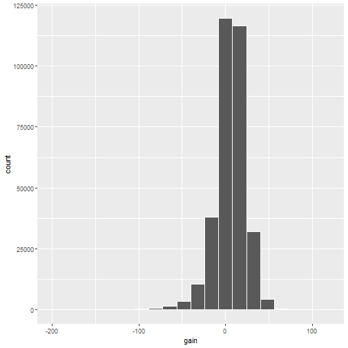

```r
library(tidyverse)
```

```
## -- Attaching packages ------------------------------------------------------------------------ tidyverse 1.3.1 --
```

```
## v ggplot2 3.3.5     v purrr   0.3.4
## v tibble  3.1.6     v dplyr   1.0.8
## v tidyr   1.2.0     v stringr 1.4.0
## v readr   2.1.2     v forcats 0.5.1
```

```
## -- Conflicts --------------------------------------------------------------------------- tidyverse_conflicts() --
## x dplyr::filter() masks stats::filter()
## x dplyr::lag()    masks stats::lag()
```

```r
library(nycflights13)
```

```
## Warning: package 'nycflights13' was built under R version 4.1.3
```

```r
# Load function to clear libraries
source(here::here("clear_libraries.R"))
```


```r
portland_flights <-
  flights %>% 
  filter(dest == "PDX")

portland_flights
```

```
## # A tibble: 1,354 x 19
##     year month   day dep_time sched_dep_time dep_delay arr_time sched_arr_time arr_delay carrier flight tailnum
##    <int> <int> <int>    <int>          <int>     <dbl>    <int>          <int>     <dbl> <chr>    <int> <chr>  
##  1  2013     1     1     1739           1740        -1     2051           2112       -21 DL        1339 N3761R 
##  2  2013     1     1     1805           1757         8     2117           2119        -2 UA        1152 N39463 
##  3  2013     1     1     2052           2029        23     2349           2350        -1 B6         165 N536JB 
##  4  2013     1     2      804            805        -1     1039           1110       -31 UA         423 N528UA 
##  5  2013     1     2     1552           1550         2     1853           1922       -29 DL         667 N371DA 
##  6  2013     1     2     1727           1720         7     2042           2040         2 UA         784 N438UA 
##  7  2013     1     2     1738           1740        -2     2028           2112       -44 DL        1339 N3754A 
##  8  2013     1     2     2024           2029        -5     2314           2350       -36 B6         165 N534JB 
##  9  2013     1     3     1755           1745        10     2110           2117        -7 DL        1394 N399DA 
## 10  2013     1     3     1814           1727        47     2108           2049        19 UA        1454 N14219 
## # ... with 1,344 more rows, and 7 more variables: origin <chr>, dest <chr>, air_time <dbl>, distance <dbl>,
## #   hour <dbl>, minute <dbl>, time_hour <dttm>
```


```r
btv_sea_flights_fall <-
  flights %>%
  filter(origin == "JFK",
         (dest == "BTV" | dest == "SEA"),
         month >= 10)
btv_sea_flights_fall
```

```
## # A tibble: 815 x 19
##     year month   day dep_time sched_dep_time dep_delay arr_time sched_arr_time arr_delay carrier flight tailnum
##    <int> <int> <int>    <int>          <int>     <dbl>    <int>          <int>     <dbl> <chr>    <int> <chr>  
##  1  2013    10     1      729            735        -6     1049           1040         9 DL         183 N721TW 
##  2  2013    10     1      853            900        -7     1217           1157        20 B6          63 N807JB 
##  3  2013    10     1      916            925        -9     1016           1033       -17 B6        1634 N192JB 
##  4  2013    10     1     1216           1221        -5     1326           1328        -2 B6          34 N318JB 
##  5  2013    10     1     1452           1459        -7     1602           1622       -20 B6        1734 N258JB 
##  6  2013    10     1     1459           1500        -1     1817           1829       -12 DL         161 N169DZ 
##  7  2013    10     1     1754           1800        -6     2102           2103        -1 B6         263 N599JB 
##  8  2013    10     1     1825           1830        -5     2159           2150         9 DL         442 N710TW 
##  9  2013    10     1     1925           1930        -5     2227           2250       -23 AA         235 N3DMAA 
## 10  2013    10     1     2238           2245        -7     2348           2353        -5 B6         234 N368JB 
## # ... with 805 more rows, and 7 more variables: origin <chr>, dest <chr>, air_time <dbl>, distance <dbl>,
## #   hour <dbl>, minute <dbl>, time_hour <dttm>
```


```r
not_BTV_SEA <- 
  flights %>% 
  filter(!(dest == "BTV" | dest == "SEA"))
not_BTV_SEA
```

```
## # A tibble: 330,264 x 19
##     year month   day dep_time sched_dep_time dep_delay arr_time sched_arr_time arr_delay carrier flight tailnum
##    <int> <int> <int>    <int>          <int>     <dbl>    <int>          <int>     <dbl> <chr>    <int> <chr>  
##  1  2013     1     1      517            515         2      830            819        11 UA        1545 N14228 
##  2  2013     1     1      533            529         4      850            830        20 UA        1714 N24211 
##  3  2013     1     1      542            540         2      923            850        33 AA        1141 N619AA 
##  4  2013     1     1      544            545        -1     1004           1022       -18 B6         725 N804JB 
##  5  2013     1     1      554            600        -6      812            837       -25 DL         461 N668DN 
##  6  2013     1     1      554            558        -4      740            728        12 UA        1696 N39463 
##  7  2013     1     1      555            600        -5      913            854        19 B6         507 N516JB 
##  8  2013     1     1      557            600        -3      709            723       -14 EV        5708 N829AS 
##  9  2013     1     1      557            600        -3      838            846        -8 B6          79 N593JB 
## 10  2013     1     1      558            600        -2      753            745         8 AA         301 N3ALAA 
## # ... with 330,254 more rows, and 7 more variables: origin <chr>, dest <chr>, air_time <dbl>, distance <dbl>,
## #   hour <dbl>, minute <dbl>, time_hour <dttm>
```


```r
many_airports <- 
  flights %>% 
  filter(dest %in% c("SEA", "SFO", "PDX", "BTV", "BDL"))
many_airports
```

```
## # A tibble: 21,640 x 19
##     year month   day dep_time sched_dep_time dep_delay arr_time sched_arr_time arr_delay carrier flight tailnum
##    <int> <int> <int>    <int>          <int>     <dbl>    <int>          <int>     <dbl> <chr>    <int> <chr>  
##  1  2013     1     1      558            600        -2      923            937       -14 UA        1124 N53441 
##  2  2013     1     1      611            600        11      945            931        14 UA         303 N532UA 
##  3  2013     1     1      655            700        -5     1037           1045        -8 DL        1865 N705TW 
##  4  2013     1     1      724            725        -1     1020           1030       -10 AS          11 N594AS 
##  5  2013     1     1      729            730        -1     1049           1115       -26 VX          11 N635VA 
##  6  2013     1     1      734            737        -3     1047           1113       -26 B6         643 N625JB 
##  7  2013     1     1      743            730        13     1059           1056         3 DL         495 N3760C 
##  8  2013     1     1      745            745         0     1135           1125        10 AA          59 N336AA 
##  9  2013     1     1      746            746         0     1119           1129       -10 UA        1668 N24224 
## 10  2013     1     1      803            800         3     1132           1144       -12 UA         223 N510UA 
## # ... with 21,630 more rows, and 7 more variables: origin <chr>, dest <chr>, air_time <dbl>, distance <dbl>,
## #   hour <dbl>, minute <dbl>, time_hour <dttm>
```


```r
# (LC3.1) What’s another way of using the “not” operator ! to filter only the 
# rows that are not going to Burlington, VT nor Seattle, 
# WA in the flights data frame? Test this out using the previous code.

flights %>% 
  filter(!(dest %in% c("SEA" ,"BTV")))
```

```
## # A tibble: 330,264 x 19
##     year month   day dep_time sched_dep_time dep_delay arr_time sched_arr_time arr_delay carrier flight tailnum
##    <int> <int> <int>    <int>          <int>     <dbl>    <int>          <int>     <dbl> <chr>    <int> <chr>  
##  1  2013     1     1      517            515         2      830            819        11 UA        1545 N14228 
##  2  2013     1     1      533            529         4      850            830        20 UA        1714 N24211 
##  3  2013     1     1      542            540         2      923            850        33 AA        1141 N619AA 
##  4  2013     1     1      544            545        -1     1004           1022       -18 B6         725 N804JB 
##  5  2013     1     1      554            600        -6      812            837       -25 DL         461 N668DN 
##  6  2013     1     1      554            558        -4      740            728        12 UA        1696 N39463 
##  7  2013     1     1      555            600        -5      913            854        19 B6         507 N516JB 
##  8  2013     1     1      557            600        -3      709            723       -14 EV        5708 N829AS 
##  9  2013     1     1      557            600        -3      838            846        -8 B6          79 N593JB 
## 10  2013     1     1      558            600        -2      753            745         8 AA         301 N3ALAA 
## # ... with 330,254 more rows, and 7 more variables: origin <chr>, dest <chr>, air_time <dbl>, distance <dbl>,
## #   hour <dbl>, minute <dbl>, time_hour <dttm>
```


```r
summary_temp <- 
  weather %>% 
  summarise(
    mean = mean(temp), 
    std_dev = sd(temp))
summary_temp
```

```
## # A tibble: 1 x 2
##    mean std_dev
##   <dbl>   <dbl>
## 1    NA      NA
```


```r
# Remove NAs
summary_temp <- 
  weather %>% 
  summarise(
    mean = mean(temp, na.rm = TRUE), 
    std_dev = sd(temp, na.rm = TRUE))
summary_temp
```

```
## # A tibble: 1 x 2
##    mean std_dev
##   <dbl>   <dbl>
## 1  55.3    17.8
```


```r
# (LC3.2) Say a doctor is studying the effect of smoking on lung cancer for a 
# large number of patients who have records measured at five-year intervals. 
# She notices that a large number of patients have missing data points because 
# the patient has died, so she chooses to ignore these patients in her analysis.
# What is wrong with this doctor’s approach?

# A: These patients could have died of lung cancer

# (LC3.3) Modify the earlier summarize() function code that creates the 
# summary_temp data frame to also use the n() summary function: 
# summarize(... , count = n()). What does the returned value correspond to?

# A: the number of observations (rows) in the dataset

summary_temp <- 
  weather %>% 
  summarise(
    mean = mean(temp, na.rm = TRUE), 
    std_dev = sd(temp, na.rm = TRUE),
    count = n())
summary_temp
```

```
## # A tibble: 1 x 3
##    mean std_dev count
##   <dbl>   <dbl> <int>
## 1  55.3    17.8 26115
```


```r
# (LC3.4) Why doesn’t the following code work? Run the code line-by-line 
# instead of all at once, and then look at the data. 

#summary_temp <- weather %>%   
#  summarize(mean = mean(temp, na.rm = TRUE)) %>% 
#  summarize(std_dev = sd(temp, na.rm = TRUE))

# A: After the first summarise step the variable 'temp' is no more; the only
  # variable available is 'mean'
```


```r
# group_by

summary_monthly_temp <- 
  weather %>% 
  group_by(month) %>% 
  summarise(mean = mean(temp, na.rm = TRUE),
            std_dev = sd(temp, na.rm = TRUE))
summary_monthly_temp
```

```
## # A tibble: 12 x 3
##    month  mean std_dev
##    <int> <dbl>   <dbl>
##  1     1  35.6   10.2 
##  2     2  34.3    6.98
##  3     3  39.9    6.25
##  4     4  51.7    8.79
##  5     5  61.8    9.68
##  6     6  72.2    7.55
##  7     7  80.1    7.12
##  8     8  74.5    5.19
##  9     9  67.4    8.47
## 10    10  60.1    8.85
## 11    11  45.0   10.4 
## 12    12  38.4    9.98
```


```r
diamonds %>% 
  group_by(cut) %>% 
  summarise(avg_price = mean(price))
```

```
## # A tibble: 5 x 2
##   cut       avg_price
##   <ord>         <dbl>
## 1 Fair          4359.
## 2 Good          3929.
## 3 Very Good     3982.
## 4 Premium       4584.
## 5 Ideal         3458.
```


```r
by_origin <- 
  flights %>% 
  group_by(origin) %>% 
  summarise(count = n())
by_origin
```

```
## # A tibble: 3 x 2
##   origin  count
##   <chr>   <int>
## 1 EWR    120835
## 2 JFK    111279
## 3 LGA    104662
```


```r
by_origin_monthly <-
  flights %>% 
  group_by(origin, month) %>% 
  summarise(count = n())
by_origin_monthly
```

```
## # A tibble: 36 x 3
## # Groups:   origin [3]
##    origin month count
##    <chr>  <int> <int>
##  1 EWR        1  9893
##  2 EWR        2  9107
##  3 EWR        3 10420
##  4 EWR        4 10531
##  5 EWR        5 10592
##  6 EWR        6 10175
##  7 EWR        7 10475
##  8 EWR        8 10359
##  9 EWR        9  9550
## 10 EWR       10 10104
## # ... with 26 more rows
```


```r
# This does not work properly
flights %>% 
  group_by(origin) %>% 
  group_by(month) %>% 
  summarize(count = n())
```

```
## # A tibble: 12 x 2
##    month count
##    <int> <int>
##  1     1 27004
##  2     2 24951
##  3     3 28834
##  4     4 28330
##  5     5 28796
##  6     6 28243
##  7     7 29425
##  8     8 29327
##  9     9 27574
## 10    10 28889
## 11    11 27268
## 12    12 28135
```


```r
# (LC3.5) Recall from Chapter 2 when we looked at temperatures by months in NYC.
# What does the standard deviation column in the summary_monthly_temp data 
# frame tell us about temperatures in NYC throughout the year?
weather %>% 
  group_by(month) %>% 
  summarise(sd = sd(temp, na.rm = TRUE))
```

```
## # A tibble: 12 x 2
##    month    sd
##    <int> <dbl>
##  1     1 10.2 
##  2     2  6.98
##  3     3  6.25
##  4     4  8.79
##  5     5  9.68
##  6     6  7.55
##  7     7  7.12
##  8     8  5.19
##  9     9  8.47
## 10    10  8.85
## 11    11 10.4 
## 12    12  9.98
```

```r
# A: Nov-Jan has the most variability in temperature
```


```r
# (LC3.6) What code would be required to get the mean and standard deviation 
# temperature for each day in 2013 for NYC?
weather %>% 
  group_by(month, day) %>% 
  summarise(mean = mean(temp, na.rm = TRUE),
            sd = sd(temp, na.rm = TRUE))
```

```
## # A tibble: 364 x 4
## # Groups:   month [12]
##    month   day  mean    sd
##    <int> <int> <dbl> <dbl>
##  1     1     1  37.0  4.00
##  2     1     2  28.7  3.45
##  3     1     3  30.0  2.58
##  4     1     4  34.9  2.45
##  5     1     5  37.2  4.01
##  6     1     6  40.1  4.40
##  7     1     7  40.6  3.68
##  8     1     8  40.1  5.77
##  9     1     9  43.2  5.40
## 10     1    10  43.8  2.95
## # ... with 354 more rows
```


```r
# (LC3.7) Recreate by_monthly_origin, but instead of grouping via 
# group_by(origin, month), group variables in a different order 
# group_by(month, origin). What differs in the resulting dataset?

by_origin_month <-
flights %>% 
  group_by(origin, month) %>% 
  summarise(count = n())

by_month_origin <-
flights %>% 
  group_by(month, origin) %>% 
  summarise(count = n())

# A: Depending on the order, the data shows either:
  # for one airport at a time, data for  all months [group_by(origin, month)]
  # for one month at a time, data for all airports [group_by(month, origin)]
```


```r
# (LC3.8) How could we identify how many flights left each of the three airports 
# for each carrier?
flights %>% 
  group_by(origin, carrier) %>% 
  summarise(count = n())
```

```
## # A tibble: 35 x 3
## # Groups:   origin [3]
##    origin carrier count
##    <chr>  <chr>   <int>
##  1 EWR    9E       1268
##  2 EWR    AA       3487
##  3 EWR    AS        714
##  4 EWR    B6       6557
##  5 EWR    DL       4342
##  6 EWR    EV      43939
##  7 EWR    MQ       2276
##  8 EWR    OO          6
##  9 EWR    UA      46087
## 10 EWR    US       4405
## # ... with 25 more rows
```

```r
# or

flights %>% count(origin, carrier)
```

```
## # A tibble: 35 x 3
##    origin carrier     n
##    <chr>  <chr>   <int>
##  1 EWR    9E       1268
##  2 EWR    AA       3487
##  3 EWR    AS        714
##  4 EWR    B6       6557
##  5 EWR    DL       4342
##  6 EWR    EV      43939
##  7 EWR    MQ       2276
##  8 EWR    OO          6
##  9 EWR    UA      46087
## 10 EWR    US       4405
## # ... with 25 more rows
```


```r
# (LC3.9) How does the filter() operation differ from a group_by() followed 
# by a summarize()?

# A: filter doesn't create a summary of data, just selects rows
```


```r
# mutate
weather <-
  weather %>% 
  mutate(temp_in_C = (temp - 32) / 1.8)
```


```r
summary_monthly_temp <-
  weather %>% 
  group_by(month) %>% 
  summarise(mean_temp_F = mean(temp, na.rm = TRUE),
            mean_temp_C = mean(temp_in_C, na.rm = TRUE))
summary_monthly_temp
```

```
## # A tibble: 12 x 3
##    month mean_temp_F mean_temp_C
##    <int>       <dbl>       <dbl>
##  1     1        35.6        2.02
##  2     2        34.3        1.26
##  3     3        39.9        4.38
##  4     4        51.7       11.0 
##  5     5        61.8       16.6 
##  6     6        72.2       22.3 
##  7     7        80.1       26.7 
##  8     8        74.5       23.6 
##  9     9        67.4       19.7 
## 10    10        60.1       15.6 
## 11    11        45.0        7.22
## 12    12        38.4        3.58
```


```r
flights <-
  flights %>% 
  mutate(gain = dep_delay - arr_delay)
flights
```

```
## # A tibble: 336,776 x 20
##     year month   day dep_time sched_dep_time dep_delay arr_time sched_arr_time arr_delay carrier flight tailnum
##    <int> <int> <int>    <int>          <int>     <dbl>    <int>          <int>     <dbl> <chr>    <int> <chr>  
##  1  2013     1     1      517            515         2      830            819        11 UA        1545 N14228 
##  2  2013     1     1      533            529         4      850            830        20 UA        1714 N24211 
##  3  2013     1     1      542            540         2      923            850        33 AA        1141 N619AA 
##  4  2013     1     1      544            545        -1     1004           1022       -18 B6         725 N804JB 
##  5  2013     1     1      554            600        -6      812            837       -25 DL         461 N668DN 
##  6  2013     1     1      554            558        -4      740            728        12 UA        1696 N39463 
##  7  2013     1     1      555            600        -5      913            854        19 B6         507 N516JB 
##  8  2013     1     1      557            600        -3      709            723       -14 EV        5708 N829AS 
##  9  2013     1     1      557            600        -3      838            846        -8 B6          79 N593JB 
## 10  2013     1     1      558            600        -2      753            745         8 AA         301 N3ALAA 
## # ... with 336,766 more rows, and 8 more variables: origin <chr>, dest <chr>, air_time <dbl>, distance <dbl>,
## #   hour <dbl>, minute <dbl>, time_hour <dttm>, gain <dbl>
```


```r
gain_summary <- 
  flights %>% 
  summarize(
    min = min(gain, na.rm = TRUE),
    q1 = quantile(gain, 0.25, na.rm = TRUE),
    median = quantile(gain, 0.5, na.rm = TRUE),
    q3 = quantile(gain, 0.75, na.rm = TRUE),
    max = max(gain, na.rm = TRUE),
    mean = mean(gain, na.rm = TRUE),
    sd = sd(gain, na.rm = TRUE),
    missing = sum(is.na(gain))
  )
gain_summary
```

```
## # A tibble: 1 x 8
##     min    q1 median    q3   max  mean    sd missing
##   <dbl> <dbl>  <dbl> <dbl> <dbl> <dbl> <dbl>   <int>
## 1  -196    -3      7    17   109  5.66  18.0    9430
```


```r
flights %>% 
  ggplot(aes(gain)) +
  geom_histogram(color = "white", bins = 20)
```

```
## Warning: Removed 9430 rows containing non-finite values (stat_bin).
```




```r
flights <- 
  flights %>%
  mutate(
    gain = dep_delay - arr_delay,
    hours = air_time / 60,
    gain_per_hour = gain / hours
  )
```


```r
# (LC3.10) What do positive values of the gain variable in flights correspond to?
# What about negative values? And what about a zero value?

# A: positive values correspond to the flight reduced delay from the departure
  # negative values correspond to the flight increasing delay from the departure

# (LC3.11) Could we create the dep_delay and arr_delay columns by simply 
# subtracting dep_time from sched_dep_time and similarly for arrivals? Try the 
# code out and explain any differences between the result and what actually 
 #appears in flights.
flights %>% 
  mutate(dep_delay_alternative = sched_dep_time - dep_time,
         arr_delay_alternative = sched_arr_time - arr_time) %>% 
  select(dep_delay, dep_delay_alternative, arr_delay, arr_delay_alternative)
```

```
## # A tibble: 336,776 x 4
##    dep_delay dep_delay_alternative arr_delay arr_delay_alternative
##        <dbl>                 <int>     <dbl>                 <int>
##  1         2                    -2        11                   -11
##  2         4                    -4        20                   -20
##  3         2                    -2        33                   -73
##  4        -1                     1       -18                    18
##  5        -6                    46       -25                    25
##  6        -4                     4        12                   -12
##  7        -5                    45        19                   -59
##  8        -3                    43       -14                    14
##  9        -3                    43        -8                     8
## 10        -2                    42         8                    -8
## # ... with 336,766 more rows
```

```r
# A: This doesn't fully work because sched_*_time variables are time of day not
  # hours/minutes
```


```r
# (LC3.12) What can we say about the distribution of gain? 
# Describe it in a few sentences using the plot and the gain_summary data frame values.

# A: Gain is quite normally distributed around zero witha slight skew to the left.
  # Most of the values are within -5  to +25 minutes
```


```r
# arrange

freq_dest <- 
  flights %>% 
  group_by(dest) %>% 
  summarize(num_flights = n())
freq_dest
```

```
## # A tibble: 105 x 2
##    dest  num_flights
##    <chr>       <int>
##  1 ABQ           254
##  2 ACK           265
##  3 ALB           439
##  4 ANC             8
##  5 ATL         17215
##  6 AUS          2439
##  7 AVL           275
##  8 BDL           443
##  9 BGR           375
## 10 BHM           297
## # ... with 95 more rows
```


```r
freq_dest %>% 
  arrange(num_flights)
```

```
## # A tibble: 105 x 2
##    dest  num_flights
##    <chr>       <int>
##  1 LEX             1
##  2 LGA             1
##  3 ANC             8
##  4 SBN            10
##  5 HDN            15
##  6 MTJ            15
##  7 EYW            17
##  8 PSP            19
##  9 JAC            25
## 10 BZN            36
## # ... with 95 more rows
```


```r
freq_dest %>% 
  arrange(desc(num_flights))
```

```
## # A tibble: 105 x 2
##    dest  num_flights
##    <chr>       <int>
##  1 ORD         17283
##  2 ATL         17215
##  3 LAX         16174
##  4 BOS         15508
##  5 MCO         14082
##  6 CLT         14064
##  7 SFO         13331
##  8 FLL         12055
##  9 MIA         11728
## 10 DCA          9705
## # ... with 95 more rows
```


```r
# Joins

flights_joined <-
  flights %>% 
  inner_join(airlines, by = "carrier")
flights
```

```
## # A tibble: 336,776 x 22
##     year month   day dep_time sched_dep_time dep_delay arr_time sched_arr_time arr_delay carrier flight tailnum
##    <int> <int> <int>    <int>          <int>     <dbl>    <int>          <int>     <dbl> <chr>    <int> <chr>  
##  1  2013     1     1      517            515         2      830            819        11 UA        1545 N14228 
##  2  2013     1     1      533            529         4      850            830        20 UA        1714 N24211 
##  3  2013     1     1      542            540         2      923            850        33 AA        1141 N619AA 
##  4  2013     1     1      544            545        -1     1004           1022       -18 B6         725 N804JB 
##  5  2013     1     1      554            600        -6      812            837       -25 DL         461 N668DN 
##  6  2013     1     1      554            558        -4      740            728        12 UA        1696 N39463 
##  7  2013     1     1      555            600        -5      913            854        19 B6         507 N516JB 
##  8  2013     1     1      557            600        -3      709            723       -14 EV        5708 N829AS 
##  9  2013     1     1      557            600        -3      838            846        -8 B6          79 N593JB 
## 10  2013     1     1      558            600        -2      753            745         8 AA         301 N3ALAA 
## # ... with 336,766 more rows, and 10 more variables: origin <chr>, dest <chr>, air_time <dbl>, distance <dbl>,
## #   hour <dbl>, minute <dbl>, time_hour <dttm>, gain <dbl>, hours <dbl>, gain_per_hour <dbl>
```


```r
# Same column has different name
flights_with_airport_names <-
  flights %>% 
  inner_join(airports, by = c("dest" = "faa"))
flights_with_airport_names
```

```
## # A tibble: 329,174 x 29
##     year month   day dep_time sched_dep_time dep_delay arr_time sched_arr_time arr_delay carrier flight tailnum
##    <int> <int> <int>    <int>          <int>     <dbl>    <int>          <int>     <dbl> <chr>    <int> <chr>  
##  1  2013     1     1      517            515         2      830            819        11 UA        1545 N14228 
##  2  2013     1     1      533            529         4      850            830        20 UA        1714 N24211 
##  3  2013     1     1      542            540         2      923            850        33 AA        1141 N619AA 
##  4  2013     1     1      554            600        -6      812            837       -25 DL         461 N668DN 
##  5  2013     1     1      554            558        -4      740            728        12 UA        1696 N39463 
##  6  2013     1     1      555            600        -5      913            854        19 B6         507 N516JB 
##  7  2013     1     1      557            600        -3      709            723       -14 EV        5708 N829AS 
##  8  2013     1     1      557            600        -3      838            846        -8 B6          79 N593JB 
##  9  2013     1     1      558            600        -2      753            745         8 AA         301 N3ALAA 
## 10  2013     1     1      558            600        -2      849            851        -2 B6          49 N793JB 
## # ... with 329,164 more rows, and 17 more variables: origin <chr>, dest <chr>, air_time <dbl>, distance <dbl>,
## #   hour <dbl>, minute <dbl>, time_hour <dttm>, gain <dbl>, hours <dbl>, gain_per_hour <dbl>, name <chr>,
## #   lat <dbl>, lon <dbl>, alt <dbl>, tz <dbl>, dst <chr>, tzone <chr>
```


```r
# Some grouping and summarising before joining
named_dests <-
  flights %>% 
  group_by(dest) %>% 
  summarise(num_flights = n()) %>% 
  arrange(desc(num_flights)) %>% 
  inner_join(airports, by = c("dest" = "faa")) %>% 
  rename(airport_name = name)
named_dests
```

```
## # A tibble: 101 x 9
##    dest  num_flights airport_name                         lat    lon   alt    tz dst   tzone              
##    <chr>       <int> <chr>                              <dbl>  <dbl> <dbl> <dbl> <chr> <chr>              
##  1 ORD         17283 Chicago Ohare Intl                  42.0  -87.9   668    -6 A     America/Chicago    
##  2 ATL         17215 Hartsfield Jackson Atlanta Intl     33.6  -84.4  1026    -5 A     America/New_York   
##  3 LAX         16174 Los Angeles Intl                    33.9 -118.    126    -8 A     America/Los_Angeles
##  4 BOS         15508 General Edward Lawrence Logan Intl  42.4  -71.0    19    -5 A     America/New_York   
##  5 MCO         14082 Orlando Intl                        28.4  -81.3    96    -5 A     America/New_York   
##  6 CLT         14064 Charlotte Douglas Intl              35.2  -80.9   748    -5 A     America/New_York   
##  7 SFO         13331 San Francisco Intl                  37.6 -122.     13    -8 A     America/Los_Angeles
##  8 FLL         12055 Fort Lauderdale Hollywood Intl      26.1  -80.2     9    -5 A     America/New_York   
##  9 MIA         11728 Miami Intl                          25.8  -80.3     8    -5 A     America/New_York   
## 10 DCA          9705 Ronald Reagan Washington Natl       38.9  -77.0    15    -5 A     America/New_York   
## # ... with 91 more rows
```


```r
# Joining that requires multiple columns to match
flights_weather_joined <-
  flights %>% 
  inner_join(weather, by = c("year", "month", "day", "hour", "origin"))
flights_weather_joined
```

```
## # A tibble: 335,220 x 33
##     year month   day dep_time sched_dep_time dep_delay arr_time sched_arr_time arr_delay carrier flight tailnum
##    <int> <int> <int>    <int>          <int>     <dbl>    <int>          <int>     <dbl> <chr>    <int> <chr>  
##  1  2013     1     1      517            515         2      830            819        11 UA        1545 N14228 
##  2  2013     1     1      533            529         4      850            830        20 UA        1714 N24211 
##  3  2013     1     1      542            540         2      923            850        33 AA        1141 N619AA 
##  4  2013     1     1      544            545        -1     1004           1022       -18 B6         725 N804JB 
##  5  2013     1     1      554            600        -6      812            837       -25 DL         461 N668DN 
##  6  2013     1     1      554            558        -4      740            728        12 UA        1696 N39463 
##  7  2013     1     1      555            600        -5      913            854        19 B6         507 N516JB 
##  8  2013     1     1      557            600        -3      709            723       -14 EV        5708 N829AS 
##  9  2013     1     1      557            600        -3      838            846        -8 B6          79 N593JB 
## 10  2013     1     1      558            600        -2      753            745         8 AA         301 N3ALAA 
## # ... with 335,210 more rows, and 21 more variables: origin <chr>, dest <chr>, air_time <dbl>, distance <dbl>,
## #   hour <dbl>, minute <dbl>, time_hour.x <dttm>, gain <dbl>, hours <dbl>, gain_per_hour <dbl>, temp <dbl>,
## #   dewp <dbl>, humid <dbl>, wind_dir <dbl>, wind_speed <dbl>, wind_gust <dbl>, precip <dbl>, pressure <dbl>,
## #   visib <dbl>, time_hour.y <dttm>, temp_in_C <dbl>
```


```r
# (LC3.13) Looking at Figure 3.7, when joining flights and weather 
# (or, in other words, matching the hourly weather values with each flight), 
# why do we need to join by all of year, month, day, hour, and origin, and not just hour?

# A. The matching observations are described by the exact combination of those variables

# (LC3.14) What surprises you about the top 10 destinations from NYC in 2013?

# A: Nothing really

flights %>% 
  count(dest, sort = TRUE) %>% 
  inner_join(airports, by = c("dest" = "faa")) %>% 
  select(dest, name, n)
```

```
## # A tibble: 101 x 3
##    dest  name                                   n
##    <chr> <chr>                              <int>
##  1 ORD   Chicago Ohare Intl                 17283
##  2 ATL   Hartsfield Jackson Atlanta Intl    17215
##  3 LAX   Los Angeles Intl                   16174
##  4 BOS   General Edward Lawrence Logan Intl 15508
##  5 MCO   Orlando Intl                       14082
##  6 CLT   Charlotte Douglas Intl             14064
##  7 SFO   San Francisco Intl                 13331
##  8 FLL   Fort Lauderdale Hollywood Intl     12055
##  9 MIA   Miami Intl                         11728
## 10 DCA   Ronald Reagan Washington Natl       9705
## # ... with 91 more rows
```


```r
# (LC3.15) What are some advantages of data in normal forms? What are some disadvantages?

# A: It removes redundant variables from the data
```


```r
# (LC3.16) What are some ways to select all three of the dest, air_time, 
# and distance variables from flights? 
# Give the code showing how to do this in at least three different ways.

# A: Below are two obvious ways
```


```r
flights %>% 
  select(dest, air_time, distance)
```

```
## # A tibble: 336,776 x 3
##    dest  air_time distance
##    <chr>    <dbl>    <dbl>
##  1 IAH        227     1400
##  2 IAH        227     1416
##  3 MIA        160     1089
##  4 BQN        183     1576
##  5 ATL        116      762
##  6 ORD        150      719
##  7 FLL        158     1065
##  8 IAD         53      229
##  9 MCO        140      944
## 10 ORD        138      733
## # ... with 336,766 more rows
```


```r
flights %>% 
  select(dest:distance)
```

```
## # A tibble: 336,776 x 3
##    dest  air_time distance
##    <chr>    <dbl>    <dbl>
##  1 IAH        227     1400
##  2 IAH        227     1416
##  3 MIA        160     1089
##  4 BQN        183     1576
##  5 ATL        116      762
##  6 ORD        150      719
##  7 FLL        158     1065
##  8 IAD         53      229
##  9 MCO        140      944
## 10 ORD        138      733
## # ... with 336,766 more rows
```


```r
# (LC3.17) How could one use starts_with(), ends_with(), and contains() to 
# select columns from the flights data frame? Provide three different examples 
# in total: one for starts_with(), one for ends_with(), and one for contains().
```


```r
# starts_with
flights %>% 
  select(starts_with("dep"))
```

```
## # A tibble: 336,776 x 2
##    dep_time dep_delay
##       <int>     <dbl>
##  1      517         2
##  2      533         4
##  3      542         2
##  4      544        -1
##  5      554        -6
##  6      554        -4
##  7      555        -5
##  8      557        -3
##  9      557        -3
## 10      558        -2
## # ... with 336,766 more rows
```


```r
# ends_with
flights %>% 
  select(ends_with("time"))
```

```
## # A tibble: 336,776 x 5
##    dep_time sched_dep_time arr_time sched_arr_time air_time
##       <int>          <int>    <int>          <int>    <dbl>
##  1      517            515      830            819      227
##  2      533            529      850            830      227
##  3      542            540      923            850      160
##  4      544            545     1004           1022      183
##  5      554            600      812            837      116
##  6      554            558      740            728      150
##  7      555            600      913            854      158
##  8      557            600      709            723       53
##  9      557            600      838            846      140
## 10      558            600      753            745      138
## # ... with 336,766 more rows
```


```r
# contains
flights %>% 
  select(contains("hour"))
```

```
## # A tibble: 336,776 x 4
##     hour time_hour           hours gain_per_hour
##    <dbl> <dttm>              <dbl>         <dbl>
##  1     5 2013-01-01 05:00:00 3.78          -2.38
##  2     5 2013-01-01 05:00:00 3.78          -4.23
##  3     5 2013-01-01 05:00:00 2.67         -11.6 
##  4     5 2013-01-01 05:00:00 3.05           5.57
##  5     6 2013-01-01 06:00:00 1.93           9.83
##  6     5 2013-01-01 05:00:00 2.5           -6.4 
##  7     6 2013-01-01 06:00:00 2.63          -9.11
##  8     6 2013-01-01 06:00:00 0.883         12.5 
##  9     6 2013-01-01 06:00:00 2.33           2.14
## 10     6 2013-01-01 06:00:00 2.3           -4.35
## # ... with 336,766 more rows
```


```r
# (LC3.18) Why might we want to use the select function on a data frame?

# A: To get rid of superfluous variables; this helps with managing the data 

# (LC3.19) Create a new data frame that shows the top 5 airports with the 
# largest arrival delays from NYC in 2013.

flights %>% 
  select(dest, arr_delay) %>% 
  group_by(dest) %>% 
  summarise(mean_delay = mean(arr_delay, na.rm = TRUE)) %>% 
  inner_join(airports %>% select(faa, name), by = c("dest" = "faa")) %>% 
  select(name, mean_delay) %>% 
  slice_max(mean_delay, n = 5)
```

```
## # A tibble: 5 x 2
##   name                  mean_delay
##   <chr>                      <dbl>
## 1 Columbia Metropolitan       41.8
## 2 Tulsa Intl                  33.7
## 3 Will Rogers World           30.6
## 4 Jackson Hole Airport        28.1
## 5 Mc Ghee Tyson               24.1
```


```r
# (LC3.20) Let’s now put your newly acquired data wrangling skills to the test!

# An airline industry measure of a passenger airline’s capacity is the available 
# seat miles, which is equal to the number of seats available multiplied by the
# number of miles or kilometers flown summed over all flights.

# For example, let’s consider the scenario in Figure 3.10. Since the airplane 
# has 4 seats and it travels 200 miles, the available seat miles are 4×200=800.

# Extending this idea, let’s say an airline had 2 flights using a plane with 10 
# seats that flew 500 miles and 3 flights using a plane with 20 seats that flew 
# 1000 miles, the available seat miles would be 2×10×500+3×20×1000=70,000 seat miles.

# Using the datasets included in the nycflights13 package, compute the available
# seat miles for each airline sorted in descending order. After completing all 
# the necessary data wrangling steps, the resulting data frame should have 16 
# rows (one for each airline) and 2 columns (airline name and available seat miles).

flights %>%
  inner_join(airlines, by = "carrier") %>% 
  inner_join(planes, by = "tailnum") %>% 
  select(name, seats, distance) %>% 
  mutate(available_seat_miles = seats * distance) %>% 
  group_by(name) %>% 
  summarise(total_available_seat_miles = sum(available_seat_miles)) %>% 
  arrange(desc(total_available_seat_miles))
```

```
## # A tibble: 16 x 2
##    name                        total_available_seat_miles
##    <chr>                                            <dbl>
##  1 United Air Lines Inc.                      15516377526
##  2 Delta Air Lines Inc.                       10532885801
##  3 JetBlue Airways                             9618222135
##  4 American Airlines Inc.                      3677292231
##  5 US Airways Inc.                             2533505829
##  6 Virgin America                              2296680778
##  7 ExpressJet Airlines Inc.                    1817236275
##  8 Southwest Airlines Co.                      1718116857
##  9 Endeavor Air Inc.                            776970310
## 10 Hawaiian Airlines Inc.                       642478122
## 11 Alaska Airlines Inc.                         314104736
## 12 AirTran Airways Corporation                  219628520
## 13 Frontier Airlines Inc.                       184832280
## 14 Mesa Airlines Inc.                            20163632
## 15 Envoy Air                                      7162420
## 16 SkyWest Airlines Inc.                          1299835
```


```r
clear_libraries()
```
