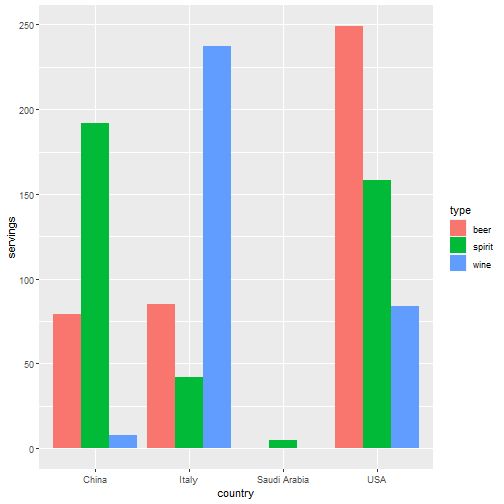
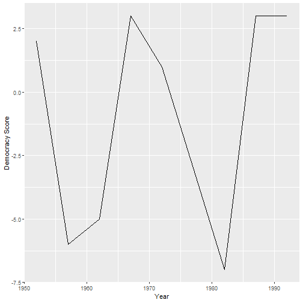

```r
# Libraries
library(tidyverse)
library(nycflights13)
library(fivethirtyeight)
```


```r
# Read a csv from the web
dem_score <- read_csv("https://moderndive.com/data/dem_score.csv")
```

```
## Rows: 96 Columns: 10
## -- Column specification ----------------------------------------------------------------------------------------
## Delimiter: ","
## chr (1): country
## dbl (9): 1952, 1957, 1962, 1967, 1972, 1977, 1982, 1987, 1992
## 
## i Use `spec()` to retrieve the full column specification for this data.
## i Specify the column types or set `show_col_types = FALSE` to quiet this message.
```

```r
dem_score
```

```
## # A tibble: 96 x 10
##    country    `1952` `1957` `1962` `1967` `1972` `1977` `1982` `1987` `1992`
##    <chr>       <dbl>  <dbl>  <dbl>  <dbl>  <dbl>  <dbl>  <dbl>  <dbl>  <dbl>
##  1 Albania        -9     -9     -9     -9     -9     -9     -9     -9      5
##  2 Argentina      -9     -1     -1     -9     -9     -9     -8      8      7
##  3 Armenia        -9     -7     -7     -7     -7     -7     -7     -7      7
##  4 Australia      10     10     10     10     10     10     10     10     10
##  5 Austria        10     10     10     10     10     10     10     10     10
##  6 Azerbaijan     -9     -7     -7     -7     -7     -7     -7     -7      1
##  7 Belarus        -9     -7     -7     -7     -7     -7     -7     -7      7
##  8 Belgium        10     10     10     10     10     10     10     10     10
##  9 Bhutan        -10    -10    -10    -10    -10    -10    -10    -10    -10
## 10 Bolivia        -4     -3     -3     -4     -7     -7      8      9      9
## # ... with 86 more rows
```


```r
# Wide/untidy data
drinks_smaller <-
  drinks %>%
  filter(country %in% c("USA", "China", "Italy", "Saudi Arabia")) %>%
  select(-total_litres_of_pure_alcohol) %>%
  rename_with(~ str_remove(.x, "_servings"))
drinks_smaller
```

```
## # A tibble: 4 x 4
##   country       beer spirit  wine
##   <chr>        <int>  <int> <int>
## 1 China           79    192     8
## 2 Italy           85     42   237
## 3 Saudi Arabia     0      5     0
## 4 USA            249    158    84
```


```r
# In tidy data:

#  Each variable forms a column.
#  Each observation forms a row.
#  Each type of observational unit forms a table.
```


```r
# (LC4.1) What are common characteristics of “tidy” data frames?

# A: Every value belongs to a variable and an observation. A variable contains
# all values that measure the same underlying attribute (like height,
# temperature, duration) across units. An observation contains all values
# measured on the same unit (like a person, or a day, or a city) across attributes.

#  Each variable forms a column.
#  Each observation forms a row.
#  Each type of observational unit forms a table.


# (LC4.2) What makes “tidy” data frames useful for organizing data?

# A: Tidy data always has the same general structure, whereas messy data is
# usually messy in a custom way.
```


```r
# Long/tidy data
drinks_smaller_tidy <-
  drinks_smaller %>%
  pivot_longer(cols = -country, names_to = "type", values_to = "servings")
drinks_smaller_tidy
```

```
## # A tibble: 12 x 3
##    country      type   servings
##    <chr>        <chr>     <int>
##  1 China        beer         79
##  2 China        spirit      192
##  3 China        wine          8
##  4 Italy        beer         85
##  5 Italy        spirit       42
##  6 Italy        wine        237
##  7 Saudi Arabia beer          0
##  8 Saudi Arabia spirit        5
##  9 Saudi Arabia wine          0
## 10 USA          beer        249
## 11 USA          spirit      158
## 12 USA          wine         84
```


```r
drinks_smaller_tidy %>%
  ggplot(aes(country, servings, fill = type)) +
  geom_col(position = "dodge")
```




```r
# (LC4.3) Take a look at the airline_safety data frame included in the
# fivethirtyeight data package. Run the following:

# airline_safety

# After reading the help file by running ?airline_safety, we see that
# airline_safety is a data frame containing information on different airline
# companies’ safety records. This data was originally reported on the data
# journalism website, FiveThirtyEight.com, in Nate Silver’s article, “Should
# Travelers Avoid Flying Airlines That Have Had Crashes in the Past?”.
# Let’s only consider the variables airlines and those relating to fatalities for simplicity:

airline_safety_smaller <- airline_safety %>%
  select(airline, starts_with("fatalities"))
airline_safety_smaller
```

```
## # A tibble: 56 x 3
##    airline               fatalities_85_99 fatalities_00_14
##    <chr>                            <int>            <int>
##  1 Aer Lingus                           0                0
##  2 Aeroflot                           128               88
##  3 Aerolineas Argentinas                0                0
##  4 Aeromexico                          64                0
##  5 Air Canada                           0                0
##  6 Air France                          79              337
##  7 Air India                          329              158
##  8 Air New Zealand                      0                7
##  9 Alaska Airlines                      0               88
## 10 Alitalia                            50                0
## # ... with 46 more rows
```

```r
# This data frame is not in “tidy” format. How would you convert this data frame
# to be in “tidy” format, in particular so that it has a variable fatalities_years
# indicating the incident year and a variable count of the fatality counts?
```


```r
airline_safety_smaller %>%
  pivot_longer(
    cols = -airline,
    names_to = "fatalities_years",
    values_to = "count"
  )
```

```
## # A tibble: 112 x 3
##    airline               fatalities_years count
##    <chr>                 <chr>            <int>
##  1 Aer Lingus            fatalities_85_99     0
##  2 Aer Lingus            fatalities_00_14     0
##  3 Aeroflot              fatalities_85_99   128
##  4 Aeroflot              fatalities_00_14    88
##  5 Aerolineas Argentinas fatalities_85_99     0
##  6 Aerolineas Argentinas fatalities_00_14     0
##  7 Aeromexico            fatalities_85_99    64
##  8 Aeromexico            fatalities_00_14     0
##  9 Air Canada            fatalities_85_99     0
## 10 Air Canada            fatalities_00_14     0
## # ... with 102 more rows
```


```r
guat_dem <-
  dem_score %>%
  filter(country == "Guatemala")
guat_dem
```

```
## # A tibble: 1 x 10
##   country   `1952` `1957` `1962` `1967` `1972` `1977` `1982` `1987` `1992`
##   <chr>      <dbl>  <dbl>  <dbl>  <dbl>  <dbl>  <dbl>  <dbl>  <dbl>  <dbl>
## 1 Guatemala      2     -6     -5      3      1     -3     -7      3      3
```


```r
guat_geom_tidy <-
  guat_dem %>%
  pivot_longer(
    cols = -country,
    names_to = "year",
    values_to = "democracy_score",
    names_transform = list(year = as.integer)
  )
guat_geom_tidy
```

```
## # A tibble: 9 x 3
##   country    year democracy_score
##   <chr>     <int>           <dbl>
## 1 Guatemala  1952               2
## 2 Guatemala  1957              -6
## 3 Guatemala  1962              -5
## 4 Guatemala  1967               3
## 5 Guatemala  1972               1
## 6 Guatemala  1977              -3
## 7 Guatemala  1982              -7
## 8 Guatemala  1987               3
## 9 Guatemala  1992               3
```


```r
guat_geom_tidy %>%
  ggplot(aes(year, democracy_score)) +
  geom_line() +
  labs(x = "Year", y = "Democracy Score")
```




```r
# (LC4.4) Convert the dem_score data frame into a “tidy” data frame and assign
# the name of dem_score_tidy to the resulting long-formatted data frame.
dem_score_tidy <-
  dem_score %>%
  pivot_longer(
    cols = -country,
    names_to = "year",
    values_to = "democracy_score",
    names_transform = list(year = as.integer)
  )
dem_score_tidy
```

```
## # A tibble: 864 x 3
##    country    year democracy_score
##    <chr>     <int>           <dbl>
##  1 Albania    1952              -9
##  2 Albania    1957              -9
##  3 Albania    1962              -9
##  4 Albania    1967              -9
##  5 Albania    1972              -9
##  6 Albania    1977              -9
##  7 Albania    1982              -9
##  8 Albania    1987              -9
##  9 Albania    1992               5
## 10 Argentina  1952              -9
## # ... with 854 more rows
```


```r
# (LC4.5) Read in the life expectancy data stored at
# https://moderndive.com/data/le_mess.csv and convert it to a “tidy” data frame.

life_exp <- read_csv("https://moderndive.com/data/le_mess.csv")
```

```
## Rows: 202 Columns: 67
## -- Column specification ----------------------------------------------------------------------------------------
## Delimiter: ","
## chr  (1): country
## dbl (66): 1951, 1952, 1953, 1954, 1955, 1956, 1957, 1958, 1959, 1960, 1961, 1962, 1963, 1964, 1965, 1966, 19...
## 
## i Use `spec()` to retrieve the full column specification for this data.
## i Specify the column types or set `show_col_types = FALSE` to quiet this message.
```

```r
life_exp
```

```
## # A tibble: 202 x 67
##    country     `1951` `1952` `1953` `1954` `1955` `1956` `1957` `1958` `1959` `1960` `1961` `1962` `1963` `1964`
##    <chr>        <dbl>  <dbl>  <dbl>  <dbl>  <dbl>  <dbl>  <dbl>  <dbl>  <dbl>  <dbl>  <dbl>  <dbl>  <dbl>  <dbl>
##  1 Afghanistan   27.1   27.7   28.2   28.7   29.3   29.8   30.3   30.9   31.4   31.9   32.5   33.0   33.5   34.1
##  2 Albania       54.7   55.2   55.8   56.6   57.4   58.4   59.5   60.6   61.8   62.9   63.9   64.8   65.6   66.2
##  3 Algeria       43.0   43.5   44.0   44.4   44.9   45.4   45.9   46.4   47.0   47.5   48.0   48.6   49.1   49.6
##  4 Angola        31.0   31.6   32.1   32.7   33.2   33.8   34.3   34.9   35.4   36.0   36.5   37.1   37.6   38.2
##  5 Antigua an~   58.3   58.8   59.3   59.9   60.4   60.9   61.4   62.0   62.5   63.0   63.5   63.9   64.4   64.8
##  6 Argentina     61.9   62.5   63.1   63.6   64.0   64.4   64.7   65     65.2   65.4   65.5   65.6   65.7   65.8
##  7 Armenia       62.7   63.1   63.6   64.1   64.5   65     65.4   65.9   66.4   66.9   67.3   67.8   68.3   68.8
##  8 Aruba         59.0   60.0   61.0   61.9   62.7   63.4   64.1   64.7   65.2   65.7   66.1   66.4   66.8   67.1
##  9 Australia     68.7   69.1   69.7   69.8   70.2   70.0   70.3   70.9   70.4   70.9   71.1   70.9   71.0   70.6
## 10 Austria       65.2   66.8   67.3   67.3   67.6   67.7   67.5   68.5   68.4   68.8   69.7   69.5   69.6   70.1
## # ... with 192 more rows, and 52 more variables: `1965` <dbl>, `1966` <dbl>, `1967` <dbl>, `1968` <dbl>,
## #   `1969` <dbl>, `1970` <dbl>, `1971` <dbl>, `1972` <dbl>, `1973` <dbl>, `1974` <dbl>, `1975` <dbl>,
## #   `1976` <dbl>, `1977` <dbl>, `1978` <dbl>, `1979` <dbl>, `1980` <dbl>, `1981` <dbl>, `1982` <dbl>,
## #   `1983` <dbl>, `1984` <dbl>, `1985` <dbl>, `1986` <dbl>, `1987` <dbl>, `1988` <dbl>, `1989` <dbl>,
## #   `1990` <dbl>, `1991` <dbl>, `1992` <dbl>, `1993` <dbl>, `1994` <dbl>, `1995` <dbl>, `1996` <dbl>,
## #   `1997` <dbl>, `1998` <dbl>, `1999` <dbl>, `2000` <dbl>, `2001` <dbl>, `2002` <dbl>, `2003` <dbl>,
## #   `2004` <dbl>, `2005` <dbl>, `2006` <dbl>, `2007` <dbl>, `2008` <dbl>, `2009` <dbl>, `2010` <dbl>, ...
```


```r
life_exp_tidy <-
  life_exp %>%
  pivot_longer(
    cols = -country,
    names_to = "year",
    values_to = "life_exp",
    names_transform = list(year = as.integer)
  )
life_exp_tidy
```

```
## # A tibble: 13,332 x 3
##    country      year life_exp
##    <chr>       <int>    <dbl>
##  1 Afghanistan  1951     27.1
##  2 Afghanistan  1952     27.7
##  3 Afghanistan  1953     28.2
##  4 Afghanistan  1954     28.7
##  5 Afghanistan  1955     29.3
##  6 Afghanistan  1956     29.8
##  7 Afghanistan  1957     30.3
##  8 Afghanistan  1958     30.9
##  9 Afghanistan  1959     31.4
## 10 Afghanistan  1960     31.9
## # ... with 13,322 more rows
```
