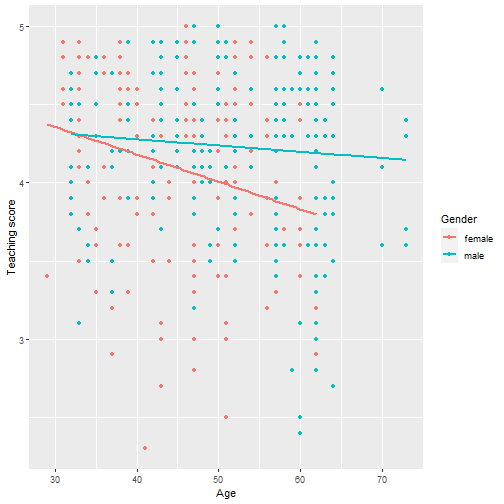
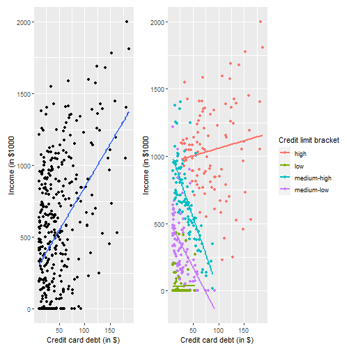

```r
# Load libraries

library(tidyverse)
```

```
## -- Attaching packages ------------------------------------------------------------------------ tidyverse 1.3.1 --
```

```
## v ggplot2 3.3.5     v purrr   0.3.4
## v tibble  3.1.6     v dplyr   1.0.8
## v tidyr   1.2.0     v stringr 1.4.0
## v readr   2.1.2     v forcats 0.5.1
```

```
## -- Conflicts --------------------------------------------------------------------------- tidyverse_conflicts() --
## x dplyr::filter() masks stats::filter()
## x dplyr::lag()    masks stats::lag()
```

```r
library(moderndive)
```

```
## Warning: package 'moderndive' was built under R version 4.1.3
```

```r
library(skimr)
```

```
## Warning: package 'skimr' was built under R version 4.1.3
```

```r
library(ISLR)
```

```
## Warning: package 'ISLR' was built under R version 4.1.3
```

```r
library(patchwork)

# Load function to clear libraries
source(here::here("clear_libraries.R"))
```

### 6.1 One numerical and one categorical explanatory variable
#### 6.1.1 Exploratory data analysis


```r
evals_ch6 <-
  evals %>% 
  select(ID, score, age, gender)
```


```r
# Quick look
glimpse(evals_ch6)
```

```
## Rows: 463
## Columns: 4
## $ ID     <int> 1, 2, 3, 4, 5, 6, 7, 8, 9, 10, 11, 12, 13, 14, 15, 16, 17, 18, 19, 20, 21, 22, 23, 24, 25, 26, 2~
## $ score  <dbl> 4.7, 4.1, 3.9, 4.8, 4.6, 4.3, 2.8, 4.1, 3.4, 4.5, 3.8, 4.5, 4.6, 3.9, 3.9, 4.3, 4.5, 4.8, 4.6, 4~
## $ age    <int> 36, 36, 36, 36, 59, 59, 59, 51, 51, 40, 40, 40, 40, 40, 40, 40, 40, 31, 31, 31, 31, 31, 31, 62, ~
## $ gender <fct> female, female, female, female, male, male, male, male, male, female, female, female, female, fe~
```


```r
# Random sample
evals_ch6 %>% 
  slice_sample(n = 5)
```

```
## # A tibble: 5 x 4
##      ID score   age gender
##   <int> <dbl> <int> <fct> 
## 1   123   3.7    52 female
## 2   293   3.8    32 male  
## 3   431   4.5    33 male  
## 4   399   3.6    57 male  
## 5   413   4      47 female
```


```r
# Skim

evals_ch6 %>% 
  select(score, age, gender) %>% 
  skim()
```


Table: Data summary

|                         |           |
|:------------------------|:----------|
|Name                     |Piped data |
|Number of rows           |463        |
|Number of columns        |3          |
|_______________________  |           |
|Column type frequency:   |           |
|factor                   |1          |
|numeric                  |2          |
|________________________ |           |
|Group variables          |None       |


**Variable type: factor**

|skim_variable | n_missing| complete_rate|ordered | n_unique|top_counts         |
|:-------------|---------:|-------------:|:-------|--------:|:------------------|
|gender        |         0|             1|FALSE   |        2|mal: 268, fem: 195 |


**Variable type: numeric**

|skim_variable | n_missing| complete_rate|  mean|   sd|   p0|  p25|  p50|  p75| p100|hist                                     |
|:-------------|---------:|-------------:|-----:|----:|----:|----:|----:|----:|----:|:----------------------------------------|
|score         |         0|             1|  4.17| 0.54|  2.3|  3.8|  4.3|  4.6|    5|▁▁▅▇▇ |
|age           |         0|             1| 48.37| 9.80| 29.0| 42.0| 48.0| 57.0|   73|▅▆▇▆▁ |


```r
# Correlation between numerical variables

evals_ch6 %>% 
  get_correlation(formula = score ~ age)
```

```
## # A tibble: 1 x 1
##      cor
##    <dbl>
## 1 -0.107
```


```r
# Visualize

evals_ch6 %>% 
  ggplot(aes(age, score, color = gender)) +
  geom_point() +
  geom_smooth(method = "lm", se = FALSE) +
  labs(x = "Age", y = "Teaching score", color = "Gender")
```

```
## `geom_smooth()` using formula 'y ~ x'
```


#### 6.1.2 Interaction model

```r
# Fit regression model
score_model_interaction <-
  evals_ch6 %>% 
  lm(score ~ age * gender, data = .)

score_model_interaction %>% 
  get_regression_table()
```

```
## # A tibble: 4 x 7
##   term           estimate std_error statistic p_value lower_ci upper_ci
##   <chr>             <dbl>     <dbl>     <dbl>   <dbl>    <dbl>    <dbl>
## 1 intercept         4.88      0.205     23.8    0        4.48     5.29 
## 2 age              -0.018     0.004     -3.92   0       -0.026   -0.009
## 3 gender: male     -0.446     0.265     -1.68   0.094   -0.968    0.076
## 4 age:gendermale    0.014     0.006      2.45   0.015    0.003    0.024
```

#### 6.1.3 Parallel slopes model

```r
evals_ch6 %>% 
  ggplot(aes(age, score, color = gender)) +
  geom_point() +
  geom_parallel_slopes(se = FALSE) +
  labs(x = "Age", y = "Teaching score", color = "Gender")
```


```r
# Fit linear model

score_model_parallel_slopes <-
  evals_ch6 %>% 
  lm(score ~ age + gender, data = .)

score_model_parallel_slopes %>% 
  get_regression_table()
```

```
## # A tibble: 3 x 7
##   term         estimate std_error statistic p_value lower_ci upper_ci
##   <chr>           <dbl>     <dbl>     <dbl>   <dbl>    <dbl>    <dbl>
## 1 intercept       4.48      0.125     35.8    0        4.24     4.73 
## 2 age            -0.009     0.003     -3.28   0.001   -0.014   -0.003
## 3 gender: male    0.191     0.052      3.63   0        0.087    0.294
```

#### 6.1.4 Observed/fitted values and residuals

```r
regression_points <- 
  score_model_interaction %>% 
  get_regression_points()

regression_points
```

```
## # A tibble: 463 x 6
##       ID score   age gender score_hat residual
##    <int> <dbl> <int> <fct>      <dbl>    <dbl>
##  1     1   4.7    36 female      4.25    0.448
##  2     2   4.1    36 female      4.25   -0.152
##  3     3   3.9    36 female      4.25   -0.352
##  4     4   4.8    36 female      4.25    0.548
##  5     5   4.6    59 male        4.20    0.399
##  6     6   4.3    59 male        4.20    0.099
##  7     7   2.8    59 male        4.20   -1.40 
##  8     8   4.1    51 male        4.23   -0.133
##  9     9   3.4    51 male        4.23   -0.833
## 10    10   4.5    40 female      4.18    0.318
## # ... with 453 more rows
```


```r
# (LC6.1) Compute the observed values, fitted values, and residuals not for the interaction model as we just did, but rather for the parallel slopes model we saved in score_model_parallel_slopes.

score_model_parallel_slopes %>% 
  get_regression_points()
```

```
## # A tibble: 463 x 6
##       ID score   age gender score_hat residual
##    <int> <dbl> <int> <fct>      <dbl>    <dbl>
##  1     1   4.7    36 female      4.17    0.528
##  2     2   4.1    36 female      4.17   -0.072
##  3     3   3.9    36 female      4.17   -0.272
##  4     4   4.8    36 female      4.17    0.628
##  5     5   4.6    59 male        4.16    0.437
##  6     6   4.3    59 male        4.16    0.137
##  7     7   2.8    59 male        4.16   -1.36 
##  8     8   4.1    51 male        4.23   -0.132
##  9     9   3.4    51 male        4.23   -0.832
## 10    10   4.5    40 female      4.14    0.363
## # ... with 453 more rows
```

### 6.2 Two numerical explanatory variables
#### 6.2.1 Exploratory data analysis


```r
credit_ch6 <-
  Credit %>% 
  as_tibble() %>% 
  select(
    ID, 
    debt = Balance, 
    credit_limit = Limit,
    income = Income,
    credit_rating = Rating,
    age = Age
  )
```


```r
glimpse(credit_ch6)
```

```
## Rows: 400
## Columns: 6
## $ ID            <int> 1, 2, 3, 4, 5, 6, 7, 8, 9, 10, 11, 12, 13, 14, 15, 16, 17, 18, 19, 20, 21, 22, 23, 24, 25~
## $ debt          <int> 333, 903, 580, 964, 331, 1151, 203, 872, 279, 1350, 1407, 0, 204, 1081, 148, 0, 0, 368, 8~
## $ credit_limit  <int> 3606, 6645, 7075, 9504, 4897, 8047, 3388, 7114, 3300, 6819, 8117, 1311, 5308, 6922, 3291,~
## $ income        <dbl> 14.891, 106.025, 104.593, 148.924, 55.882, 80.180, 20.996, 71.408, 15.125, 71.061, 63.095~
## $ credit_rating <int> 283, 483, 514, 681, 357, 569, 259, 512, 266, 491, 589, 138, 394, 511, 269, 200, 286, 339,~
## $ age           <int> 34, 82, 71, 36, 68, 77, 37, 87, 66, 41, 30, 64, 57, 49, 75, 57, 73, 69, 28, 44, 63, 72, 6~
```


```r
credit_ch6 %>% slice_sample(n = 5)
```

```
## # A tibble: 5 x 6
##      ID  debt credit_limit income credit_rating   age
##   <int> <int>        <int>  <dbl>         <int> <int>
## 1   346     0         1511   30.0           137    33
## 2    32     0         2733   28.9           210    43
## 3   368   216         3615   23.8           263    70
## 4    19   891         6384   49.6           448    28
## 5    87   815         6340   55.4           448    33
```


```r
credit_ch6 %>% 
  select(debt, credit_limit, income) %>% 
  skim() 
```


Table: Data summary

|                         |           |
|:------------------------|:----------|
|Name                     |Piped data |
|Number of rows           |400        |
|Number of columns        |3          |
|_______________________  |           |
|Column type frequency:   |           |
|numeric                  |3          |
|________________________ |           |
|Group variables          |None       |


**Variable type: numeric**

|skim_variable | n_missing| complete_rate|    mean|      sd|     p0|     p25|     p50|     p75|     p100|hist                                     |
|:-------------|---------:|-------------:|-------:|-------:|------:|-------:|-------:|-------:|--------:|:----------------------------------------|
|debt          |         0|             1|  520.02|  459.76|   0.00|   68.75|  459.50|  863.00|  1999.00|▇▅▃▂▁ |
|credit_limit  |         0|             1| 4735.60| 2308.20| 855.00| 3088.00| 4622.50| 5872.75| 13913.00|▆▇▃▁▁ |
|income        |         0|             1|   45.22|   35.24|  10.35|   21.01|   33.12|   57.47|   186.63|▇▂▁▁▁ |


```r
credit_ch6 %>% 
  select(debt, credit_limit, income) %>% 
  cor()
```

```
##                   debt credit_limit    income
## debt         1.0000000    0.8616973 0.4636565
## credit_limit 0.8616973    1.0000000 0.7920883
## income       0.4636565    0.7920883 1.0000000
```

```r
# Note collinearity between explanatory variables (credit_limit, income)
```


```r
credit_ch6 %>% 
  ggplot(aes(credit_limit, debt)) +
  geom_point() + 
  geom_smooth(method = "lm", se = FALSE) +
  labs(
    x = "Credit limit (in $)", 
    y = "Credit card debt (in $)", 
    title = "Debt and credit limit"
  ) +
  
  credit_ch6 %>% 
  ggplot(aes(income, debt)) +
  geom_point() + 
  geom_smooth(method = "lm", se = FALSE) +
  labs(
    x = "Income (in $1000)", 
    title = "Debt and income"
  )
```

```
## `geom_smooth()` using formula 'y ~ x'
## `geom_smooth()` using formula 'y ~ x'
```


```r
# (LC6.2) Conduct a new exploratory data analysis with the same outcome variable y debt but with credit_rating and age as the new explanatory variables x1 and x2. What can you say about the relationship between a credit card holder’s debt and their credit rating and age?

credit_ch6 %>% 
  select(credit_rating, age) %>% 
  skim()
```


Table: Data summary

|                         |           |
|:------------------------|:----------|
|Name                     |Piped data |
|Number of rows           |400        |
|Number of columns        |2          |
|_______________________  |           |
|Column type frequency:   |           |
|numeric                  |2          |
|________________________ |           |
|Group variables          |None       |


**Variable type: numeric**

|skim_variable | n_missing| complete_rate|   mean|     sd| p0|    p25| p50|    p75| p100|hist                                     |
|:-------------|---------:|-------------:|------:|------:|--:|------:|---:|------:|----:|:----------------------------------------|
|credit_rating |         0|             1| 354.94| 154.72| 93| 247.25| 344| 437.25|  982|▆▇▃▁▁ |
|age           |         0|             1|  55.67|  17.25| 23|  41.75|  56|  70.00|   98|▆▇▇▇▁ |


```r
credit_ch6 %>% 
  select(debt, credit_rating, age) %>% 
  cor()
```

```
##                      debt credit_rating         age
## debt          1.000000000     0.8636252 0.001835119
## credit_rating 0.863625161     1.0000000 0.103164996
## age           0.001835119     0.1031650 1.000000000
```

```r
# High correlation between debt-credit_rating, low between debt-age
# Low correlation between explanatory variables
```


```r
credit_ch6 %>% 
  ggplot(aes(credit_rating, debt)) +
  geom_point() + 
  geom_smooth(method = "lm", se = FALSE) +
  labs(
    x = "Credit rating", 
    y = "Credit card debt (in $)", 
    title = "Debt and credit rating"
  ) +
  
  credit_ch6 %>% 
  ggplot(aes(age, debt)) +
  geom_point() + 
  geom_smooth(method = "lm", se = FALSE) +
  labs(
    x = "Age", 
    title = "Debt and age"
  )
```

```
## `geom_smooth()` using formula 'y ~ x'
## `geom_smooth()` using formula 'y ~ x'
```


#### 6.2.2 Regression plane

```r
# Fit regression model

debt_model <- 
  credit_ch6 %>% 
  lm(debt ~ credit_limit + income, data = .)

debt_model %>% 
  get_regression_table()
```

```
## # A tibble: 3 x 7
##   term         estimate std_error statistic p_value lower_ci upper_ci
##   <chr>           <dbl>     <dbl>     <dbl>   <dbl>    <dbl>    <dbl>
## 1 intercept    -385.       19.5       -19.8       0 -423.    -347.   
## 2 credit_limit    0.264     0.006      45.0       0    0.253    0.276
## 3 income         -7.66      0.385     -19.9       0   -8.42    -6.91
```


```r
# (LC6.3) Fit a new simple linear regression using lm(debt ~ credit_rating + age, data = credit_ch6) where credit_rating and age are the new numerical explanatory variables x1 and x2. Get information about the “best-fitting” regression plane from the regression table by applying the get_regression_table() function. How do the regression results match up with the results from your previous exploratory data analysis?

credit_ch6 %>% 
  lm(debt ~ credit_rating + age, data = .) %>% 
  get_regression_table()
```

```
## # A tibble: 3 x 7
##   term          estimate std_error statistic p_value lower_ci upper_ci
##   <chr>            <dbl>     <dbl>     <dbl>   <dbl>    <dbl>    <dbl>
## 1 intercept      -270.      44.8       -6.02       0  -358.    -181.  
## 2 credit_rating     2.59     0.074     34.8        0     2.45     2.74
## 3 age              -2.35     0.668     -3.52       0    -3.66    -1.04
```

```r
# Interptretation: When taking into account all other explanatory variables, for every increase in one unit in credit_rating, there is an increase of ~2.6 USD in debt AND when taking into consideration all other explanatory variables, there is a decrease of ~2.4 USD in debt for every added year in age.

# Answer: The slope for age-debt doesn't agree with the exploratory analysis where there was a small positive association between the variables (now clearly negative).
```

#### 6.2.3 Observed/fitted values and residuals


```r
debt_model %>% 
  get_regression_points()
```

```
## # A tibble: 400 x 6
##       ID  debt credit_limit income debt_hat residual
##    <int> <int>        <int>  <dbl>    <dbl>    <dbl>
##  1     1   333         3606   14.9     454.   -121. 
##  2     2   903         6645  106.      559.    344. 
##  3     3   580         7075  105.      683.   -103. 
##  4     4   964         9504  149.      986.    -21.7
##  5     5   331         4897   55.9     481.   -150. 
##  6     6  1151         8047   80.2    1127.     23.6
##  7     7   203         3388   21.0     349.   -146. 
##  8     8   872         7114   71.4     948.    -76.0
##  9     9   279         3300   15.1     371.    -92.2
## 10    10  1350         6819   71.1     873.    477. 
## # ... with 390 more rows
```

### 6.3 Related topics
#### 6.3.1 Model selection using visualizations

```r
# MA Shools

# interaction model
MA_schools %>% 
  ggplot(aes(perc_disadvan, average_sat_math, color = size)) +
  geom_point(alpha = 0.25) +
  geom_smooth(method = "lm", se = FALSE) +
  labs(x = "Percent economically disadvantaged", y = "Math SAT Score", 
       color = "School size", title = "Interaction model") 
```

```
## `geom_smooth()` using formula 'y ~ x'
```


```r
# Parallel slopes model

MA_schools %>% 
   ggplot(aes(perc_disadvan, average_sat_math, color = size)) +
  geom_point(alpha = 0.25) +
  geom_parallel_slopes(se = FALSE) +
  labs(x = "Percent economically disadvantaged", y = "Math SAT Score", 
       color = "School size", title = "Parallel slopes model") 
```


```r
# Side-by-side

(# interaction model
MA_schools %>% 
  ggplot(aes(perc_disadvan, average_sat_math, color = size)) +
  geom_point(alpha = 0.25) +
  geom_smooth(method = "lm", se = FALSE) +
  labs(x = "Percent economically disadvantaged", y = "Math SAT Score", 
       color = "School size", title = "Interaction model")) +
  (# Parallel slopes model
    MA_schools %>% 
   ggplot(aes(perc_disadvan, average_sat_math, color = size)) +
  geom_point(alpha = 0.25) +
  geom_parallel_slopes(se = FALSE) +
  labs(x = "Percent economically disadvantaged", y = "Math SAT Score", 
       color = "School size", title = "Parallel slopes model"))
```

```
## `geom_smooth()` using formula 'y ~ x'
```


```r
model_2_interaction <-
  MA_schools %>% 
  lm(average_sat_math ~ perc_disadvan * size, data = .)

model_2_interaction %>% 
  get_regression_table()
```

```
## # A tibble: 6 x 7
##   term                     estimate std_error statistic p_value lower_ci upper_ci
##   <chr>                       <dbl>     <dbl>     <dbl>   <dbl>    <dbl>    <dbl>
## 1 intercept                 594.       13.3      44.7     0      568.     620.   
## 2 perc_disadvan              -2.93      0.294    -9.96    0       -3.51    -2.35 
## 3 size: medium              -17.8      15.8      -1.12    0.263  -48.9     13.4  
## 4 size: large               -13.3      13.8      -0.962   0.337  -40.5     13.9  
## 5 perc_disadvan:sizemedium    0.146     0.371     0.393   0.694   -0.585    0.877
## 6 perc_disadvan:sizelarge     0.189     0.323     0.586   0.559   -0.446    0.824
```


```r
model_2_parallel_slopes <-
  MA_schools %>% 
  lm(average_sat_math ~ perc_disadvan + size, data = .)

model_2_parallel_slopes %>% 
  get_regression_table()
```

```
## # A tibble: 4 x 7
##   term          estimate std_error statistic p_value lower_ci upper_ci
##   <chr>            <dbl>     <dbl>     <dbl>   <dbl>    <dbl>    <dbl>
## 1 intercept       588.       7.61     77.3     0       573.     603.  
## 2 perc_disadvan    -2.78     0.106   -26.1     0        -2.99    -2.57
## 3 size: medium    -11.9      7.54     -1.58    0.115   -26.7      2.91
## 4 size: large      -6.36     6.92     -0.919   0.359   -20.0      7.26
```

#### 6.3.2 Model selection using R-squared


```r
model_2_interaction %>% 
  get_regression_points()
```

```
## # A tibble: 332 x 6
##       ID average_sat_math perc_disadvan size   average_sat_math_hat residual
##    <int>            <dbl>         <dbl> <fct>                 <dbl>    <dbl>
##  1     1              516          21.5 medium                 517.    -0.67
##  2     2              514          22.7 large                  519.    -4.77
##  3     3              534          14.6 large                  541.    -6.99
##  4     4              581           6.3 large                  564.    17.2 
##  5     5              592          10.3 large                  553.    39.2 
##  6     6              576          10.3 large                  553.    23.2 
##  7     7              504          25.6 large                  511.    -6.82
##  8     8              505          15.2 large                  539.   -34.3 
##  9     9              481          23.8 small                  525.   -43.5 
## 10    10              513          25.5 large                  511.     1.91
## # ... with 322 more rows
```


```r
# Compute variance for obs, expected, and residual
model_2_interaction %>% 
  get_regression_points() %>% 
  summarise(
    var_y = var(average_sat_math), 
    var_y_hat = var(average_sat_math_hat), 
    var_residual = var(residual)
  )
```

```
## # A tibble: 1 x 3
##   var_y var_y_hat var_residual
##   <dbl>     <dbl>        <dbl>
## 1 3691.     2580.        1111.
```


```r
# R-squared for interaction model
model_2_interaction %>% 
  get_regression_summaries()
```

```
## # A tibble: 1 x 9
##   r_squared adj_r_squared   mse  rmse sigma statistic p_value    df  nobs
##       <dbl>         <dbl> <dbl> <dbl> <dbl>     <dbl>   <dbl> <dbl> <dbl>
## 1     0.699         0.694 1107.  33.3  33.6      151.       0     5   332
```


```r
# R-squared for parallel slopes model
model_2_parallel_slopes%>% 
  get_regression_summaries()
```

```
## # A tibble: 1 x 9
##   r_squared adj_r_squared   mse  rmse sigma statistic p_value    df  nobs
##       <dbl>         <dbl> <dbl> <dbl> <dbl>     <dbl>   <dbl> <dbl> <dbl>
## 1     0.699         0.696 1109.  33.3  33.5      254.       0     3   332
```

#### 6.3.3 Correlation coefficient

```r
# Using dollars instead of 1000xdollars doesn't change the correlation
credit_ch6 %>% 
  select(debt, income) %>% 
  mutate(income = income * 1000) %>% 
  cor()
```

```
##             debt    income
## debt   1.0000000 0.4636565
## income 0.4636565 1.0000000
```


```r
# The correlation coefficient is invariant to linear transformations
credit_ch6 %>% 
  select(debt, income) %>%  
  cor()
```

```
##             debt    income
## debt   1.0000000 0.4636565
## income 0.4636565 1.0000000
```

#### 6.3.4 Simpson’s Paradox

```r
credit_ch6 %>% 
  ggplot(aes(credit_limit)) +
  geom_histogram(color = "white") 
```

```
## `stat_bin()` using `bins = 30`. Pick better value with `binwidth`.
```


```r
credit_ch6 %>% 
  ggplot(aes(income, debt))+ 
  geom_point() +
  geom_smooth(method = "lm", se = FALSE) +
  labs(
    x = "Credit card debt (in $)",
    y = "Income (in $1000",
  ) +

credit_ch6 %>% 
  mutate(
    credit_limit_bracket = case_when(
      credit_limit < 3088 ~ "low",
      credit_limit < 4622 ~ "medium-low",
      credit_limit < 5873 ~ "medium-high",
      TRUE ~ "high"
    )
  ) %>% 
  ggplot(aes(income, debt, color = credit_limit_bracket)) +
  geom_point() +
  geom_smooth(method = "lm", se = FALSE) +
  labs(
    x = "Credit card debt (in $)",
    y = "Income (in $1000",
    color = "Credit limit bracket"
  )
```

```
## `geom_smooth()` using formula 'y ~ x'
## `geom_smooth()` using formula 'y ~ x'
```




```r
clear_libraries()
```
