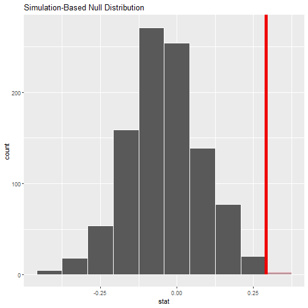
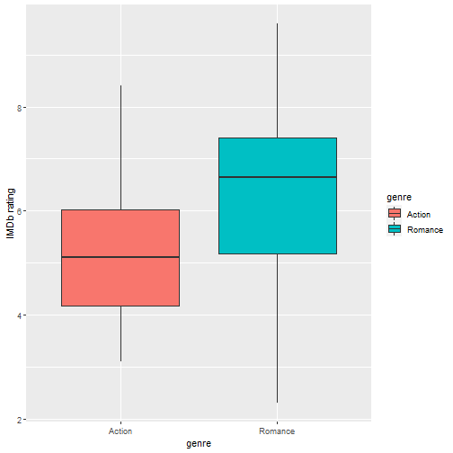
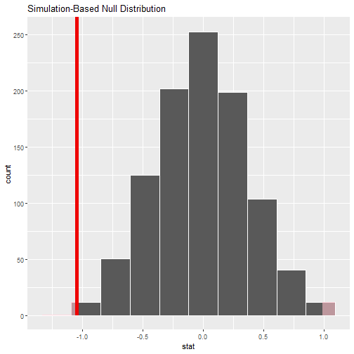
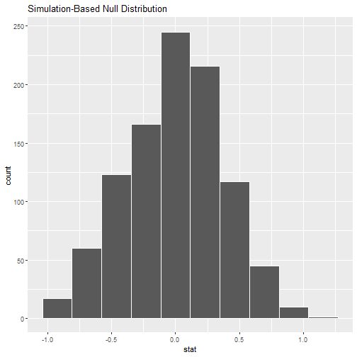
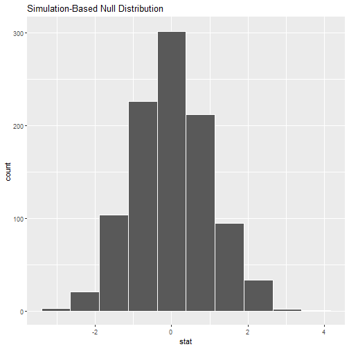
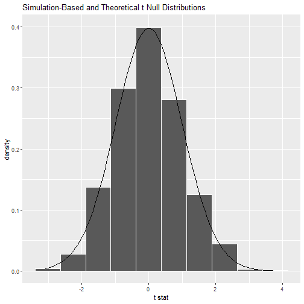
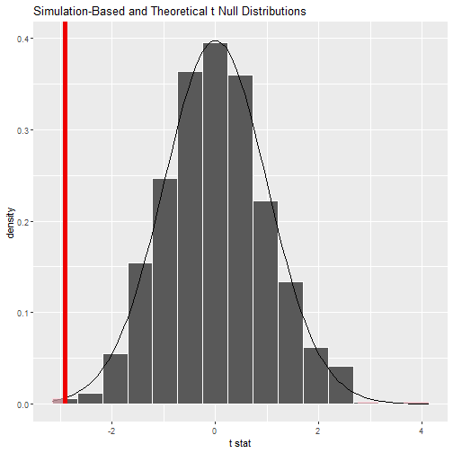

```r
# Load libraries
library(tidyverse)
```

```
## -- Attaching packages ------------------------------------------------------------------------ tidyverse 1.3.1 --
```

```
## v ggplot2 3.3.5     v purrr   0.3.4
## v tibble  3.1.6     v dplyr   1.0.8
## v tidyr   1.2.0     v stringr 1.4.0
## v readr   2.1.2     v forcats 0.5.1
```

```
## -- Conflicts --------------------------------------------------------------------------- tidyverse_conflicts() --
## x dplyr::filter() masks stats::filter()
## x dplyr::lag()    masks stats::lag()
```

```r
library(moderndive)
```

```
## Warning: package 'moderndive' was built under R version 4.1.3
```

```r
library(infer)
```

```
## Warning: package 'infer' was built under R version 4.1.3
```

```r
library(nycflights13)
```

```
## Warning: package 'nycflights13' was built under R version 4.1.3
```

```r
library(ggplot2movies)
library(patchwork)
library(ggprism)

# Load function to clear libraries
source(here::here("clear_libraries.R"))
```

### 9.1 Promotions activity
#### 9.1.1 Does gender affect promotions at a bank?

```r
# Promotions data
promotions %>% 
  slice_sample(n = 6) %>% 
  arrange(id)
```

```
## # A tibble: 6 x 3
##      id decision gender
##   <int> <fct>    <fct> 
## 1    11 promoted male  
## 2    25 promoted female
## 3    26 promoted female
## 4    30 promoted female
## 5    41 not      female
## 6    42 not      female
```


```r
# Visualize
promotions %>% 
  ggplot(aes(gender, fill = decision)) +
  geom_bar() +
  labs(x = "Gender of name in résumé") 
```


```r
promotions %>% 
  count(gender, decision)
```

```
## # A tibble: 4 x 3
##   gender decision     n
##   <fct>  <fct>    <int>
## 1 male   not          3
## 2 male   promoted    21
## 3 female not         10
## 4 female promoted    14
```
#### 9.1.2 Shuffling once

```r
(promotions %>% 
  ggplot(aes(gender, fill = decision)) +
  geom_bar() +
  labs(x = "Gender of name in résumé",
       title = "Original")) +
(promotions_shuffled %>% 
  ggplot(aes(gender, fill = decision)) +
  geom_bar() +
  labs(x = "Gender of name in résumé",
       title = "Shuffled"))
```


```r
# Proportions in the shuffled data
promotions_shuffled %>% 
  count(gender, decision)
```

```
## # A tibble: 4 x 3
##   gender decision     n
##   <fct>  <fct>    <int>
## 1 male   not          6
## 2 male   promoted    18
## 3 female not          7
## 4 female promoted    17
```

#### 9.1.3 Shuffling 16 times
#### 9.1.4 What did we just do?

### 9.2 Understanding hypothesis tests
### 9.3 Conducting hypothesis tests
#### 9.3.1 infer package workflow


```r
# Specify variables
promotions %>% 
  specify(decision ~ gender, success = "promoted")
```

```
## Response: decision (factor)
## Explanatory: gender (factor)
## # A tibble: 48 x 2
##    decision gender
##    <fct>    <fct> 
##  1 promoted male  
##  2 promoted male  
##  3 promoted male  
##  4 promoted male  
##  5 promoted male  
##  6 promoted male  
##  7 promoted male  
##  8 promoted male  
##  9 promoted male  
## 10 promoted male  
## # ... with 38 more rows
```


```r
# Hypothesize the null
promotions %>% 
  specify(decision ~ gender, success = "promoted") %>% 
  hypothesize(null = "independence")
```

```
## Response: decision (factor)
## Explanatory: gender (factor)
## Null Hypothesis: independence
## # A tibble: 48 x 2
##    decision gender
##    <fct>    <fct> 
##  1 promoted male  
##  2 promoted male  
##  3 promoted male  
##  4 promoted male  
##  5 promoted male  
##  6 promoted male  
##  7 promoted male  
##  8 promoted male  
##  9 promoted male  
## 10 promoted male  
## # ... with 38 more rows
```


```r
# Generate replicates of shuffled datasets
promotions_generate <-
  promotions %>% 
  specify(decision ~ gender, success = "promoted") %>% 
  hypothesize(null = "independence") %>% 
  generate(reps = 1000, type = "permute")
promotions_generate
```

```
## Response: decision (factor)
## Explanatory: gender (factor)
## Null Hypothesis: independence
## # A tibble: 48,000 x 3
## # Groups:   replicate [1,000]
##    decision gender replicate
##    <fct>    <fct>      <int>
##  1 not      male           1
##  2 not      male           1
##  3 not      male           1
##  4 promoted male           1
##  5 promoted male           1
##  6 promoted male           1
##  7 promoted male           1
##  8 not      male           1
##  9 promoted male           1
## 10 promoted male           1
## # ... with 47,990 more rows
```


```r
# Calculate summary statistics
null_distribution <-
promotions %>% 
  specify(decision ~ gender, success = "promoted") %>% 
  hypothesize(null = "independence") %>% 
  generate(reps = 1000, type = "permute") %>% 
  calculate(stat = "diff in props", order = c("male", "female"))
null_distribution
```

```
## Response: decision (factor)
## Explanatory: gender (factor)
## Null Hypothesis: independence
## # A tibble: 1,000 x 2
##    replicate    stat
##        <int>   <dbl>
##  1         1 -0.0417
##  2         2  0.0417
##  3         3 -0.0417
##  4         4  0.208 
##  5         5  0.0417
##  6         6  0.0417
##  7         7  0.0417
##  8         8  0.0417
##  9         9 -0.0417
## 10        10 -0.0417
## # ... with 990 more rows
```


```r
# Save observed statistic
obs_diff_prop <-
promotions %>% 
  specify(decision ~ gender, success = "promoted") %>% 
  calculate(stat = "diff in props", order = c("male", "female"))
obs_diff_prop
```

```
## Response: decision (factor)
## Explanatory: gender (factor)
## # A tibble: 1 x 1
##    stat
##   <dbl>
## 1 0.292
```


```r
# Visualize the p-value
null_distribution %>% 
  visualize(bins = 10) +
  shade_p_value(obs_stat = obs_diff_prop, direction = "right")
```




```r
# Get numerical p-value
null_distribution %>% 
  get_p_value(obs_stat = obs_diff_prop, direction = "right")
```

```
## # A tibble: 1 x 1
##   p_value
##     <dbl>
## 1   0.023
```

#### 9.3.2 Comparison with confidence intervals


```r
# Change from hypothesis test to confidence interval
bootstrap_distribution <-
  promotions %>% 
  specify(formula = decision ~ gender, success = "promoted") %>% 
  # Change 1 - Remove hypothesize():
  # hypothesize(null = "independence") %>% 
  # Change 2 - Switch type from "permute" to "bootstrap":
  generate(reps = 1000, type = "bootstrap") %>% 
  calculate(stat = "diff in props", order = c("male", "female"))
```


```r
# Compute 95% CI from percentiles
percentile_ci <-
  bootstrap_distribution %>% 
  get_ci(level = 0.95, type = "percentile")
percentile_ci
```

```
## # A tibble: 1 x 2
##   lower_ci upper_ci
##      <dbl>    <dbl>
## 1   0.0591    0.513
```

```r
# We are 95% “confident” that the true difference in population proportions pm−pf is between (0.054, 0.550)
```


```r
# Visualize Bootstrap distribution
bootstrap_distribution %>% 
  visualize() +
  shade_ci(endpoints = percentile_ci)
```


```r
# Calculate 95% CI using standard error
se_ci <- 
  bootstrap_distribution %>% 
  get_confidence_interval(
    level = 0.95, 
    type = "se", 
    point_estimate = obs_diff_prop
  )
se_ci
```

```
## # A tibble: 1 x 2
##   lower_ci upper_ci
##      <dbl>    <dbl>
## 1   0.0529    0.530
```


```r
# Visualize bootstrap distibution with se_ci
visualize(bootstrap_distribution) + 
  shade_confidence_interval(endpoints = se_ci)
```


```r
# (LC9.1) Why does the following code produce an error? In other words, what about the response and predictor variables make this not a possible computation with the infer package?

#null_distribution_mean <- promotions %>%
 # specify(formula = decision ~ gender, success = "promoted") %>% 
  #hypothesize(null = "independence") %>% 
  #generate(reps = 1000, type = "permute") %>% 
  #calculate(stat = "diff in means", order = c("male", "female"))

# A: This code tries to calculate a difference in means and not proportions

# (LC9.2) Why are we relatively confident that the distributions of the sample proportions will be good approximations of the population distributions of promotion proportions for the two genders?

# A: The resumes were randomly assigned to the readers; therefore the sample should be unbiased and representative of the underlying population.

# (LC9.3) Using the definition of p-value, write in words what the p-value represents for the hypothesis test comparing the promotion rates for males and females.

# A: The p-value represents the probability of observing a an advantage in promotion rates for men as big or bigger as the one seen in a world where no actual gender-bias truly exists.
```

#### 9.3.3 “There is only one test”

```r
# (LC9.4) Describe in a paragraph how we used Allen Downey’s diagram to conclude if a statistical difference existed between the promotion rate of males and females using this study.

# A: (1) First we calculate the observed difference in promotion rates between genders in the data. (2) Then, to create the NULL-world, we break the association between gender and promotion rate by randomizing the gender label assignment in the data and calculate the test statistic in this case; we repeat this procedure 1000 times to create a NULL-distribution of values that are more-or-less likely to appear in this scenario. (3) We then compare the observed test statistic to the NULL-distribution and count the probability of seeing a test statistic in the NULL-distribution that is equal or more extreme than the observed one; this is our p-value. (4) If the p-value (risk of seeing a difference in advantage of males when no differences exists) is below a pre-decided cut-off value (0.05), we conclude that the null-hypothesis (there is no difference) can be rejected, else we conclude that the null-hypothesis can't be rejected (all based on the data we have).
```

### 9.4 Interpreting hypothesis tests
#### 9.4.1 Two possible outcomes


```r
# (LC9.5) What is wrong about saying, “The defendant is innocent.” based on the US system of criminal trials?

# A: A defendant can't be found 'innocent', only 'not-guilty'. This means that there is no way of knowing for sure if the defendant committed the accused crime, only lack-of evidence to show that they are guilty.

# (LC9.6) What is the purpose of hypothesis testing?

# A: The purpose of hypothesis testing is to infer, whether an observation made from a sample happened due to chance alone, or reflects a true population parameter. This is done by testing the alternative/challenger hypothesis (observed value of statistic) against a NULL hypothesis (representing a situation where the statistic equals zero or no real effect exists difference) 

# (LC9.7) What are some flaws with hypothesis testing? How could we alleviate them?

# A: A hypothesis test in an either/or test, where the data either supports or does not support the rejection of the NULL hypothesis. It tells nothing about the size of the possible effect. You must set a subjective threshold for the risk of making an error in falsely rejecting the H0 (0.05 usually). There is a balance of making either a typeI error (false positive) or typeII error (false negative). 

# (LC9.8) Consider two α significance levels of 0.1 and 0.01. Of the two, which would lead to a more liberal hypothesis testing procedure? In other words, one that will, all things being equal, lead to more rejections of the null hypothesis H0.

# A: α significance levels of 0.1 would lead to more rejections of H0 (is more liberal)
```

### 9.5 Case study: Are action or romance movies rated higher?

```r
# The movies dataset in the ggplot2movies package
glimpse(movies)
```

```
## Rows: 58,788
## Columns: 24
## $ title       <chr> "$", "$1000 a Touchdown", "$21 a Day Once a Month", "$40,000", "$50,000 Climax Show, The", ~
## $ year        <int> 1971, 1939, 1941, 1996, 1975, 2000, 2002, 2002, 1987, 1917, 1988, 1994, 1906, 1965, 1983, 1~
## $ length      <int> 121, 71, 7, 70, 71, 91, 93, 25, 97, 61, 99, 96, 10, 10, 106, 101, 107, 10, 110, 7, 90, 85, ~
## $ budget      <int> NA, NA, NA, NA, NA, NA, NA, NA, NA, NA, NA, NA, NA, NA, NA, NA, NA, NA, NA, NA, NA, 450000,~
## $ rating      <dbl> 6.4, 6.0, 8.2, 8.2, 3.4, 4.3, 5.3, 6.7, 6.6, 6.0, 5.4, 5.9, 7.0, 6.7, 7.1, 7.2, 7.9, 6.6, 5~
## $ votes       <int> 348, 20, 5, 6, 17, 45, 200, 24, 18, 51, 23, 53, 44, 11, 1259, 614, 2718, 37, 7252, 15, 10, ~
## $ r1          <dbl> 4.5, 0.0, 0.0, 14.5, 24.5, 4.5, 4.5, 4.5, 4.5, 4.5, 4.5, 4.5, 4.5, 14.5, 4.5, 4.5, 4.5, 0.0~
## $ r2          <dbl> 4.5, 14.5, 0.0, 0.0, 4.5, 4.5, 0.0, 4.5, 4.5, 0.0, 0.0, 0.0, 0.0, 0.0, 4.5, 4.5, 4.5, 0.0, ~
## $ r3          <dbl> 4.5, 4.5, 0.0, 0.0, 0.0, 4.5, 4.5, 4.5, 4.5, 4.5, 4.5, 4.5, 0.0, 0.0, 4.5, 4.5, 4.5, 4.5, 4~
## $ r4          <dbl> 4.5, 24.5, 0.0, 0.0, 14.5, 14.5, 4.5, 4.5, 0.0, 4.5, 14.5, 4.5, 0.0, 0.0, 4.5, 4.5, 4.5, 4.~
## $ r5          <dbl> 14.5, 14.5, 0.0, 0.0, 14.5, 14.5, 24.5, 4.5, 0.0, 4.5, 24.5, 4.5, 4.5, 0.0, 4.5, 4.5, 4.5, ~
## $ r6          <dbl> 24.5, 14.5, 24.5, 0.0, 4.5, 14.5, 24.5, 14.5, 0.0, 44.5, 4.5, 14.5, 14.5, 14.5, 14.5, 14.5,~
## $ r7          <dbl> 24.5, 14.5, 0.0, 0.0, 0.0, 4.5, 14.5, 14.5, 34.5, 14.5, 24.5, 24.5, 34.5, 4.5, 14.5, 24.5, ~
## $ r8          <dbl> 14.5, 4.5, 44.5, 0.0, 0.0, 4.5, 4.5, 14.5, 14.5, 4.5, 4.5, 14.5, 14.5, 4.5, 14.5, 24.5, 24.~
## $ r9          <dbl> 4.5, 4.5, 24.5, 34.5, 0.0, 14.5, 4.5, 4.5, 4.5, 4.5, 14.5, 4.5, 4.5, 14.5, 14.5, 14.5, 24.5~
## $ r10         <dbl> 4.5, 14.5, 24.5, 45.5, 24.5, 14.5, 14.5, 14.5, 24.5, 4.5, 4.5, 24.5, 14.5, 24.5, 24.5, 14.5~
## $ mpaa        <chr> "", "", "", "", "", "", "R", "", "", "", "", "", "", "", "PG-13", "PG-13", "", "", "", "", ~
## $ Action      <int> 0, 0, 0, 0, 0, 0, 1, 0, 0, 0, 0, 0, 0, 0, 1, 1, 0, 0, 1, 0, 0, 0, 1, 0, 0, 0, 0, 0, 0, 0, 0~
## $ Animation   <int> 0, 0, 1, 0, 0, 0, 0, 0, 0, 0, 0, 0, 0, 0, 0, 0, 0, 0, 0, 1, 0, 0, 0, 0, 0, 0, 1, 0, 0, 0, 0~
## $ Comedy      <int> 1, 1, 0, 1, 0, 0, 0, 0, 0, 0, 0, 0, 1, 0, 1, 1, 0, 0, 1, 1, 1, 0, 0, 0, 1, 0, 1, 0, 0, 1, 0~
## $ Drama       <int> 1, 0, 0, 0, 0, 1, 1, 0, 1, 0, 1, 0, 0, 0, 0, 0, 1, 0, 0, 0, 0, 1, 1, 0, 0, 0, 0, 0, 1, 0, 1~
## $ Documentary <int> 0, 0, 0, 0, 0, 0, 0, 1, 0, 0, 0, 0, 0, 0, 0, 0, 0, 1, 0, 0, 0, 0, 0, 0, 0, 0, 0, 0, 0, 0, 0~
## $ Romance     <int> 0, 0, 0, 0, 0, 0, 0, 0, 0, 0, 0, 0, 0, 0, 0, 0, 0, 0, 0, 0, 0, 0, 0, 0, 0, 0, 0, 0, 1, 0, 0~
## $ Short       <int> 0, 0, 1, 0, 0, 0, 0, 1, 0, 0, 0, 0, 1, 1, 0, 0, 0, 1, 0, 1, 0, 0, 0, 0, 1, 0, 1, 0, 0, 1, 0~
```


```r
# Sample of the wrangled version of the dataset
movies_sample
```

```
## # A tibble: 68 x 4
##    title                     year rating genre  
##    <chr>                    <int>  <dbl> <chr>  
##  1 Underworld                1985    3.1 Action 
##  2 Love Affair               1932    6.3 Romance
##  3 Junglee                   1961    6.8 Romance
##  4 Eversmile, New Jersey     1989    5   Romance
##  5 Search and Destroy        1979    4   Action 
##  6 Secreto de Romelia, El    1988    4.9 Romance
##  7 Amants du Pont-Neuf, Les  1991    7.4 Romance
##  8 Illicit Dreams            1995    3.5 Action 
##  9 Kabhi Kabhie              1976    7.7 Romance
## 10 Electric Horseman, The    1979    5.8 Romance
## # ... with 58 more rows
```


```r
# Exploratory plots
movies_sample %>% 
  ggplot(aes(genre, rating, fill = genre)) +
  geom_boxplot() +
  labs(y = "IMDb rating")
```




```r
# Some summary statistics split by genre
movies_sample %>% 
  group_by(genre) %>% 
  summarise(
    n = n(), 
    mean_rating = mean(rating), 
    std_dev_rating = sd(rating)
  )
```

```
## # A tibble: 2 x 4
##   genre       n mean_rating std_dev_rating
##   <chr>   <int>       <dbl>          <dbl>
## 1 Action     32        5.28           1.36
## 2 Romance    36        6.32           1.61
```

#### 9.5.2 Sampling scenario
#### 9.5.3 Conducting the hypothesis test

```r
# Specify variables
movies_sample %>% 
  specify(rating ~ genre)
```

```
## Response: rating (numeric)
## Explanatory: genre (factor)
## # A tibble: 68 x 2
##    rating genre  
##     <dbl> <fct>  
##  1    3.1 Action 
##  2    6.3 Romance
##  3    6.8 Romance
##  4    5   Romance
##  5    4   Action 
##  6    4.9 Romance
##  7    7.4 Romance
##  8    3.5 Action 
##  9    7.7 Romance
## 10    5.8 Romance
## # ... with 58 more rows
```


```r
# Hypothesize the null
movies_sample %>% 
  specify(rating ~ genre) %>% 
  hypothesize(null = "independence")
```

```
## Response: rating (numeric)
## Explanatory: genre (factor)
## Null Hypothesis: independence
## # A tibble: 68 x 2
##    rating genre  
##     <dbl> <fct>  
##  1    3.1 Action 
##  2    6.3 Romance
##  3    6.8 Romance
##  4    5   Romance
##  5    4   Action 
##  6    4.9 Romance
##  7    7.4 Romance
##  8    3.5 Action 
##  9    7.7 Romance
## 10    5.8 Romance
## # ... with 58 more rows
```


```r
# Generate replicates

movies_sample %>% 
  specify(rating ~ genre) %>% 
  hypothesize(null = "independence") %>% 
  generate(reps = 1000, type = "permute") 
```

```
## Response: rating (numeric)
## Explanatory: genre (factor)
## Null Hypothesis: independence
## # A tibble: 68,000 x 3
## # Groups:   replicate [1,000]
##    rating genre   replicate
##     <dbl> <fct>       <int>
##  1    4.2 Action          1
##  2    2.3 Romance         1
##  3    3.7 Romance         1
##  4    6.7 Romance         1
##  5    5.2 Action          1
##  6    8.5 Romance         1
##  7    4.9 Romance         1
##  8    7.8 Action          1
##  9    4.8 Romance         1
## 10    3.5 Romance         1
## # ... with 67,990 more rows
```


```r
# Create null distribution
null_distribution_movies <-
movies_sample %>% 
  specify(rating ~ genre) %>% 
  hypothesize(null = "independence") %>% 
  generate(reps = 1000, type = "permute") %>% 
  calculate(stat = "diff in means", order = c("Action", "Romance")) 
null_distribution_movies
```

```
## Response: rating (numeric)
## Explanatory: genre (factor)
## Null Hypothesis: independence
## # A tibble: 1,000 x 2
##    replicate    stat
##        <int>   <dbl>
##  1         1 -0.599 
##  2         2 -0.0378
##  3         3  0.293 
##  4         4 -0.0615
##  5         5  0.104 
##  6         6  0.222 
##  7         7 -0.274 
##  8         8 -0.882 
##  9         9 -0.0437
## 10        10  0.328 
## # ... with 990 more rows
```


```r
# Calculate observed statistic
obs_diff_means <-
  movies_sample %>% 
  specify(rating ~ genre) %>% 
  calculate(stat = "diff in means", order = c("Action", "Romance"))
obs_diff_means
```

```
## Response: rating (numeric)
## Explanatory: genre (factor)
## # A tibble: 1 x 1
##    stat
##   <dbl>
## 1 -1.05
```


```r
# Visualize the p-value
null_distribution_movies %>% 
  visualize(bins = 10) +
  shade_p_value(obs_stat = obs_diff_means, direction = "both")
```




```r
# Numerical p-value
null_distribution_movies %>% 
  get_p_value(obs_stat = obs_diff_means, direction = "both")
```

```
## # A tibble: 1 x 1
##   p_value
##     <dbl>
## 1   0.004
```


```r
# Interpretation with α = 0.0001

# From the book: The p-value is larger than our (even smaller) pre-specified α significance level of 0.001. Thus, we are inclined to fail to reject the null hypothesis H0:μa−μr=0. In non-statistical language, the conclusion is: we do not have the evidence needed in this sample of data to suggest that we should reject the hypothesis that there is no difference in mean IMDb ratings between romance and action movies. We, thus, cannot say that a difference exists in romance and action movie ratings, on average, for all IMDb movies.
```


```r
# (LC9.9) Conduct the same analysis comparing action movies versus romantic movies using the median rating instead of the mean rating. What was different and what was the same?

null_distribution_median <-
movies_sample %>% 
  specify(rating ~ genre) %>% 
  hypothesize(null = "independence") %>% 
  generate(reps = 1000, type = "permute") %>% 
  calculate(stat = "diff in medians", order = c("Action", "Romance"))

obs_diff_median <-
  movies_sample %>% 
  specify(rating ~ genre) %>% 
  calculate(stat = "diff in medians", order = c("Action", "Romance"))

null_distribution_median %>% 
  visualize(bins = 10) +
  shade_p_value(obs_stat = obs_diff_median, direction = "both")
```


```r
null_distribution_median %>% 
  get_p_value(obs_stat = obs_diff_median, direction = "both")
```

```
## # A tibble: 1 x 1
##   p_value
##     <dbl>
## 1   0.008
```


```r
# A: The end result is the same; we do not have enough evidence to reject the null hypothesis based on this evidence (p = 0.008) if the pre-determined level of alpha is kept at 0.001. In case of testing the differences between medians, the sample statistic is even more to the side of Romantic movies (-1.55); however the p-value is slightly larger.
```


```r
# (LC9.10) What conclusions can you make from viewing the faceted histogram looking at rating versus genre that you couldn’t see when looking at the boxplot?

# A: Not sure what I am supposed to answer here

movies_sample %>% 
  ggplot(aes(rating)) +
  geom_histogram(binwidth = 0.5) +
  facet_wrap(vars(genre), ncol = 1)
```


```r
# (LC9.11) Describe in a paragraph how we used Allen Downey’s diagram to conclude if a statistical difference existed between mean movie ratings for action and romance movies.

# A: (1) We calculated the observed difference in means between genres. (2) We simulated a distribution of possible differences in a situation where no real difference exists (randomly assigned genre labels to movies and replicated this 1000 times). (3) We compared the observed difference in ratings to the null distribution and made inference on the probability of seeing a difference as extreme or more extreme in a world where no difference exists.

# (LC9.12) Why are we relatively confident that the distributions of the sample ratings will be good approximations of the population distributions of ratings for the two genres?

# A: Because the sampling was done in randomly without bias

# (LC9.13) Using the definition of p-value, write in words what the p-value represents for the hypothesis test comparing the mean rating of romance to action movies.

# A: The p-value indicates the probability of making a typeI error; in other words, it is the risk of concluding that there is a difference in the average ratings of movies in the two genres when no such difference actually exists.

# (LC9.14) What is the value of the p-value for the hypothesis test comparing the mean rating of romance to action movies?

# A: The p-value is 0.006

# (LC9.15) Test your data wrangling knowledge and EDA skills:

  #  Use dplyr and tidyr to create the necessary data frame focused on only action and romance movies (but not both) from the movies data frame in the ggplot2movies package.
  #  Make a boxplot and a faceted histogram of this population data comparing ratings of action and romance movies from IMDb.
  #  Discuss how these plots compare to the similar plots produced for the movies_sample data.

# A: I don't understand what the exercise asks for, so I did an analysis on all the data based on the specs in the sample.
a_and_r <-
  movies %>% 
  filter(!(Action == 1 & Romance == 1)) %>% 
  pivot_longer(cols = c(Action:Short), names_to = "genre") %>% 
  filter(genre %in% c("Action", "Romance"), value == 1) %>% 
  select(title, genre, rating)
  
(a_and_r %>% 
  ggplot(aes(genre, rating, fill = genre)) +
  geom_boxplot() +
    theme(legend.position = "none")) +
  (a_and_r %>% 
     ggplot(aes(rating)) +
     geom_histogram() +
     facet_wrap(vars(genre), ncol = 1))
```

```
## `stat_bin()` using `bins = 30`. Pick better value with `binwidth`.
```


### 9.6 Conclusion
##### 9.6.1 Theory-based hypothesis tests

```r
# EDA from before
movies_sample %>% 
  group_by(genre) %>% 
  summarize(n = n(), mean_rating = mean(rating), std_dev = sd(rating))
```

```
## # A tibble: 2 x 4
##   genre       n mean_rating std_dev
##   <chr>   <int>       <dbl>   <dbl>
## 1 Action     32        5.28    1.36
## 2 Romance    36        6.32    1.61
```

Null distribution

```r
# Construct null distribution of xbar_a - xbar_r:
null_distribution_movies <- 
  movies_sample %>% 
  specify(formula = rating ~ genre) %>% 
  hypothesize(null = "independence") %>% 
  generate(reps = 1000, type = "permute") %>% 
  calculate(stat = "diff in means", order = c("Action", "Romance"))
visualize(null_distribution_movies, bins = 10)
```




```r
# Construct null distribution of t:
null_distribution_movies_t <- 
  movies_sample %>% 
  specify(formula = rating ~ genre) %>% 
  hypothesize(null = "independence") %>% 
  generate(reps = 1000, type = "permute") %>% 
  # Notice we switched stat from "diff in means" to "t"
  calculate(stat = "t", order = c("Action", "Romance"))
visualize(null_distribution_movies_t, bins = 10)
```




```r
# Visualize null t-distributions
null_distribution_movies_t %>% 
  visualize(bins = 10, method = "both")
```

```
## Warning: Check to make sure the conditions have been met for the theoretical method. {infer} currently does not
## check these for you.
```




```r
# Calculate observed t-statistic
obs_two_sample_t <- 
  movies_sample %>% 
  specify(formula = rating ~ genre) %>% 
  calculate(stat = "t", order = c("Action", "Romance"))
obs_two_sample_t
```

```
## Response: rating (numeric)
## Explanatory: genre (factor)
## # A tibble: 1 x 1
##    stat
##   <dbl>
## 1 -2.91
```


```r
# Visualize p-value
null_distribution_movies_t %>% 
  visualize(method = "both") +
  shade_p_value(obs_stat = obs_two_sample_t, direction = "both")
```

```
## Warning: Check to make sure the conditions have been met for the theoretical method. {infer} currently does not
## check these for you.
```




```r
# Get p-value
null_distribution_movies_t %>% 
  get_p_value(obs_stat = obs_two_sample_t, direction = "both")
```

```
## # A tibble: 1 x 1
##   p_value
##     <dbl>
## 1   0.002
```

#### 9.6.2 When inference is not needed
#### 9.6.3 Problems with p-values


```r
clear_libraries()
```
